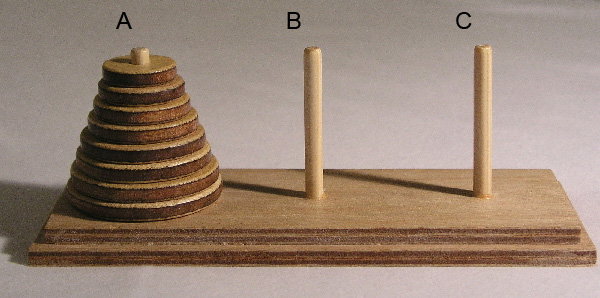

# Рекурсивные алгоритмы и рекуррентные соотношения

---

## 📌 Размерность задачи и универсальность алгоритмов
У каждой математической задачи, как правило, есть размерность. Например, когда мы вычисляем определитель, мы так и говорим, - мы вычисляем определитель размерности $n$ (или можно сказать определитель $n$-го порядка). Иногда под размерностью задачи понимают длину массива входных данных к этой задаче. 

Понятно, что:
- одна и та же задача, но с разной размерностью, решается с помощью одного и того же алгоритма, для которого размерность задачи является просто одним из входных параметров. Например, один и тот же алгоритм сортировки можно применять и для массива из 10 элементов, и для массива из 100 элементов. Это свойство алгоритма называется его универсальностью. Хороший алгоритм должен обладать свойством универсальности. Если же алгоритм не обладает универсальностью, т.е. его надо каждый раз переделывать при изменении размерности задачи, то это плохой алгоритм.
- чем больше размерность задачи, тем дольше работает алгоритм. Это означает, что сложность алгоритма зависит от размерности задачи. Эта сложность может быть полиномиальной (и тогда мы получаем полиномиальный алгоритм), или экспоненциальной, или факториальной. Например, «пузырьковая» сортировка - это полиномиальный алгоритм со сложностью $n^2$. Для сортировки массива можно применить и алгоритм с факториальной сложностью. Действительно, можно выписать все $n!$ перестановок элементов массива и затем выбрать ту из них, в которой элементы идут в порядке возрастания. Естественно, на практике предпочтительней использовать алгоритмы с меньшей сложностью.
- для задачи можно попытаться разработать рекурсивный алгоритм, основная идея которого - свести решение исходной задачи к такой же задаче, но с меньшей размерностью. Иногда такое сведение более сложной задачи к похожей, но более простой задаче удаётся, и тогда мы получаем рекурсивный алгоритм.

## Примеры:
1. Вычисление $n!$ (классический пример использования рекурсивного алгоритма). Чтобы вычислить $n!$, надо сначала вычислить $(n - 1)!$ и затем полученное число умножить на $n$. Т.е. мы свели задачу размерности $n$ к задаче размерности $n - 1$. Надо только помнить, что $0! = 1$ (база рекурсии). **База рекурсии** - это ситуация, когда сводить к задаче меньшей размерности уже не надо.
2. Сортировка методом поиска (сортировка выбором). Идея рекурсивного алгоритма: найдём в исходном массиве длины $n$ минимальный элемент. Для этого потребуется выполнить $(n - 1)$ сравнение. После этого исходный массив станет на 1 элемент короче, и в нём снова нужно будет найти минимальный элемент, Он будет уже вторым по величине элементом исходного массива. Отбросим его и найдём минимальный элемент в оставшемся массиве и т.д. Здесь мы тоже сводим задачу размерности и к задаче размерности  $(n - 1)$.
3. Задача о ханойских башнях.

> Легенда гласит, что в Великом храме города Бенарес, под собором, отмечающим середину мира, находится бронзовый диск, на котором укреплены 3 алмазных стержня, высотой в один локоть и толщиной с пчелу. Давным давно, в самом начале времён, монахи этого монастыря провинились перед богом Брахмой. Разгневанный Брахма воздвиг три высоких стержня и на один из них возложил 64 диска, сделанных из чистого золота. Причём так, что каждый меньший диск лежит на большем. Как только все 64 диска будут переложены со стержня, на который Брахма сложил их при создании мира, на другой стержень, башня вместе с храмом обратятся в пыль и под громовые раскаты погибнет мир.

 

Чтобы решить исходную задачу, т.е. переложить $n$ дисков со стержня А на стержень В, поступим следующим образом:
1. Переложим $(n - 1)$ диск со стержня А на стержень С (естественно, не сразу, а постепенно, соблюдая правила).
2. Переложим оставшийся диск (он самый большой) со стержня А на стержень В.
3. Переложим $(n - 1)$ диск со стержня С на стержень В (тоже не сразу, а постепенно).

Получается, чтобы решить задачу для $n$ дисков, мы сначала решаем задачу для $(n - 1)$ дисков (переложив их с А на С), затем решаем задачу для одного (самого большого диска), переложив его с А на В, и наконец решаем задачу для $(n - 1)$ дисков (переложив их с С на B).

> ❓ Вопрос: одинаковую ли сложность имеют три этих рекурсивных алгоритма?

Чтобы это понять запишем т.н. рекуррентные соотношения для функции сложности этих алгоритмов.

## 📌 Рекуррентные соотношения

Пусть $f(n)$ - это сложность вычисления $n!$ с помощью описанного выше рекурсивного алгоритма, $g(n)$ - это сложность сортировки n-элементного массива рекурсивным методом поиска, a $h(n)$ - это сложность решения задачи для $n$ ханойских башен с помощью описанного рекурсивного алгоритма.

Очевидно, выполняются равенства:

$$
\begin{align}
& f(n) = f(n - 1) + 1,\\
& f(0) = 0 \text{ (база рекурсии)} \\
~ \\
& g(n) = n - 1 + g(n - 1),\\
& g(1) = 0 \text{ (база рекурсии)} \\
~ \\
& h(n) = h(n - 1) + 1 + h(n - 1),\\
& h(1) = 1 \text{ (база рекурсии)}
\end{align}
$$

**Они называются рекуррентными соотношениями.**

## 📌 Примеры рекуррентных соотношений

Примеры рекуррентных соотношений известны вам из школьной программы. 

Действительно, вот эти примеры:
- арифметическая прогрессия: $a_{n+1} = a_n + d$
- геометрическая прогрессия: $b_{n+1} = b_n * q$

В рекуррентном соотношении некая переменная величина, имеющая номер, выражается через такую же величину (или несколько величин), но с меньшими номерами.

Решить рекуррентное соотношение - это значит получить формулу, с помощью которой можно вычислить переменную величину с заданным номером сразу, минуя вычисления этой переменной величины с меньшими номерами. Например, если решить рекуррентное соотношение, задающее арифметическую прогрессию, мы получим известную формулу:

$$
a_n = a_1 + d(n - 1)
$$

А для геометрической прогрессии решение выглядит так:

$$
b_n = b_1 * q^{n - 1}
$$

## 📌 Решение рекуррентных соотношений

Решив рекуррентные соотношения для величин $f(n)$ и $g(n)$, мы найдём сложность рекурсивных алгоритмов из примеров 1 и 2.

Как их решить?

### Для факториала

$$
\begin{align}
& f(n) = f(n - 1) + 1,\\
& f(n - 1) = f(n - 2) + 1,\\
& f(n - 2) = f(n - 3) + 1,\\
& ... \\
& f(0) = 0
\end{align}
$$

Сложим эти равенства - левые части отдельно, правые - отдельно. Получим:

$$
f(n) + f(n - 1) + f(n - 2) + … + f(0) = f(n - 1) + 1 + f(n - 2) + 1 + … + 0.
$$

После упрощения получаем:

$$
f(n) = n.
$$

### Для сортировки

Аналогично поступим для нахождения функции $g(n)$.

$$
\begin{align}
& g(n) = n - 1 + g(n - 1),\\
& g(n - 1) = n - 2 + g(n - 2),\\
& g(n - 2) = n - 3 + g(n - 3),\\
& ...\\
& g(1) = 0
\end{align}
$$

После суммирования всех равенств получим:

$$
g(n) + g(n - 1) + g(n - 2) + … + g(1) = n - 1 + g(n - 1) + n - 2 + g(n - 2) + … + 1 + g(1)
$$

После упрощения получаем:

$$
g(n) = n - 1 + n - 2 + n - 3 + ... + 1 = n\frac{(n - 1)}{2}
$$

Два описанных рекурсивных алгоритма имеют полиномиальную сложность, но разную: первый алгоритм имеет линейную сложность (т.е. порядка $n$), а второй - квадратичную (т.е. порядка $n^2$).

### Для ханойских башен

Это были очень простые примеры. В задаче о ханойских башнях так просто решить рекуррентное соотношение не получится. 

Давайте введем величину $x_n = h(n) + 1$

Тогда из равенства

$$
h(n) = h(n - 1) + 1 + h(n - 1),
$$

мы сначала получим равенство

$$
h(n) + 1 = h(n - 1) + 1 + h(n - 1) + 1
$$

которое превращается в рекуррентное соотношение

$$
x_n = 2x_{n-1}
$$

а это уже геометрическая прогрессия с первым элементом $x_1 = 2$ и знаменателем $q=2$. Используя школьную формулу общего члена геометрической прогрессии, получаем

$$
x_n = 2^n
$$

Откуда следует, что 

$$
h(n) = 2^n - 1
$$

### Выводы:
1. Рекурсивный алгоритм для решения задачи о ханойских башнях имеет экспоненциальную сложность. Значит, он не является эффективным. Сегодня существует строгое доказательство, что эту задачу в принципе нельзя решить эффективным алгоритмом;
2. Для решения задачи с тремя дисками нужно выполнить 7 шагов;
3. Число шагов для 64 дисков, которые должны совершить монахи, равно 18 446 744 073 709 551 615. Если бы монахи, работая день и ночь, делали каждую секунду одно перемещение диска, их работа продолжалась бы почти 585 миллиардов лет.

## 📌 Примеры рекурсивных алгоритмов

Примеры рекурсивных алгоритмов встречаются и в линейной алгебре. Давайте вспомним правило вычисления определителя 3-го порядка методом «разложения по строке»:

$$
 \begin{vmatrix}  
  5 & 2 & 3 \\    
  4 & -1 & 2 \\    
  7 & 0 & 1 \\     
 \end{vmatrix} = 5 *
 \begin{vmatrix}  
  -1 & 2 \\    
  0 & 1 \\     
 \end{vmatrix} - 2 *
 \begin{vmatrix}  
  4 & 2 \\    
  7 & 1 \\     
 \end{vmatrix} + 3 *
 \begin{vmatrix}  
  4 & -1 \\    
  7 & 0 \\     
 \end{vmatrix}  
$$

Это равенство показывает, что для вычисления определителя 3-го порядка можно посчитать 3 определителя 2-го порядка, перемножить их на соответствующие числа первой строки и сложить полученные произведения. Обобщим это правило на случай определителя n-го порядка. Пусть $Z_n$ - это количество операций умножения и сложения, необходимых для вычисления определителя n-го порядка методом «разложения по строке». Тогда получаем следующее рекуррентное соотношение:

$$
\begin{align}
& z_n = n * z_{n-1} + 2n -1, \\
& z_2 = 3 \text{ (база рекурсии)}
\end{align}
$$

Это ещё более сложное рекуррентное соотношение, Мы не сможем сейчас его решить.

## 📌 «Плюсы» и «минусы» рекурсивных алгоритмов
Рассмотрим главные «плюсы» и «минусы» рекурсивных алгоритмов.

Преимущества:
1. простая логика;
2. короткий программный код;
3. легко доказывать корректность алгоритма;
4. есть методы вычисления сложности алгоритма.

Недостатки:
1. высокая сложность (обычно экспоненциальная, и поэтому долго работает);
2. большие затраты памяти (поэтому бывает переполнение стека);
3. к некоторым задачам нельзя применить (в принципе).

Первые два недостатка можно избежать, если заменить рекурсию на итерацию.

Рассмотрим, как это делается на примере вычисления чисел Фибоначчи.

Первые два числа Фибоначчи $f_1 = 1$, $f_2 = 1$, а все последующие числа вычисляются рекурсивно с помощью рекуррентного соотношения

$$
f_n = f_{n-1} + f_{n-2}
$$

Пусть $S(n)$ - сложность рекурсивного алгоритма вычисления п-го числа Фибоначчи. Тогда для функции $S(n)$ выполняется рекуррентное соотношение

$$
S(n) = S(n - 1) + S(n - 2) + 1,\\
S(1) = 0,\\
S(2) = 0
$$

Если его решить, то получим, что

$$
S(n) \approx (1,6)^n,
$$

т.е. рекурсивный алгоритм вычисления чисел Фибоначчи имеет экспоненциальную сложность. Это значит, что для вычисления, например, 70-го числа Фибоначчи таким рекурсивным алгоритмом потребуются миллионы лет. Однако с помощью итерации это можно сделать гораздо быстрее и с меньшими затратами памяти.

Действительно, заведём массив $х_1, х_2, х_3, … , х_n$, где $х_i = f_i$

Вычислять $х_3, х_4, х_5, … , х_n$, будем в цикле по $i = 3, … , n$ по правилу:

$$
x_i = x_{i-1} + x_{i-2}
$$

Тогда для вычисления n-го числа Фибоначчи потребуется выполнить всего $n - 2$ операций сложения, т.е. получаем итерационный алгоритм с линейной сложностью.

Заметим, что рекурсивные алгоритмы в задаче о ханойских башнях и в задаче вычисления чисел Фибоначчи обращаются сами к себе дважды, а не один раз (как при вычислении $n!$ или сортировке массива методом поиска). В более сложных случаях рекурсивный алгоритм может вызывать сам себя переменное количество раз (например, в задаче вычисления определителя n-го порядка алгоритм вызывает себя $n$ раз, решая задачу меньшей размерности).

Также при написании программного кода, реализующего рекурсивный алгоритм, нужно обязательно явно прописывать базу рекурсии.
 
 | Алгоритм              | Рекуррентное соотношение    | Решение               | Сложность |
|------------------------|-----------------------------|-----------------------|-----------|
| Факториал              | $f(n)=f(n-1)+1$             | $f(n)=n$              | $O(n)$    |
| Сортировка выбором     | $g(n)=g(n-1)+n-1$           | $\tfrac{n(n-1)}{2}$   | $O(n^2)$  |
| Ханойские башни        | $h(n)=2h(n-1)+1$            | $2^n-1$               | $O(2^n)$  |
| Фибоначчи (рекурсивно) | $S(n)=S(n-1)+S(n-2)+1$      | $\approx (1,6)^n$     | $O(2^n)$  |

 ---

# Взаимная рекурсия

Взаимная рекурсия в программировании - это такой способ взаимодействия двух (или более) алгоритмов, при котором они решают некоторую общую задачу, рекурсивно обращаясь друг к другу. Такой способ взаимодействия алгоритмов иногда ещё называют косвенной рекурсией.

### Пример
Пусть нам нужно разработать алгоритм, который бы генерировал все строки длины п из нулей и единиц, где никакие два нуля не стоят рядом. Например, при $n = 3$ это будут строки (010), (011), (110), (101), (111). Конечно, задачу можно было бы решить полным перебором, т.е. сгенерировать все $2^n$ строк длины n из нулей и единиц, а потом проверить, какие из них не подходят под условие задачи и удалить их. Оставшиеся строки будут образовывать искомое множество. Сложность такого алгоритма экспоненциальная.

---

Однако эту задачу можно решить и с помощью взаимной рекурсии. Действительно, пусть у нас есть две процедуры $Р_0$ и $Р_1$. Пусть процедура $Р_0$ получает на вход параметр n и строит все строки длины n из нулей и единиц, начинающиеся на 0, где никакие два нуля не стоят рядом. А процедура $P_1$ получает на вход параметр $n$ и строит все строки длины n из нулей и единиц, начинающиеся на 1, где никакие два нуля не стоят рядом. Очевидно, что если мы запустим обе эти процедуры с параметром n, то построим все интересующие нас строки. Организуем взаимодействие этих процедур по следующим правилам:
1. процедура $Р_0$, получив на вход параметр k, пишет 0 в начале текущей строки и обращается к процедуре $P_1$ с параметром $k - 1$;
2. процедура $P_1$, получив на вход параметр k, пишет 1 в начале текущей строки, обращается к себе самой с параметром $k-1$ и к процедуре $Р_0$ с таким же параметром $k-1$.

Описанные процедуры $Р_0$ и $Р_1$ начинают работу с пустыми строками и будут взаимно вызывать себя, постепенно дописывая 0 и 1 к текущим строкам, пока не напишут все строки длины n. Их взаимодействие организовано так, что в полученных строках никакие два нуля не стоят рядом. База рекурсии применяется при k = 0. В этом случае процедуры ничего не пишут, а просто «передают управление» в вызвавшую их процедуру.

Вычислим количество искомых строк длины $n$. Через $х_n$, обозначим количество тех строк, которые начинаются с 0, а через $y_n$ - количество строк, начинающихся с 1. Очевидно, что $х_1 = у_1 = 1$. В общем же случае выполняются равенства

$$
\begin{cases}
x_n = y_{n-1} \\
y_n = x_{n-1} + y_{n-1}
\end{cases}
$$

Мы получили систему рекуррентных соотношений. Решим её **методом исключения неизвестных**. Исключим из второго уравнения $х_{n - 1}$, подставив вместо него $y_{n-2}$. Это можно сделать в силу первого уравнения. Тогда получим рекуррентное соотношение для $у_n$

$$
y_n = y_{n-2} + y_{n-1}
$$

Это **линейное однородное рекуррентное соотношение с постоянными коэффициентами глубины 2**. Оно задаёт последовательность чисел Фибоначчи, если считать, что начальными условиями являются $у_0 = 1$, $y_1 = 1$. Согласно формуле Бине и учитывая, что $x_n = y_{n-1}$, получаем

$$
y_n = \frac{1}{\sqrt{5}} \left( \left( \frac{1 + \sqrt{5}}{2} \right)^{n+1} - \left( \frac{1 - \sqrt{5}}{2} \right)^{n+1} \right),\\
x_n = \frac{1}{\sqrt{5}} \left( \left( \frac{1 + \sqrt{5}}{2} \right)^n - \left( \frac{1 - \sqrt{5}}{2} \right)^n \right).
$$

Таким образом искомое количество строк длины n равно

$$
x_n + y_n = \frac{1}{\sqrt{5}} \left( \left( \frac{1 + \sqrt{5}}{2} \right)^{n+1} - \left( \frac{1 - \sqrt{5}}{2} \right)^{n+1} \right) + 
\frac{1}{\sqrt{5}} \left( \left( \frac{1 + \sqrt{5}}{2} \right)^n - \left( \frac{1 - \sqrt{5}}{2} \right)^n \right)
$$

Выполним проверку для n = 2. Искомое количество строк длины 2 равно 3 - это строки (01), (10) и (11). Согласно полученной формуле

$$
\begin{align}
x_2 + y_2 &= \frac{1}{\sqrt{5}} \left( 
\left( \frac{1 + \sqrt{5}}{2} \right)^2 + 
\left( \frac{1 + \sqrt{5}}{2} \right)^3 - 
\left( \frac{1 - \sqrt{5}}{2} \right)^2 - 
\left( \frac{1 - \sqrt{5}}{2} \right)^3 
\right) \\
&= \frac{1}{\sqrt{5}} \left( 
\left( \frac{1 + \sqrt{5}}{2} \right)^2 \cdot \frac{3 + \sqrt{5}}{2} - 
\left( \frac{1 - \sqrt{5}}{2} \right)^2 \cdot \frac{3 - \sqrt{5}}{2} 
\right) \\
&= \frac{1}{\sqrt{5}} \left( 
\left( \frac{3 + \sqrt{5}}{2} \right)^2 - 
\left( \frac{3 - \sqrt{5}}{2} \right)^2 
\right) \\
&= \frac{1}{\sqrt{5}} \left( 
\frac{14 + 6\sqrt{5}}{4} - \frac{14 - 6\sqrt{5}}{4} 
\right) = 3
\end{align}
$$

## 🎯 Итоги

Подведём итоги, касающиеся взаимной рекурсии.

1. При анализе алгоритмов, основанных на взаимной рекурсии, часто возникают системы линейных рекуррентных соотношений с постоянными коэффициентами (как правило, неоднородные).
2. Методом исключения систему рекуррентных соотношений можно свести к одному рекуррентному соотношению, глубина которого зависит от числа соотношений в системе и их глубины.
3. При заданных начальных условиях система рекуррентных соотношений имеет единственное решение. Если же начальные условия отсутствуют или их не достаточное количество, то различных решений может быть бесконечно много.

# Двойная рекурсия

Во всех рассмотренных ранее примерах рекурсивных алгоритмов параметром рекурсии являлся один единственный параметр n - размер решаемой задачи. Это может быть длина входного массива, число вершин в графе, размер квадратной матрицы и т.д. Однако есть задачи, где на вход подаётся объект, имеющий несколько измерений, например, прямоугольная матрица, у которой два таких измерения - число строк и число столбцов. Очевидно, что оба эти параметра влияют на сложность решения задачи, связанной с этой матрицей.

Существуют рекурсивные алгоритмы для работы с подобными многомерными объектами. В них рекурсия выполняется по нескольким параметрам сразу. Рассмотрим пример рекурсии по двум параметрам, т.е. двойную рекурсию.

---

## Пример 

Рекурсивным методом вычислить число сочетаний $C^k_n$, где $n = 0,1,2,3,…$, $k = 0,1,2,…n$.

## 📌 Решение 
Рассмотрим два рекурсивных метода для решения поставленной задачи.

### I метод
Воспользуемся известным в комбинаторике свойством биномиальных коэффициентов С , которое используется при построении треугольника Паскаля

$$
C^k_n=C^{k-1}_{n-1} + C^k_{n-1}
$$

Это равенство является рекуррентным соотношением, которое позволяет вычислять числа через самих себя, но с другими параметрами $n$ и $k$ (т.е. рекурсивно). В данном случае рекурсивная процедура, вычисляющая $C^k_n$, обращается сама к себе дважды. При написании программного кода нужно не забыть указать базу рекурсии, т.е. начальную ситуацию, когда рекурсивная процедура не должна себя вызывать (иначе возникнет зацикливание). Указанное рекуррентное соотношение не применимо, когда k = 0 (заметим, что $k \leq n$). Поэтому в данном примере база рекурсии - это равенство $C^0_n = 1$.

### II метод

Согласно определению

$$
C^k_n=\frac{n!}{k!(n-k)!}
$$

Для указанной формулы можно вынести за скобки $\frac{n}{k}$ и получить рекуррентное соотношение:

$$
C^k_n=\frac{n}{k} \cdot C^{k-1}_{n-1}
$$

В данном случае рекурсивная процедура для вычисления обращается сама к себе один раз. Поскольку полученное рекуррентное соотношение не применимо, когда k = 0, то база рекурсии будет состоять из равенства $C^0_n = 1$.

---

Ранее мы установили, что для экономии вычислительных ресурсов - уменьшения времени работы и сокращения потребляемой памяти - при написании программного кода рекурсию заменяют на итерацию. В данном примере итерация состоит в том, что мы заполняем элементы двумерного массива ($a_{ij}$), где $a_{ij} = C^i_j$.

Вычисление ($a_{ij}$) осуществляется по формулам:

$$
\begin{cases}
& a_{i,j} = 1,\text{ при }i = 0 \\
& a_{i,j} = a_{i,j-1} + a_{i-1,j-1},\text{ при }0 < i \leq j \\
& a_{i,j} = 0,\text{ при } i > j
\end{cases}
$$

Итерационный процесс заполнения массива ($a_{ij}$) при первом рекурсивном методе изображён на рисунке:

Элементы массива, отмеченные жёлтым цветом, - это базовые элементы, т.к. они заполняются единицами согласно базе рекурсии. «Красный» элемент вычисляется как сумма двух «зелёных» элементов, которые сами когда-то были «красными» и вычислялись через свои «зелёные» элементы. «Синие» элементы - это те элементы, которые заполняются сразу после базовых. Для них, как и для «красных» элементов, работает то же самое правило сложения.

---

При втором рекурсивном методе соответствующий итерационный процесс вычисления элементов массива ($a_{ij}$) происходит согласно правилу:

$$
\begin{cases}
& a_{i,j} = 1,\text{ при }i = 0 \\
& a_{i,j} = \frac{j}{i} \cdot a_{i-1,j-1},\text{ при } i \leq j \\
& a_{i,j} = 0,\text{ при } i > j
\end{cases}
$$

Процесс заполнения массива изображён на рисунке:

Элементы массива, отмеченные жёлтым цветом, заполняются единицами согласно базе рекурсии. «Красный» элемент получается из «зелёного» элемента умножением на дробь $\frac{j}{i}$. «Синие» элементы заполняются после базовых тоже по правилу умножения.

---

## 🎯 Итоги

Важно отметить, что оба итерационных метода быстро работают и не требуют большого объёма памяти, поскольку имеют полиномиальную сложность порядка не выше, чем $n$, и используют двумерный массив размера $k\times n$. Действительно, чтобы вычислить искомый элемент $C^k_n$, который расположен в k-й строке n-го столбца, нужно заполнить все строки этой матрицы с номерами $і \leq k$ и все столбцы с номерами $j \leq n$, т.е. вычислить $n \cdot k$ элементов. Поскольку каждый из них требует для своего вычисления максимум одну арифметическую операцию - сложение либо умножение, то сложность описанных итерационных методов является величиной порядка $n \cdot k$, что не превосходит $n^2$, поскольку $k \leq n$.
