# 🎯 Паросочетания в графах

В приложениях теории графов часто встречаются задачи, связанные с нахождением в графе некоторого набора рёбер, обладающего определёнными свойствами. Примерами такого «особого» набора рёбер могут служить гамильтонов цикл, кратчайшая цепь между двумя вершинами или совокупность ребер, образующих остовное дерево связного графа. Ещё один пример - это паросочетание.

## 📌 Паросочетание

**Паросочетанием** в графе называется такой набор его рёбер, в котором никакие два ребра не смежны. Иными словами, всякая вершина графа инцидента не более, чем одному ребру, принадлежащему паросочетанию. Про вершины, инцидентные рёбрам из паросочетания, говорят, что они покрыты этим паросочетанием.

## 📝 Пример

В графе, изображённом на рисунке, паросочетание состоит из двух рёбер $[v_2,v_5]$ и $[v_4,v_6]$. Вершины $v_2, v_5, v_4, v_6$ покрыты паросочетанием, а вершины $v_1, v_3$ - нет.

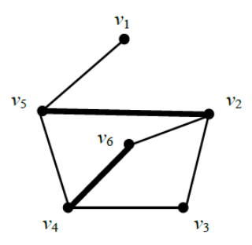

Среди всех паросочетаний особый интерес вызывают максимальные паросочетания. 

Паросочетание в графе называется **максимальным**, если оно содержит максимальное количество рёбер среди всех паросочетаний в этом графе. В графе на рисунке выше паросочетание из трёх рёбер $[v_1, v_5], [v_2, v_3], [v_4, v_6]$ является максимальным, а паросочетание из двух рёбер $[v_2,v_5]$ и $[v_4,v_6]$ - нет.

---

Задача нахождения максимального паросочетания возникает, например, в ситуации, когда имеется перечень процессов и набор исполнителей, причём каждый исполнитель способен выполнять лишь некоторые из этих процессов. Требуется так распределить процессы между исполнителями, чтобы, во-первых, каждый из них выполнял только один процесс, во-вторых, каждый процесс выполнялся только одним исполнителем и, наконец, было выполнено как можно больше процессов. Нетрудно видеть, что для решения данной задачи достаточно найти максимальное паросочетание в двудольном графе, у которого одна из долей соответствует набору процессов, другая - набору исполнителей, а ребро соединяет две вершину-процесс с вершиной-исполнителем, если данный процесс может выполняться данным исполнителем.

> Граф называется двудольным, если множество его вершин можно разбить на два непересекающихся подмножества так, что все рёбра соединяют вершины из разных подмножеств.

---

## 📌 Цепь чередующаяся относительно паросочетания

> Путём называется последовательность вершин, где каждая следующая вершина соединена ребром с предыдущей.

Путь называется **цепью**, если все его ребра различны.

Цепь называется чередующейся относительно паросочетания $М$, если оба её конца не покрыты рёбрами из паросочетания $М$, а каждая её внутренняя (т.е. не концевая) вершина покрыта только одним ребром из паросочетания $М$. 

Заметим, что чередующаяся цепь всегда состоит из **нечётного числа ребер**, и при движении от одной её концевой вершины к другой будут чередоваться рёбра, принадлежащие и не принадлежащие паросочетанию $М$. 

Например, в графе, изображённом на рисунке, цепь $[v_1,v_5], [v_5,v_2], [v_2,v_6], [v_6,v_4], [v_4,v_3]$ является чередующейся относительно паросочетания из ребер $[v_2,v_5], [v_4,v_6]$. В то же время, в этом графе нет ни одной цепи, чередующейся относительно паросочетания $[v_1,v_5], [v_2,v_3] и [v_4,v_6]$, которое, как было отмечено выше, является максимальным.

---

## 💡 Теорема

Справедлива следующая теорема, принадлежащая Клоду Бержу.

> Паросочетание $М$ в двудольном графе является максимальным тогда и только тогда, когда в этом графе нет цепей, чередующихся относительно паросочетания $М$.

---

## 📌 Поиск максимального паросочетания

Рассмотрим алгоритм для нахождения максимального паросочетания в двудольном графе, использующий чередующиеся цепи. 

Сначала в графе выбирается произвольное паросочетание (это может быть просто отдельное ребро графа). Оно объявляется **текущим паросочетанием**.

Далее на каждом шаге алгоритм находит цепь, чередующуюся относительно текущего паросочетания. Если такая цепь $Р$ найдена, то все ребра этой цепи, принадлежащие текущему паросочетанию $М$, исключаются из него, а все ребра цепи $Р$, не принадлежащие паросочетанию $М$, добавляются в него. 

Полученное паросочетание $М'$ объявляется новым текущим паросочетанием. Оно содержит ровно на одно ребро больше, чем предыдущее текущее паросочетание $М$. 

На следующем шаге снова ищется цепь, чередующаяся относительно нового текущего паросочетания $М'$ и т.д. После каждого шага количество рёбер в текущем паросочетании увеличивается ровно на единицу. Если на очередном шаге не найдётся ни одной цепи, чередующейся относительно текущего паросочетания, то это паросочетание объявляется **максимальным** и алгоритм завершает работу.

---

## 📌 Волновой метод

Основной процедурой описанного алгоритма является поиск цепи $Р$, чередующейся относительно текущего паросочетания $М$. Он осуществляется **«волновым методом»**. 

Сначала формируется нулевой фронт волны - это множество всех свободных (т.е. не покрытых текущим паросочетанием $М$) вершин, принадлежащих одной доле исходного графа. 

Если $k$-й фронт уже построен, то $(k + 1)$-й фронт будет состоять из вершин, которые **не встречались** в предыдущих фронтах. При чётных $k$ дополнительно требуется, чтобы каждая вершина $(k + 1)$-го фронта была смежна хотя бы с одной вершиной $k$-го фронта, а при нечётных $k$ каждая вершина $(k + 1)$-го фронта должна соединяться ровно с одной вершиной $k$-го фронта ребром, принадлежащим паросочетанию $М$. 

Поиск цепи $Р$ заканчивается, как только в очередном фронте появится свободная (т.е. не покрытая паросочетанием $М$) вершина, либо очередной фронт окажется пустым. В первом случае чередующаяся цепь соединяет свободные вершины, одна из которых принадлежит нулевому, а другая - последнему фронту. Во втором случае чередующейся цепи не существует.

---

## 📝 Пример

Работу описанного алгоритма рассмотрим на конкретном графе.

### Задача

Найти максимальное паросочетание в двудольном графе, изображённом на рисунке.

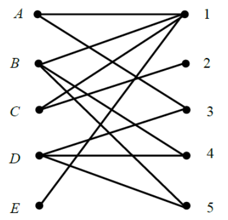

### Решение

Пусть после нескольких шагов алгоритма получили текущее паросочетание $М$, состоящее из ребер $[А,1], [В,4], [С,2]$. 

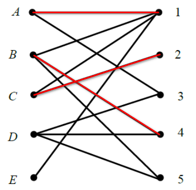

При поиске чередующейся цепи относительно паросочетания $М$ «волновым методом» получим два фронта - нулевой и первый. Нулевой фронт состоит из вершин $D$ и $Е$, а первый фронт - из вершин $1$, $3$, $4$ и $5$. В качестве чередующейся выберем, например, цепь, образованную единственным ребром $[D,3]$.

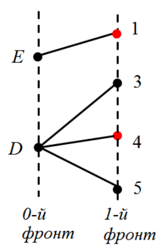

Тогда новое текущее паросочетание $М'$ будет состоять из ребер $[4,1], [B,4], [C,2], [D,3]$.

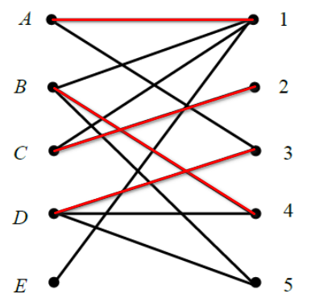

При поиске чередующейся цепи относительно этого паросочетания получим шесть фронтов - от нулевого до пятого. Принадлежащие им вершины изображены на рисунке. Например, четвёртый фронт содержит вершину $D$, а пятый - вершины $4$ и $5$.

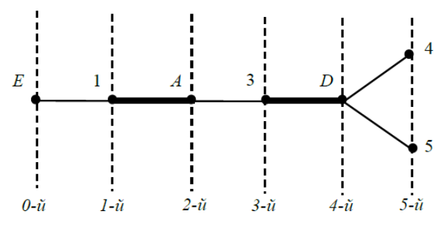

Относительно паросочетания $М'$ существует чередующаяся цепь $E \rightarrow 1 \rightarrow A \rightarrow 3 \rightarrow D \rightarrow 5$. 

Тогда новое текущее паросочетание будет образовано рёбрами $[В,4]$ и $[С,2]$, взятыми из предыдущего паросочетания (т.к. они не вошли в чередующуюся цепь), а также рёбрами $[E,1]$, $[А,3]$ и $[D,5]$ из чередующейся цепи (т.к. они не входили в предыдущее паросочетанне). Таким образом мы получили искомое максимальное паросочетание $[А,3]$, $[В,4]$, $[С,2]$, $[D,5]$ и $[E,1]$. 

Максимальным оно является потому, что покрывает все вершины графа.

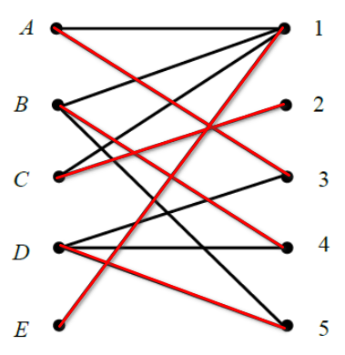

Найденное максимальное паросочетание можно интерпретировать следующим образом. Предположим, что вершины А, В, C. D, Е означают английский, французский, немецкий, испанский и итальянский языки соответственно, а вершины 1, 2, 3, 4, 5 - переводчиков с этих языков на русский. Рёбра графа показывают, какими языками владеет каждый из переводчиков. Пусть нам потребовалось распределить переводчиков А, В, С, D, Е по 5 группам туристов, говорящих на перечисленных языках 1, 2, 3, 4, 5 так, чтобы каждый переводчик работал только с одной группой туристов. Тогда найденное максимальное паросочетание - это один из возможных вариантов такого распределения переводчиков по группам туристов.

# 🎯 Совершенное паросочетание

Паросочетание, которое покрывает все вершины графа, называется **совершенным паросочетанием**. 

Совершенное паросочетание изображено на рисунке (слева). Очевидно, что совершенное паросочетание всегда является максимальным паросочетанием. Однако, максимальное паросочетание не всегда является совершенным. На рисунке ниже (справа) паросочетание из двух ребер $[A, B]$ и $[C, D]$ является максимальным, но не является совершенным, т. к. оно не покрывает вершину $Е$.

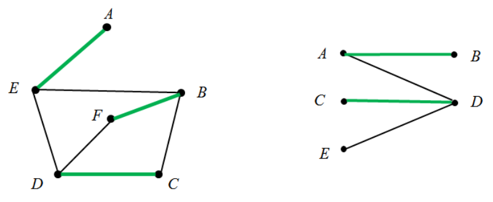

Критерий существования совершенного паросочетания в двудольном графе сформулирован в теореме Холла.

## 💡 Теорема Холла

> Для существования совершенного паросочетания в двудольном графе необходимо и достаточно, чтобы в нём для каждого подмножества $S_1$ вершин из первой доли графа и множества $S_2$ всех вершин из второй доли, смежных вершинам подмножества $S_1$, выполнялось неравенство:

$$
|S1| \leq |S2|.
$$

где $|S_1|$ и $|S_2|$ - количество вершин в $S_1$ и $S_2$ соответственно.

В графе на рисунке ниже не существует совершенного паросочетания, т.к. неравенство из теоремы Холла нарушено, например, для двухэлементного подмножества вершин $S_1 = \{ C, E \}$, которому соответствует одноэлементное множество $S_2 = \{ D \}$.

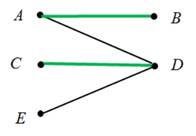

Применять теорему Холла для проверки существования совершенного паросочетания в графе перебором всех подмножеств вершин первой доли с большим количеством вершин в ней за разумное время практически невозможно, т.к. у $n$-элементного множества существует $2^n$ различных подмножеств. Тем более, эту теорему нельзя использовать для поиска совершенного паросочетания, даже если известно, что оно в данном графе имеется.

## 📌 Дерево чередующееся относительно паросочетания

Для поиска совершенного паросочетания в двудольном графе можно использовать понятие чередующегося (относительно паросочетания) дерева. Построение чередующегося относительно паросочетания $М$ дерева происходит методом «волны». 

Нулевой фронт волны - это произвольная свободная (т.е. не покрытая паросочетанием $М$) вершина. Она является корнем чередующегося дерева. Если $k$-й фронт уже построен, то каждая вершина $(k + 1)$-го фронта **не должна встречаться в предыдущих фронтах** и должна быть смежна ровно одной вершине $k$-го фронта. Кроме того, при нечетных $k$ каждая вершина $k$-го фронта должна соединяться ребром только с одной вершиной $(k + 1)$-го фронта, и это ребро обязано принадлежать паросочетанию $М$. В полученном дереве при движении от корня дерева к любой его концевой вершине будут чередоваться ребра, не принадлежащие и принадлежащие паросочетанию $М$.

Построение дерева завершается, как только в очередном фронте найдется свободная вершина, либо очередной фронт окажется пустым. В первом случае в дереве имеется цепь, чередующаяся относительно паросочетания $М$. Она соединяет корень и свободную концевую вершину дерева. С помощью этой цепи можно увеличить число ребер в паросочетании $М$. Во втором случае в полученном дереве нет ни одной чередующейся цепи. Это означает, что в исходном графе не существует совершенного паросочетания.

## 📝 Пример

Рассмотрим, например, каким образом с помощью чередующихся деревьев будет найдено совершенное паросочетание в графе:

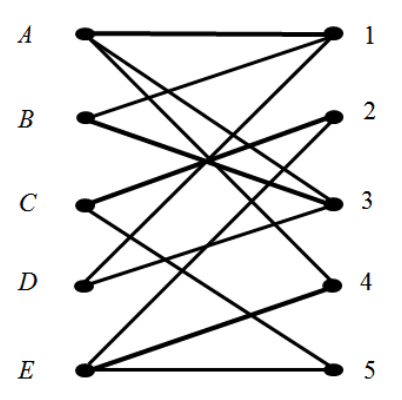

Пусть на некотором шаге алгоритма текущее паросочетание $М$ состояло из ребер $[А,1]$, $[В,3]$, $[C,2]$ и $[E,4]$. 

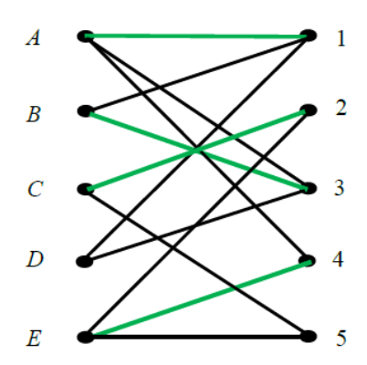

При построении дерева, чередующегося относительно паросочетания $М$, нулевой фронт будет состоять из свободной вершины $D$. Тогда первый фронт будет содержать смежные ей вершины $1$ и $3$. Поскольку обе они покрыты рёбрами текущего паросочетания, продолжаем строить чередующееся дерево.

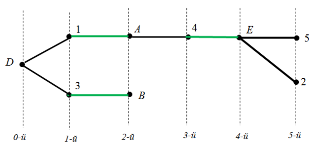

Согласно алгоритму, второй фронт содержит вершины, в которые можно попасть из вершин первого фронта **по рёбрам паросочетания**, т.е. в данном случае - это вершины $A$ и $B$. 

Третий фронт - это вершины, которые смежны вершинам $A$ и $B$ и не встречались в предыдущих фронтах. В данном случае это вершина $4$. Поскольку вершина $4$ покрыта ребром паросочетания, то продолжаем строить чередующееся дерево. 

В четвёртом фронте будет только вершина $Е$, а в пятом фронте - вершины $2$ и $5$. Так как в пятом фронте появилась свободная (т.е. не покрытая паросочетанием) вершина $5$, то построение чередующегося дерева завершено, и мы видим в нём чередующуюся цепь $[D,1]$, $[1,A]$, $[А,4]$, $[4,E]$, $[E,5]$.

«Перекрашивая» рёбра этой чередующейся цепи, получаем новое паросочетание: $[A,4]$, $[B,3]$, $[C,2]$, $[D,1]$, $[E,5]$. Это паросочетание является совершенным, т.к. покрывает все вершины графа.

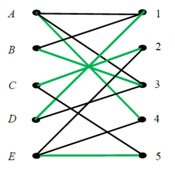

## 📝 Пример

Пример использования совершенного паросочетания для решения задачи о покрытии.

Пусть требуется покрыть прямоугольными плитками некоторую плоскую поверхность (плоскую фигуру). Все плитки - стандартные, имеют одинаковую форму и размеры $(2 \times 1)$. Плитки должны покрыть всю заданную поверхность без наложения одной на другую (например, покрыть паркетными плитками пол в помещении). 

Какие-то фигуры покрыть можно, другие - нет.

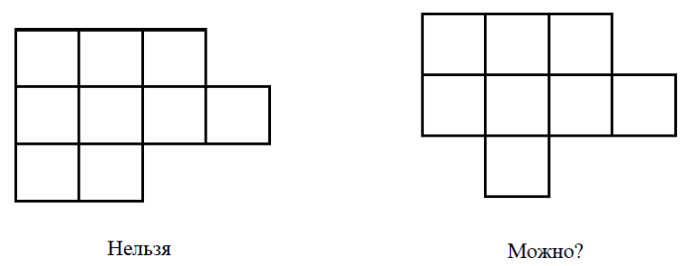

Чем сложнее форма заданной поверхности, тем сложнее возникающая задача о покрытии.

Пронумеруем участки поверхности единичного размера.

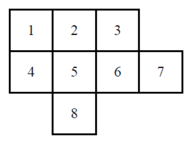

Построим граф, в котором вершины соответствуют нумерованным участкам поверхности, а ребра связывают соседствующие участки.

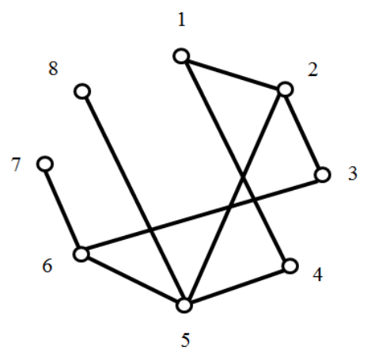

Построенное совершенное паросочетание указывает на возможный способ покрытия поверхности.

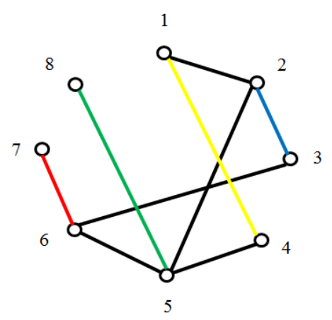

Способ покрытия поверхности соответствующий построенному паросочетанию.

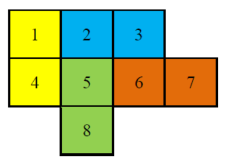
