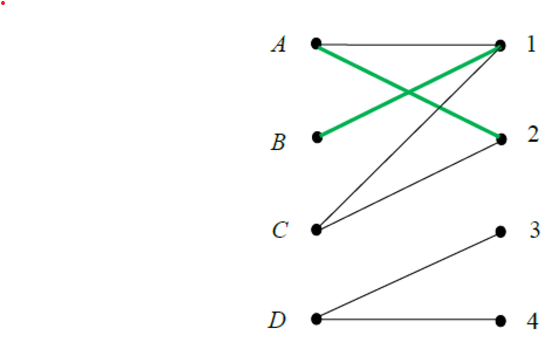
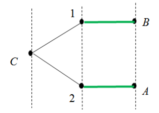
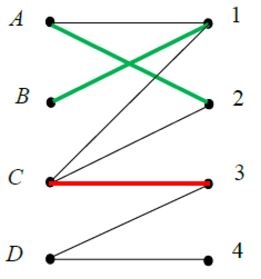
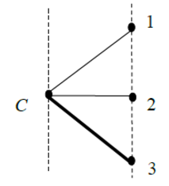
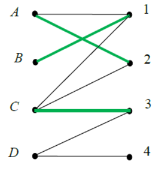
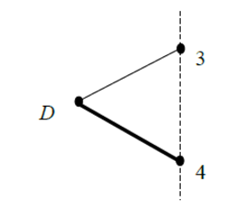
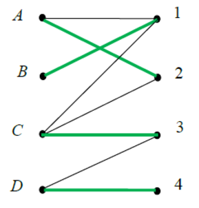

# 🎯 Задача о назначении

При решении некоторых практических задач приходится рассматривать полные двудольные графы, в которых каждое ребро имеет определенную стоимость. Например, стоимость ребра может означать материальные или временные затраты, возникающие при условии, что данный процесс будет выполнен данным исполнителем. В этом случае возникает задача о назначении, которая состоит в нахождении совершенного паросочетания с минимальной суммарной стоимостью. 

Если имеется $n$ процессов и $n$ исполнителей, то исходные данные для задачи о назначении представляют собой квадратную матрицу затрат $n$-го порядка, у которой на пересечении $i$-й строки и $j$-ro столбца находится неотрицательное число, указывающее затраты на выполнение $i$-го процесса $j$-м исполнителем. Очевидно, что в этом случае существует всего $n!$ возможных вариантов назначения. Поэтому при больших значениях параметра $n$ задачу невозможно решить полным перебором всех возможных вариантов.

Пример матрицы затрат для 4 процессов и 4 исполнителей.

$$ 
 \begin{pmatrix}    
  1 & 4 & 4 & 3 \\
  2 & 7 & 6 & 8 \\
  4 & 7 & 5 & 6 \\
  2 & 5 & 1 & 1 \\
 \end{pmatrix}
$$

## Редуцирование матрицы затрат

Отметим одну важную особенность задачи о назначении: если найдено оптимальное назначение для исходной матрицы затрат, то оно останется оптимальным и для преобразованной матрицы, полученной из исходной вычитанием произвольной константы из всех элементов какой-либо её строки или столбца. 

Например, пусть имеются процессы A и В и два исполнителя, а матрица затрат указана на рисунке.

$$
 \begin{pmatrix}    
  6 & 5 \\
  7 & 9 \\
 \end{pmatrix}
$$

Очевидно, в данном случае существует всего два назначения: $[A, 1], [B, 2]$ и $[A, 2], [B, 1]$. Стоимость первого из них равна 15, а второго — 12. т.е. второе назначение оптимально. Если из первой строки исходной матрицы вычесть 5, а из второй — 7, то получим матрицу, указанную на рисунке ниже, с тем же самым оптимальным назначением $[A, 2], [B, 1]$, стоимость которого равна нулю. 

$$
 \begin{pmatrix}    
  1 & 0 \\
  0 & 2 \\
 \end{pmatrix}
$$

Нетрудно видеть, что стоимость оптимального назначения при подобных преобразованиях исходной матрицы затрат уменьшается ровно на суммарную величину вычитаемых констант. Этот факт используется в *венгерском алгоритме*. 

Процедура упрощения матрицы затрат путем вычитания минимальных элементов из строк и затем из столбцов до тех пор, пока в каждой строке и столбце не появятся нули называется *Редуцированием матрицы затрат*.

## Венгерский алгоритм

Основная идея венгерского алгоритма состоит в том, чтобы найти какое-либо **совершенное паросочетание в двудольном графе**, структура которого существенно зависит от исходной матрицы затрат. Для этого проводится редуцирование матрицы затрат — из каждой строки исходной матрицы вычитают минимальный элемент строки, а затем из каждого столбца полученной матрицы вычитают минимальный элемент столбца. В результате в каждой строке и каждом столбце новой матрицы будет присутствозвать хотя бы один нулевой элемент. 

Далее в двудольном графе, имеющем по $n$ вершин в каждой доле, проводят ребро $[i,j]$ тогда и только тогда, когда элемент $a_{ij}$ преобразованной матрицы затрат равен нулю. Если в полученном двудольном графе удается с помощью чередующихся деревьев найти совершенное паросочетание, то входящие в него ребра указывают на оптимальное решение исходной задачи о назначении. 

Если же текущее чередующееся дерево не содержит ни одной чередующейся цепи, то в этом графе нет совершенного паросочетания. Поэтому в графе проводят дополнительные ребра и снова ищут совершенное паросочетание. Для этого выполняют следующие действия:
1. Определяют множества $X$ и $Y$ - номера всех вершин соответственно из первой и второй доли полученного двудольного графа, покрытых текущим чередующимся деревом;
2. Находят минимальный элемент (он всегда будет положительным) среди элементов преобразованной матрицы затрат, попавших в строки с номерами из множества $X$, но не попавших в столбцы с номерами из множества $Y$;
3. Найденный минимальный элемент вычитают из строк с номерами из множества $X$ и добавляют к столбцам с номерами из множества $Y$ (в результате в преобразованной матрице затрат появятся новые нулевые элементы);
4. В текущем двудольном графе добавляют ребра, соответствующие новым нулевым элементам преобразованной матрицы затрат;
5. В новом текущем двудольном графе ищут совершенное паросочетание с помощью чередующихся деревьев.

Указанную последовательность действий повторяют до тех пор, пока в текущем двудольном графе не будет найдено совершенное паросочетание. Входящие в него ребра, как было сказано выше, соответствуют оптимальному решению исходной задачи о назначении.

## 📝 Пример

Применим венгерский алгоритм к задаче о назначении с матрицей затрат, указанной на рисунке.

$$ 
 \begin{pmatrix}    
  1 & 4 & 4 & 3 \\
  2 & 7 & 6 & 8 \\
  4 & 7 & 5 & 6 \\
  2 & 5 & 1 & 1 \\
 \end{pmatrix}
$$

После вычитания минимальных элементов из каждой строки и из второго столбца получим преобразованную матрицу затрат, указанную на рисунке.

$$ 
 \begin{pmatrix}    
  0 & 0 & 3 & 2 \\
  0 & 2 & 4 & 6 \\
  0 & 0 & 1 & 2 \\
  1 & 1 & 0 & 0 \\
 \end{pmatrix}
$$

Этой матрице соответствует следующий двудольный граф:

Пусть текущее паросочетание $M$ состоит из ребер $[A, 2], [B, 1]$ (выделены зелёным). Для увеличения паросочетания $M$ строим чередующееся дерево с корнем в вершине $C$. Это дерево изображено на рисунке ниже:

В этом дереве нем нет цепей, чередующихся относительно паросочетания $M$. Это означает, что в данном двудольном графе нет совершенного паросочетания. А поскольку это дерево покрывает вершины $A$, $В$, $С$, $1$ и $2$, то множество $X=\{A, В, C\}$, а множество $Y =\{ 1, 2\}$. Минимальный элемент в строках $A$, $В$, $С$ и
столбцах $3$, $4$ преобразованной матрицы затрат равен единице. Вычитая единицу из строк $A$, $В$, $С$ и добавляя единицу к столбцам $1$ и $2$, получаем новую матрицу затрат.

$$ 
 \begin{pmatrix}    
  0 & 0 & 3 & 2 \\
  0 & 2 & 4 & 6 \\
  0 & 0 & 1 & 2 \\
  1 & 1 & 0 & 0 \\
 \end{pmatrix} 
 \rightarrow
 \begin{pmatrix}    
  0 & 0 & 2 & 1 \\
  0 & 2 & 3 & 5 \\
  0 & 0 & 0 & 1 \\
  2 & 2 & 0 & 0 \\
 \end{pmatrix} 
$$ 

В ней появился новый нулевой элемент в строке $C$ и столбце $3$. Поэтому в текущем двудольном графе добавляем ребро $[C,3]$. В результате получаем новый двудольный граф (добавленное ребро выделено красным):

Строим для него чередующееся дерево с корнем в вершине $C3$. В этом дереве есть чередующаяся цепь, состоящая из единственного ребра $[C,3]$.

С помощью этой цепи увеличиваем текущее паросочетание $M$ до трех ребер: $[A, 2], [B, 1]$ и $[C,3]$.

Непокрытыми остались вершины $D$ и $4$. Строим чередующееся дерево с корнем в вершине $D$ изображеноое на рисунке ниже:

Оно содержит чередующуюся цепь $[D, 4]$, поэтому текущее паросочетание можно увеличить до совершенного паросочетания $[A, 2], [B, 1]$, $[C,3]$ и $[D, 4]$.

Найденное совершенное паросочетание указывает на оптимальное решение исходной задачи о назначении. В данном случае это назначение $[A, 2], [B, 1]$, $[C,3]$ и $[D, 4]$. Его стоимость равна $4+2+5+1 = 12$, что является минимально возможной величиной.

# 🎯 Потоки в сетях

Методами теории графов удаётся решать некоторые задачи, связанные с перемещением объектов из одной вершины в другую вдоль дуг орграфов. Это могут быть, например, сообщения, пересылаемые по каналам связи в компьютерных сетях. Обычно потоки информации пытаются направлять таким образом, чтобы они не превышали пропускные способности каналов связи, и при этом объем передаваемой информации за фиксированный промежуток времени был по возможности максимальным. Задача становится ещё более сложной, если, кроме того, требуется подобрать наиболее надёжные маршруты для передачи информации или минимизировать связанные с этим расходы. При решении подобных задач часто используется понятие потока в сети.

---

Пусть имеется сеть (взвешенный ориентированный граф) с одним источником $s$ и одним стоком $t$. 

Вершина $s$ сети является **источником**, если не существует дуг, входящих в эту вершину. Вершина $t$ является **стоком**, если не существует дуг, исходящих из этой вершины. 

Будем считать, что каждая дуга е имеет пропускную способность $р(е)$, которая выражается натуральным числом. 

**Потоком** в такой сети называется функционал $f$, заданный на её дугах и удовлетворяющий следующим двум требованиям:
1. Для каждой дуги $e$ выполняется неравенство $0 \leq f(e) \leq p(e)$;
2. Для каждой вершины $v$, кроме источника и стока, выполняется равенство $\sum_{e \in In(v)} f(e) = \sum_{e \in Out(v)} f(e),$

где $In(v)$ - множество дуг, входящих в вершину $v$, a $Out(v)$ - множество дуг, исходящих из вершины $v$.

Число $f(e)$ будем называть **локальным потоком** вдоль дуги $e$. Указанные в определении два требования к локальным потокам вполне объяснимы. Например, если исходная сеть - это транспортная сеть, где дуги - это дороги, а вершины - это перекрёстки, то пропускную способность $р(е)$ дуги $е$ можно интерпретировать как максимальное количество автомобилей, которые теоретически могут находиться на данной дороге, двигаясь в направлении данной дуги. Пропускная способность дороги зависит от её ширины, числа полос, качества дороги, ограничений скорости движения по ней и т.д. Тогда под локальным потоком $f(e)$ вдоль дуги е в данном случае следует понимать реальное количество автомобилей, передвигающихся по данной дороге в заданном направлении.

---

> 1. Для каждого ребра $е$ выполняется неравенство $0 \leq f(e) \leq p(e)$;

Первое требование, сформулированное в определении потока, означает, что реальное число автомобилей, одновременно едущих по любой дороге, не должно превышать её пропускной способности. 

>2. Для каждой вершины $v$, кроме источника и стока, выполняется равенство $\sum_{e \in In(v)} f(e) = \sum_{e \in Out(v)} f(e),$ где $In(v)$ - множество дуг, входящих в вершину $v$, a $Out(v)$ - множество дуг, исходящих из вершины $v$.

Второе требование выражает локальный закон сохранения потока: суммарное количество автомобилей, приезжающих к любому перекрёстку, должно быть равно суммарному количеству автомобилей, уезжающих с него.

---

Из условия сохранения потока в каждой вершине сети, кроме источника и стока, следует глобальный закон сохранения:

$\sum_{e \in In(t)} f(e) = \sum_{e \in Out(s)} f(e) = F$

где число $F$ - это величина потока. Глобальный закон сохранения, по сути, означает, что все автомобили, которые выехали из источника (их суммарное количество и есть величина потока $F$), должны в итоге приехать в сток. Иными словами, в транспортной сети автомобили не должны возникать «из ничего» и исчезать «в никуда».

---

## 📝 Пример

На рисунке представлена сеть $G$ с источником $s$ и стоком $t$. На каждой дуге указана пара чисел $(f(e), p(е))$. Первое число - это локальный поток вдоль дуги, а второе - её пропускная способность. Нетрудно видеть, что оба требования к потоку $f$ выполнены, а величина потока $F = 10$.

Дуга, у которой локальный поток совпадает с её пропускной способностью, называется **насыщенной дугой**. На рисунке насыщенными дугами являются $(s,b)$, $(a,b)$ и $(a,с)$.

---

В сети можно задать несколько разных потоков, отличающихся величиной $F$. Один из них - нулевой поток, когда $f(e) = 0$ сразу для всех дуг сети. Однако с практической точки зрения интерес вызывает задача поиска потока с максимально возможной для заданной сети величиной $F$. Оказывается, эта величина связана с понятием разреза сети.

**Разрезом сети** называется такое разбиение множества её вершин на два подмножества $V_1$ и $V_2$, при котором $s \in V_1$, $t \in V_2$. 

Известно, что в $n$-вершинной сети существует $2^{n - 2}$ различных разрезов.

**Пропускной способностью разреза** называется суммарная пропускная способность всех дуг, начало которых принадлежит множеству $V_1$, а конец - множеству $V_2$.

В таблице перечислены все разрезы сети, изображённой на рисунке, и пропускные способности этих разрезов.

| Вершины из $V_1$ | Вершины из $V_2$ | Пропускная способность |
|------------------|------------------|:----------------------:|
| s                | a, b, c, t       | 11                     |
| s, a             | b, c, t          | 10                     |
| s, b             | a, c, t          | 16                     |
| s, c             | a, b, t          | 20                     |
| s, a, b          | c, t             | 14                     |
| s, a, c          | b, t             | 14                     |
| s, b, c          | a, t             | 19                     |
| s, a, b, c       | t                | 12                     |

## 💡 Теорема Форда-Фалкерсона

Справедлива следующая теорема Форда-Фалкерсона, связывающая максимальный поток в сети и её минимальный разрез.

> Максимальная величина потока в сети равна минимальной пропускной способности разреза этой сети.

Для сетей с небольшим числом вершин теорема Форда- Фалкерсона позволяет найти максимальную величину потока в сети полным перебором всех её разрезов. Однако, она ничего не говорит о локальных потоках вдоль дуг, обеспечивающих этот максимальный поток. По сути, теорема утверждает, что максимальный поток в сети определяется её самым «узким местом». 

Согласно этой теореме, поток в сети, изображённый на рисунке, является максимальным, поскольку его величина равна 10, а это совпадает с минимальной пропускной способностью разреза этой сети (см. табл.).

