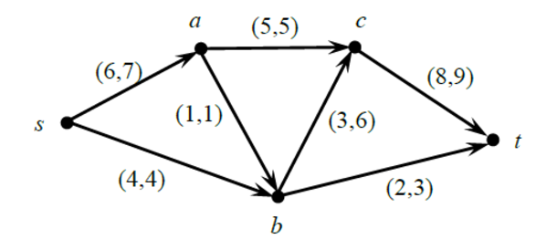
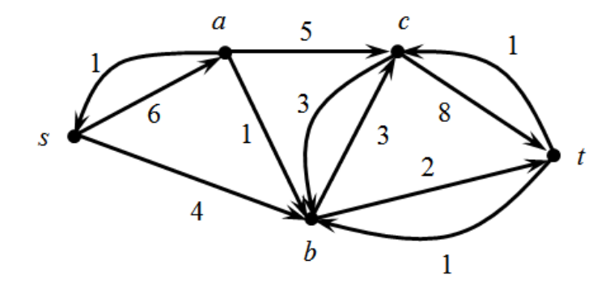
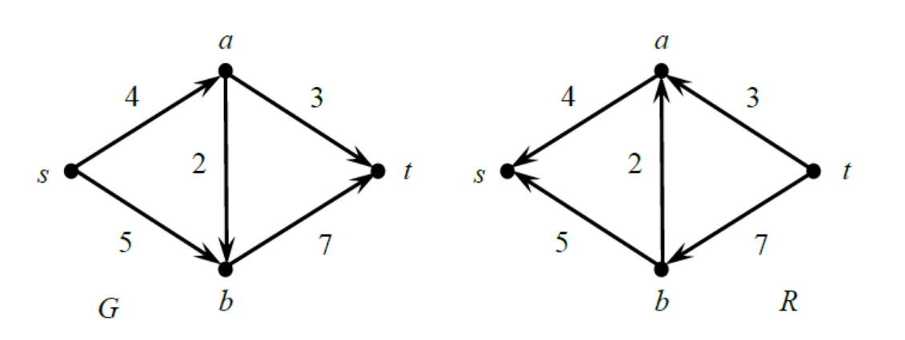
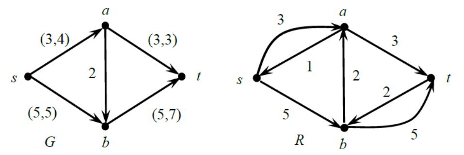
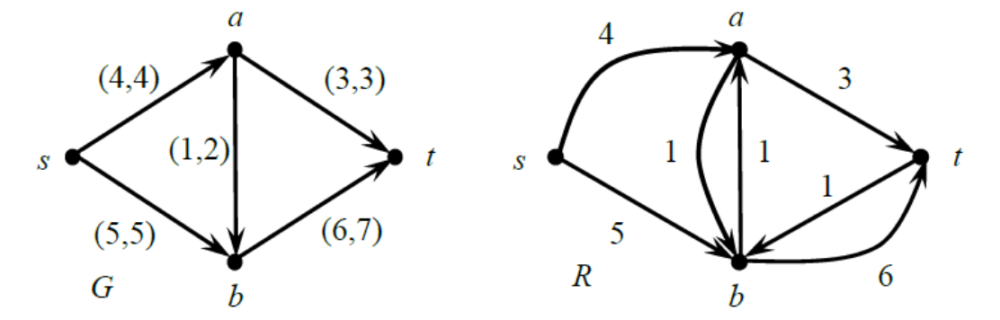
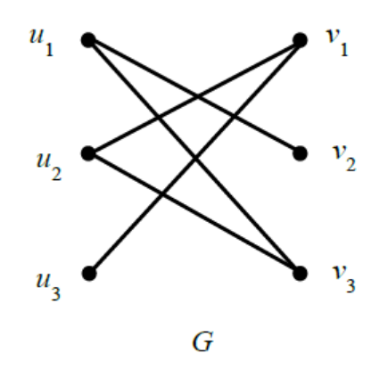
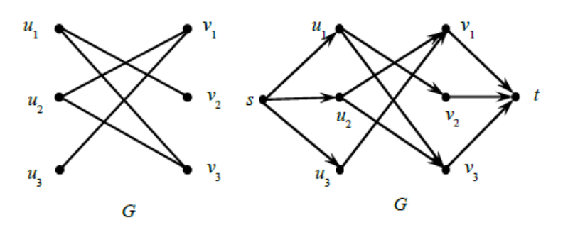

# 🎯 Задача о максимальном потоке
## Остаточная сеть
Если в исходной сети существует некоторый поток, то можно построить так называемую остаточную сеть. 

Остаточная сеть – это сеть с тем же набором вершин, что и у исходной сети. Наличие дуг и их веса в остаточной сети определяются по следующим правилам: 
1. Если дуга $e$ исходной сети является насыщенной (т.е. локальный поток $f(e)$ равен пропускной способности), то в остаточной сети проводим дугу $e$ с весом $p(e)$;
2. Если дуга $e=[v_{i},v_{j}]$ исходной сети является пустой (т.е. локальный поток $f(e)$ равен нулю), то в остаточной сети проводим обратную дугу $[v_{j},v_{i}]$ с весом $p(e)$;
3. Если дуга $e=[v_{i},v_{j}]$ исходной сети не является ни пустой, ни насыщенной (т.е. для неё выполняются неравенства $0<f(e)<p(e)$ ), то в остаточной сети проводим две дуги: саму дугу $e=[v_{i},v_{j}]$ с весом $f(e)$ и обратную дугу $[v_{j},v_{i}]$ с весом, равным $p(e)-f(e)$.

📌 Остаточная сеть содержит информацию о незадействованном резерве, который можно использовать для наращивания в исходной сети уже существующего потока.

Действительно, если в остаточной сети дуга $e$ имеет вес $p(e)$, то, согласно правилу 2, в исходном графе эта дуга является пустой. Значит, вдоль неё можно направить локальный поток величины не более, чем $p(e)$. Если же в остаточной сети дуга $e$ имеет вес $p(e)-f(e)>0$, то, согласно правилу 3, в исходном графе эта дуга не является насыщенной. Поэтому вдоль неё можно нарастить уже имеющийся локальный поток до величины не более, чем $p(e)$. В обоих случаях эти действия должны нарастить существующий сети поток.

📌 Любой ориентированный путь в остаточной сети из стока $t$ в источник $s$ называется **увеличивающим путём**.

## 💡 Теорема
Поток в исходной сети является максимальным тогда и только тогда, когда в остаточной сети нет ни одного увеличивающего пути.

На рисунке ниже представлена исходная сеть с некоторым потоком.

На рисунке ниже изображена остаточная сеть, отвечающая потоку в исходной сети, представленной выше.

На рисунке указаны веса дуг остаточной сети. Прямые дуги – это дуги, присутствующие также и в исходной сети. Их веса равны локальным потокам. Остальные дуги – это обратные дуги. Их веса показывают неиспользованные резервы. Заметим, что в этой остаточной сети не ни одного увеличивающего пути. Поэтому, согласно предыдущей теореме, существующий в сети поток является максимальным.

## Алгоритм для нахождения максимального потока

Рассмотрим теперь алгоритм для нахождения максимального потока. Он состоит в постепенном наращивании уже имеющегося потока вдоль некоторого ориентированного пути из источника $s$ в сток $t$. Поиск такого пути осуществляется с помощью остаточной сети. Наращивание потока происходит до тех пор, пока его величина не станет максимально возможной для заданной сети. В качестве начального можно взять, например, нулевой поток.

Пусть после очередного увеличения потока в процессе работы алгоритма мы получили некоторый ненулевой поток. Построим соответствующую этому потоку остаточную сеть и найдём в ней какой-либо увеличивающий путь. Предположим, что это путь из дуг $e_{i},e_{j},...,e_{k}$. Через $d$ обозначим минимальный вес дуг, образующих этот путь. Уменьшим на величину $d$ веса всех дуг $e_{i},e_{j},...,e_{k}$. Дуги, веса которых станут после этого нулевыми, удалим из остаточной сети. 

Уменьшение весов дуг $e_{i},e_{j},e_{k}$ на величину $d$ в остаточной сети означает следующую корректировку локальных потоков в исходной сети:
1. Если дуга $e$ из увеличивающего пути существует в исходной сети, то локальный поток вдоль неё $f(e)$ уменьшается на величину $d$. 
2. Если же дуга $e$ в исходной сети отсутствует, то в ней имеется дуга, обратная по отношению к $e$. Уменьшение веса дуги $e$ на величину $d$ в остаточной сети означает уменьшение резерва в исходной сети, что эквивалентно увеличению локального потока вдоль дуги, обратной по отношению к $e$, на величину $d$. Вследствие указанной корректировки локальных потоков ровно на величину $d$ возрастает и величина потока. 

📌 Как уже было сказано, после нахождения увеличивающего пути в остаточной сети происходит корректировка обеих сетей – и остаточной, и исходной. 

В скорректированной остаточной сети снова ищут увеличивающий путь и корректируют обе сети и т.д. Алгоритм завершает работу, как только в остаточной сети не останется ни одного увеличивающего пути. В этот момент веса дуг в остаточной сети будут показывать реальные локальные потоки, а также неиспользованные резервы, что тоже может представлять интерес, например, для внесения изменений в исходную сеть (добавление дуг, повышение пропускных способностей дуг) с целью увеличить уже существующий поток.

## 📝 Пример

На рисунке ниже изображен граф, представляющий сеть $G$, для которого указаны пропускные способности дуг, и соответствующая остаточная сеть $R$, с учетом того, что поток в исходной сети равен 0. Требуется найти максимальный в сети $G$.

Остаточная сеть $R$ получается из исходной сети $G$ заменой всех дуг на обратные дуги. Вес обратной дуги равен пропускной способности соответствующей дуги из исходной сети.

В остаточной сети $R$ есть увеличивающий путь $t\rightarrow a\rightarrow s$. Минимальный вес дуг, образующих этот путь, равен 3. Согласно алгоритму уменьшаем на 3 веса дуг $(t,a)$ и $(a,s)$ остаточной сети. Это приведёт к тому, что в исходной сети локальные потоки вдоль дуг $(a,t)$ и $(s,a)$ станут равными 3. Следовательно, в исходной сети появится поток величины 3. 

Новый поток и соответствующая ему скорректированная остаточная сеть изображены на рисунке ниже.

В остаточной сети $R$ можно найти еще один увеличивающий путь $t\rightarrow b\rightarrow s$ с минимальным весом входящих в него рёбер, равным 5. Уменьшаем в остаточной сети веса дуг $(t,b)$ и $(b,s)$ на 5 и одновременно с этим наращиваем поток в исходной сети с 3 до 8. Увеличенный поток и соответствующая ему остаточная сеть изображены на рисунке ниже.

В остаточной сети есть увеличивающий путь $t\rightarrow b\rightarrow a\rightarrow s$. Минимальный вес дуг, образующих этот путь, равен 1. Поэтому уменьшаем на 1 веса всех этих дуг, причём, дугу $(a,s)$ удаляем, поскольку её вес стал равен нулю. В исходной сети также произойдут изменения, а именно: на 1 увеличатся локальные потоки вдоль дуг $(s,a)$, $(a,b)$ и $(b,t)$. Это приведёт к тому, что текущий поток возрастёт с 8 до 9. Все указанные изменения представлены на рисунке ниже.

Алгоритм завершил работу, поскольку в остаточной сети $R$ больше нет увеличивающих путей. Найденный поток величины 9 является максимальным. 

Локальный поток вдоль каждой конкретной дуги сети $G$ указан в качестве первого числа в паре, приписанной этой дуге. Второе число в паре – это пропускная способность дуги.

Максимальность найденного потока следует и из теоремы Форда-Фалкерсона. Действительно, минимальная пропускная способность разрезов этой сети также равна 9. Ею обладает разрез $V_{1}=\{s\},V_{2}=\{a,b,t\}$. Ещё один аргумент в пользу максимальности найденного потока состоит в том, что обе дуги, выходящие из источника $s$, являются насыщенными. Именно эти дуги не позволяют увеличить текущий поток в исходной сети, поскольку они создают её самое «узкое место». 

## Альтернативное применение алгоритма поиска максимального потока

Задача о максимальном потоке интересна тем, что к ней сводятся некоторые другие задачи, никак не связанные с потоками. Это сведение одной задачи к другой позволяет алгоритм, решающий первую задачу, адаптировать таким образом, чтобы с его помощью можно было решить и вторую задачу. 

Например, к поиску максимального потока можно свести задачу о максимальном паросочетании в двудольном графе. Это можно сделать следующим образом. Пусть требуется найти максимальное паросочетание в двудольном графе $G$, изображённом на рисунке.

Превратим граф $G$ в сеть с одним источником и одним стоком. Для этого добавим в графе $G$ две вершины $s$ и $t$ – источник и сток соответственно, а также дуги $(s,u_{1})$, $(s,u_{2})$, $(s,u_{3})$, $(v_{1},t)$, $(v_{2},t)$, $(v_{3},t)$. Кроме того, введём ориентацию на рёбрах графа $G$ так, чтобы образовавшиеся дуги выходили из вершин левой доли. 

Положим пропускные способности всех дуг сети $G^{\prime }$ равными 1 и найдём в ней максимальный поток. Нетрудно видеть, что его величина равна 3, поскольку именно такую пропускную способность имеет разрез, у которого $V_{1}=\{s\}$. Насыщенными окажутся все добавленные дуги $(s,u_{1})$, $(s,u_{2})$, $(s,u_{3})$, $(v_{1},t)$, $(v_{2},t)$, $(v_{3},t)$, а также дуги $(u_{1},v_{2})$, $(u_{2},v_{3})$ и $(u_{3},v_{1})$, соответствующие рёбрам $[u_{1},v_{2}]$, $[u_{2},v_{3}]$ и $[u_{3},v_{1}]$ исходного графа $G$. Эти три ребра и образуют искомое максимальное паросочетание в графе $G$, т.к. они покрывают все его вершины.

## 💡 Дополнительная информация: Ограничения алгоритма Форда-Фалкерсона

Базовый алгоритм Форда-Фалкерсона, основанный на поиске любого увеличивающего пути, имеет важное практическое ограничение: его корректность и конечность выполнения гарантированы только в том случае, если все пропускные способности дуг являются **целыми числами**.

### ⚠️ Проблемы с иррациональными числами

Если пропускные способности дуг — иррациональные числа, алгоритм может работать бесконечно, не достигая максимального потока. 

### 📈 Оценка производительности (для целых чисел)

Если все пропускные способности целые, время работы ограничено $O(|E|\cdot f)$, где $|E|$ — число рёбер, а $f$ — максимальный поток. Каждое увеличение потока наращивает его как минимум на 1.

### 🎯 Улучшенный алгоритм Эдмондса-Карпа
Чтобы избежать этих проблем и обеспечить гарантированную полиномиальную временную сложность, на практике используют Алгоритм Эдмондса-Карпа:
- Он является реализацией метода Форда-Фалкерсона, которая всегда выбирает кратчайший увеличивающий путь в остаточной сети с помощью алгоритма поиска в ширину (BFS).
- Благодаря этому строгому правилу выбора пути, алгоритм Эдмондса-Карпа имеет  временную сложность $O(VE^{2})$.
