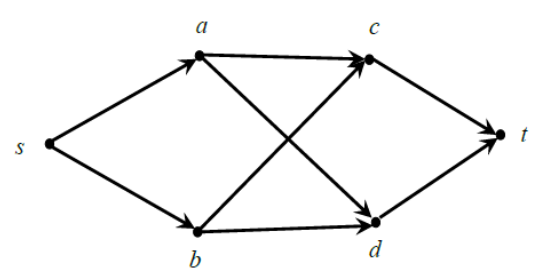
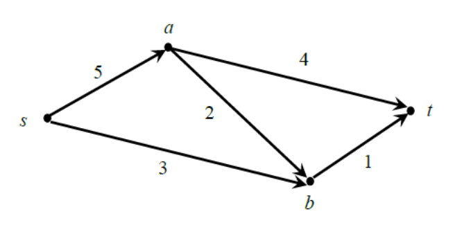
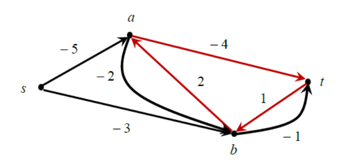
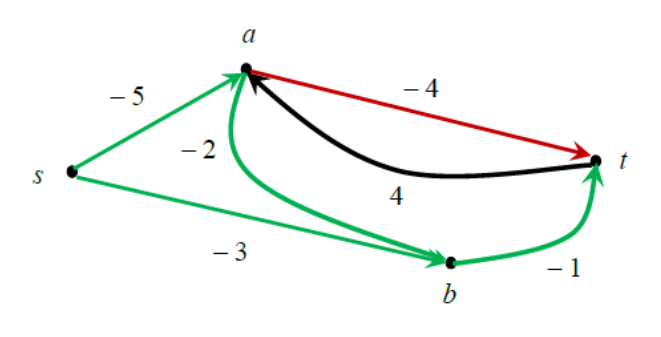
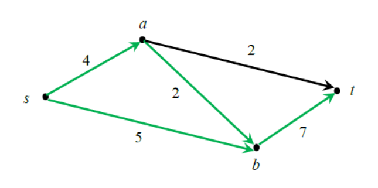
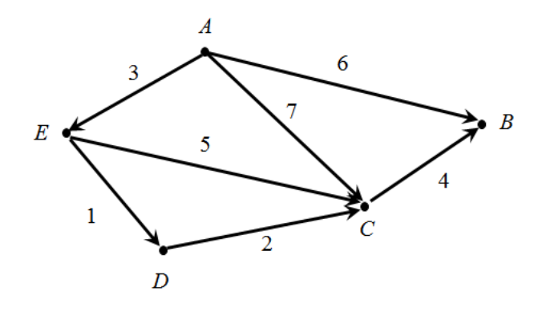
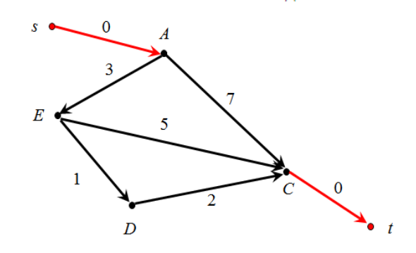
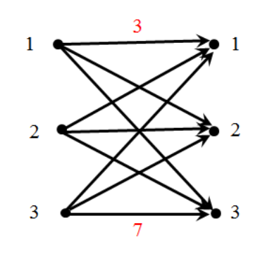
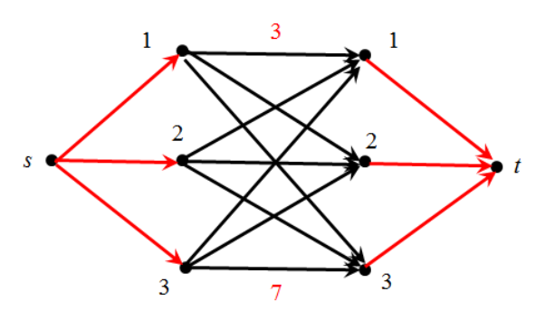

# 🎯 Задача о максимальном потоке минимальной стоимости

Рассмотренная задача о максимальном потоке может иметь не единственное решение. Существуют такие сети, в которых можно задать несколько потоков максимальной величины, отличающихся друг от друга локальными потоками вдоль отдельных дуг. 

Например, в таблице указаны пропускные способности и локальные потоки вдоль каждой дуги в сети, имеющей 6 вершин и 8 дуг.

В первой строке перечислены дуги, во второй – их пропускные способности $c(e)$, а в следующих трёх строках – локальные потоки $f_{1}(e)$, $f_{2}(e)$, $f_{3}(e)$ вдоль каждой из дуг. Все три соответствующие глобальные потоки имеют величину 4 и являются максимальными, т.к. во всех этих потоках обе дуги, входящие в сток $t$, насыщены.

| | $s \to a$ | $s \to b$ | $a \to c$ | $a \to d$ | $b \to c$ | $b \to d$ | $c \to t$ | $d \to t$ |
| :--- | :---: | :---: | :---: | :---: | :---: | :---: | :---: | :---: |
| $c(e)$ | 3 | 3 | 2 | 2 | 1 | 2 | 2 | 2 |
| $f_1(e)$ | 2 | 2 | 1 | 1 | 1 | 1 | 2 | 2 |
| $f_2(e)$ | 1 | 3 | 1 | 0 | 1 | 2 | 2 | 2 |
| $f_3(e)$ | 3 | 1 | 2 | 1 | 0 | 1 | 2 | 2 |

Задача о максимальном потоке является однокритериальной, поскольку в ней требуется среди множества допустимых потоков выбрать тот, который максимизирует один единственный функционал – величину потока. Однако задачу можно сделать двухкритериальной, если на дугах исходного графа задать ещё один функционал – **стоимость** перемещения единицы потока вдоль дуги. В этом случае у каждого максимального потока, которых может быть несколько, имеется своя суммарная стоимость. Тогда возникает задача о максимальном потоке минимальной стоимости, которая состоит в том, чтобы среди всех потоков максимальной величины найти поток минимальной стоимости.

Перейдём к точной постановке задачи о максимальном потоке минимальной стоимости. 

Пусть в исходной сети с одним источником $s$ и одним стоком $t$ каждая дуга $e$ имеет пропускную способность $p(e)$ и стоимость $c(e)$ перемещения вдоль неё единицы потока. Будем считать, что обе величины $p(e)$ и $c(e)$ являются натуральными числами. Если в исходной сети задан некоторый поток, то его величину $F$ и стоимость $C$ будем вычислять по формулам                 

$$
F=\sum _{In(t)}f(e)=\sum _{Out(s)}f(e)
$$

$$
C=\sum _{E}c(e)\cdot f(e)
$$

где $E$ – множество всех дуг исходной сети, а $f(e)$ – локальный поток вдоль дуги $e$.

Алгоритм для нахождения максимального потока минимальной стоимости вначале находит какой-либо максимальный поток, а затем перераспределяет потоки вдоль некоторых дуг так, чтобы, с одной стороны, поток остался допустимым и его величина не уменьшилась, а, с другой стороны, его стоимость стала минимально возможной. 

## Остаточная сеть
Как и при решении задачи о максимальном потоке мы будем использовать остаточную сеть. Принципы её построения такие же, как и в задаче нахождения максимального потока. Есть только одно отличие: каждая дуга остаточной сети теперь имеет не только вес, но и стоимость.

Если в исходной сети уже найден некоторый максимальный поток, построим соответствующую ей остаточную сеть с тем же набором вершин, что и у исходной сети, применяя к каждой дуге исходной сети следующие правила:
1. Если дуга $e$ исходной сети является насыщенной, т.е. для неё выполняется равенство $f(e)=p(e)$, то в остаточной сети проводим такую же дугу с весом $p(e)$ и отрицательной стоимостью ( $-c(e)$ ), где $c(e)$ – стоимость перемещения единицы потока вдоль дуги $e$ в исходной сети;
2. Если дуга $e=[u,v]$ исходной сети является пустой, т.е. поток вдоль неё $f(e)$ равен нулю, то в остаточной сети проводим обратную дугу $[v,u]$ с весом $p(e)$ и стоимостью $c(e)$;
3. Если дуга $e=[u,v]$ исходной сети не является ни пустой, ни насыщенной, т.е. для неё выполняются неравенства $0<f(e)<p(e)$, то в остаточной сети проводим две дуги:
   - дугу $[u,v]$ с весом $f(e)$ и отрицательной стоимостью ( $-c(e)$ );
   - обратную дугу $[v,u]$ с весом $p(e)-f(e)$ и стоимостью $c(e)$.

Таким образом, в остаточной сети могут появиться дуги с отрицательной стоимостью. Далее под стоимостью ориентированного цикла в остаточной сети будем понимать сумму стоимостей всех дуг, образующих этот цикл.

## 💡 Теорема

Максимальный поток имеет минимальную стоимость тогда и только тогда, когда в соответствующей остаточной сети нет ни одного ориентированного цикла отрицательной стоимости.

## Алгоритм для нахождения максимального потока минимальной стоимости

Пусть в исходной сети уже найден некоторый максимальный поток. Если в соответствующей остаточной сети нет ни одного ориентированного цикла отрицательной стоимости, то алгоритм завершил работу, а найденный максимальный поток имеет минимально возможную стоимость.

Если же в остаточной сети есть ориентированный цикл $e_{i},e_{j},\dots ,e_{k}$ отрицательной стоимости $cost$, то через $d$ обозначим минимальный вес дуг, образующих этот цикл. 

В остаточной сети выполним следующие преобразования. Уменьшим на $d$ вес каждой из дуг $e_{i},e_{j},\dots ,e_{k}$ и удалим те из них, вес которых станет равным нулю. Одновременно увеличим на $d$ веса всех дуг, обратных по отношению к $e_{i},e_{j},\dots ,e_{k}$. Если какая-либо из дуг $e_{i},e_{j},\dots ,e_{k}$ в остаточной сети не имела обратной дуги, то в новой остаточной сети добавим такую дугу и положим её вес равным $d$.

Указанные преобразования остаточной сети означают, что в исходной сети мы перенаправили локальные потоки на некоторых дугах так, что величина глобального потока $F$ не изменилась (т.е. он остался максимальным), но его стоимость уменьшилась на величину, равную $d\cdot (-cost)$, где $cost$ – отрицательная стоимость обнаруженного цикла $e_{i},e_{j},\dots ,e_{k}$.

В результате указанных действий в остаточной сети исчезает хотя бы один цикл отрицательной стоимости, а в исходной сети происходит перераспределение локальных потоков так, что глобальный поток остаётся максимальным по величине, но его стоимость при этом уменьшается. 

В преобразованной остаточной сети снова ищут ориентированный цикл отрицательной стоимости и удаляют его, что приводит к перераспределению локальных потоков с сохранением величины глобального потока $F$ и т.д. 

Алгоритм завершает работу, как только в остаточной сети не останется ни одного ориентированного цикла отрицательной стоимости. Окончательные локальные потоки вдоль дуг исходной сети будут равны весам соответствующих дуг в остаточной сети.

💡 Циклы отрицательной стоимости в остаточной сети можно находить с помощью рассмотренного ранее алгоритма Флойда. 

## 📝 Пример
Пусть требуется найти максимальный поток минимальной стоимости в сети (на дугах указаны стоимости перемещения единицы потока вдоль этих дуг):

Пропускные способности дуг, локальные потоки и стоимость перемещения единицы потока вдоль дуг указаны в таблице:

|                               | s→a | s→b | a→b | a→t | b→t |
|-------------------------------|-----|-----|-----|-----|-----|
| Пропускная способность $p(e)$ |  4  |  5  |  2  |  3  |  7  |
| Локальный поток $f(e)$        |  4  |  5  |  1  |  3  |  6  |
| Стоимость $c(e)$              |  5  |  3  |  2  |  4  |  1  |

Заметим, что указанный в таблице поток уже является максимальным для заданной сети, потому что обе дуги, выходящие из источника $s$, являются насыщенными. Величина $F$ этого потока равна 9, а его стоимость                 

$$
C=\sum _{E}c(e)\cdot f(e)=5\cdot 4+3\cdot 5+2\cdot 1+4\cdot 3+1\cdot 6=55
$$

Попробуем перераспределить поток в сети так, чтобы его величина не изменилась, а стоимость уменьшилась. Согласно описанному выше алгоритму нужно построить остаточную сеть, найти в ней цикл отрицательной стоимости и удалить его. Остаточная сеть в данном случае имеет вид (на дугах указаны их стоимости):

Красным цветом выделен цикл $t\rightarrow b\rightarrow a\rightarrow t$ со стоимостью $1+2-4=-1<0$.

Веса дуг, образующих этот цикл, равны соответственно:
- $p(t\rightarrow b)=1$ (неиспользованный резерв на встречной дуге $b\rightarrow t$);
- $p(b\rightarrow a)=1$ (неиспользованный резерв на встречной дуге $a\rightarrow b$);
- $p(a\rightarrow t)=3$ (локальный поток вдоль дуги $a\rightarrow t$).

Таким образом, минимальный из весов дуг, образующих цикл $t\rightarrow b\rightarrow a\rightarrow t$, равен $1$. Уменьшим на $1$ веса всех этих дуг и добавим дугу $t\rightarrow a$ с весом $1$. Дуги $b\rightarrow a$ и $t\rightarrow b$ с нулевым весом удалим из остаточной сети.

В результате получим новую остаточную сеть (на дугах указаны их стоимости):

Выполненные преобразования остаточной сети привели к увеличению на единицу локальных потоков вдоль дуг $a\rightarrow b$ и $b\rightarrow t$ и уменьшению на единицу локального потока вдоль дуги $a\rightarrow t$. Таким образом, мы изменили локальные потоки вдоль дуг $a\rightarrow b$, $a\rightarrow t$ и $b\rightarrow t$, не изменив величину всего потока. В новой остаточной сети зелёным цветом обозначены дуги, которым в исходной сети соответствуют насыщенные дуги.

Соответствующая исходная сеть будет иметь вид (на дугах указаны локальные потоки, зелёным цветом обозначены насыщенные дуги):

Начальный и новый локальные потоки указаны в таблице.

|                                  | s→a | s→b | a→b | a→t | b→t |
|----------------------------------|-----|-----|-----|-----|-----|
| Пропускная способность $p(e)$    |  4  |  5  |  2  |  3  |  7  |
| Начальный локальный поток $f(e)$ |  4  |  5  |  1  |  3  |  6  |
| **Новый локальный поток**        |  4  |  5  |  2  |  2  |  7  |
| Стоимость $c(e)$                 |  5  |  3  |  2  |  4  |  1  |

Стоимость нового потока равна

$$
C=5\cdot 4+3\cdot 5+2\cdot 2+4\cdot 2+1\cdot 7=54
$$

т.е. стоимость прежнего потока уменьшилась на 1. В новой остаточной сети больше нет циклов отрицательной стоимости, поэтому найденный поток является искомым максимальным потоком минимальной стоимости.

# Применение алгоритма для нахождения максимального потока минимальной стоимости

Поток, о котором шла речь в задаче о максимальном потоке минимальной стоимости, может представлять собой транспортный поток, поток жидкости в водопроводной сети, поток газа в газопроводе или нефти в нефтепроводе. Но также это может быть поток сообщений в коммуникационных сетях.

Изложенный выше алгоритм можно применять и тогда, когда пропускные способности и веса дуг являются положительными рациональными числами. Покажем, каким образом с помощью данного алгоритма можно найти максимальный поток сообщений, обладающий максимальной надёжностью передачи сообщений, в коммуникационной сети.

Пусть $p(e)$ — это вероятность того, что отдельное сообщение, отправленное по дуге $e$ в сети, не будет искажено (или перехвачено). Если искажения отдельных сообщений происходят независимо друг от друга, то вероятность передачи без искажений потока из $n$ сообщений вдоль дуги $e$ будет равна $(p(e))^{n}$. Предположим, что информация из узла $s$ в узел $t$ передаётся с помощью нескольких информационных потоков по разным маршрутам. Очевидно, что вероятность правильной передачи отдельного сообщения по маршруту равна произведению вероятностей правильной передачи сообщения по каждой дуге, образующей этот маршрут. Поэтому вероятность того, что ни одно из сообщений в потоке не будет искажено, вычисляется по формуле

$$
\prod _{E}(p(e))^{f(e)}
$$

где $f(e)$ — величина потока вдоль дуги $e$.

При передаче потока сообщений вполне естественно использовать такие маршруты и такие величины потоков вдоль этих маршрутов, чтобы вероятность правильной передачи всех сообщений была максимальной. 

В результате возникает задача найти в сети поток максимальной величины с максимально возможным произведением

$$
\prod _{E}(p(e))^{f(e)}\rightarrow max
$$

Максимизация указанного произведения за счет выбора подходящих потоков $f(e)$ с математической точки зрения равносильна минимизации суммы

$$
\sum _{E}f(e)\cdot \ln (1/p(e))
$$

Если теперь положить стоимость $c(e)$ перемещения единицы потока вдоль дуги $e$ равной $\ln (1/p(e))$, то максимальная вероятность правильной передачи всех сообщений в потоке максимальной величины обеспечивается максимальным потоком минимальной стоимости.

Есть примеры того, как алгоритм поиска максимального потока минимальной стоимости применяется даже там, где вообще нет никаких потоков. Один из таких примеров – известная задача о поиске кратчайшего пути в ориентированном графе (обычно она решается с помощью алгоритма Дейкстры или Флойда).  

## 📝 Пример 1

Пусть требуется найти кратчайший путь из вершины $A$ в вершину $C$ в орграфе (на дугах указаны их длины)

Решим эту задачу с помощью потоков, а именно, сведём её к задаче о максимальном потоке минимальной стоимости. 

Для этого, во-первых, удалим из графа все источники и стоки (если они есть), не трогая при этом вершин $A$ и $C$. В данном случае будет удалена только вершина $B$. Во-вторых, добавим источник $s$ и сток $t$. В-третьих, добавим дуги $s\rightarrow A$ и $C\rightarrow t$, длины которых положим равными $0$. В результате мы получим двухполюсную сеть. 

Будем теперь интерпретировать длины всех дуг сети как стоимости перемещения единицы потока вдоль этих дуг, а их пропускные способности будем считать равными $1$. Тогда максимальный поток из $s$ в $t$ будет равным $1$. Если дополнительно потребовать, чтобы этот поток имел минимальную стоимость, то перемещаться он будет как раз вдоль кратчайшего пути из $A$ в $C$. Значит, рассмотренный выше алгоритм поиска максимального потока минимальной стоимости можно использовать для поиска кратчайшего пути в орграфе.

## 📝 Пример 2

Пусть требуется решить задачу о назначениях с заданной матрицей затрат:

$$
\begin{pmatrix}
3 & 4 & 6 \\
2 & 8 & 9 \\
5 & 1 & 7
\end{pmatrix}
$$          

Нам уже известен эффективный «венгерский» алгоритм для решения этой задачи. Однако теперь мы можем решить её и с помощью потоков. Для этого построим ориентированный двудольный граф с тремя вершинами в левой и правой доле: 

Добавив источник $s$ и сток $t$, получим двухполюсную сеть. Из источника проведём дуги во все вершины левой доли, а в сток проведём дуги из всех вершин правой доли. Будем считать, что пропускные способности всех дуг равны $1$, а стоимости перемещения единицы потока равны $0$ для добавленных (красных) дуг, а для дуг двудольного графа (чёрных) они указаны в исходной матрице затрат. Например, стоимость дуги $(1,3)$ равна $6$. Заметим, что максимальный поток из $s$ в $t$ в этой сети равен $3$.

С одной стороны, решить задачу о назначении – это то же самое, что найти в построенном двудольном графе совершенное паросочетание минимальной стоимости. А с другой стороны, это то же самое, что найти максимальный поток минимальной стоимости в построенной двухполюсной сети. Таким образом мы адаптировали алгоритм поиска максимального потока минимальной стоимости к решению задачи о назначениях.                
