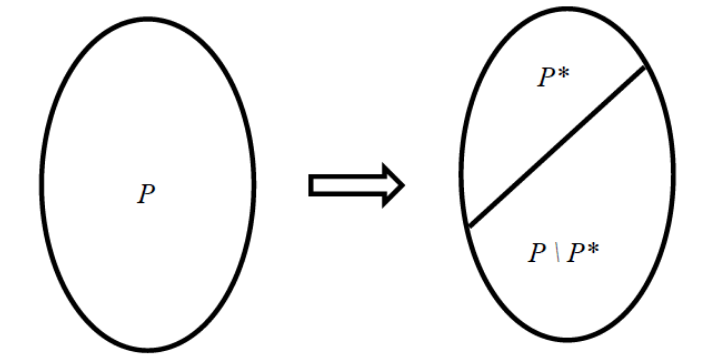
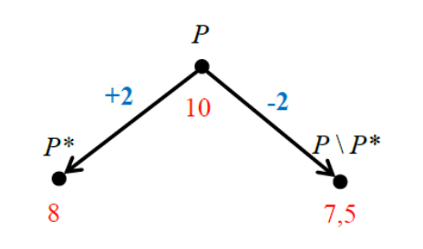
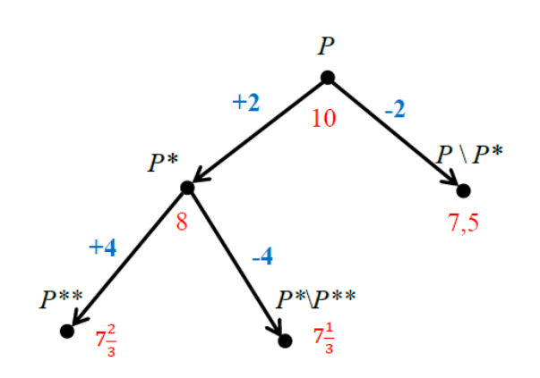
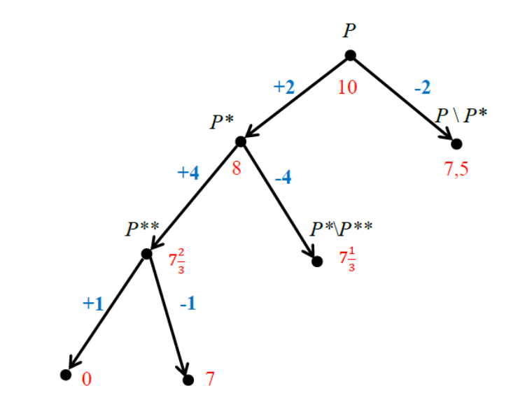
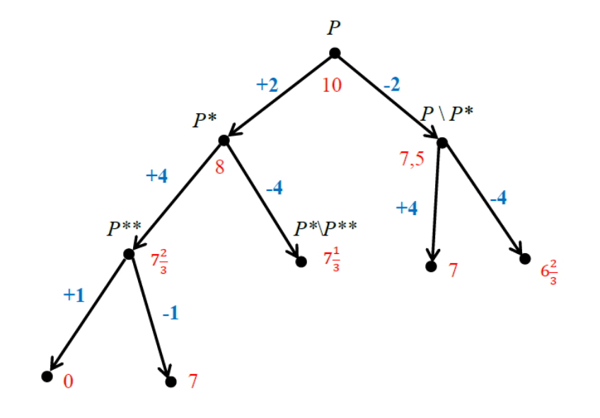
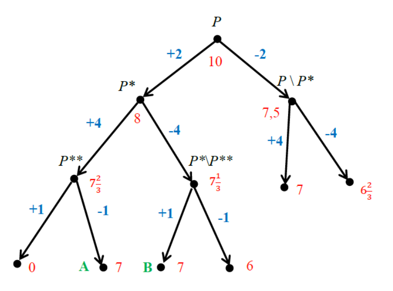
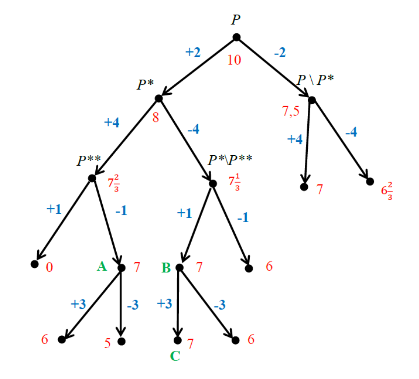
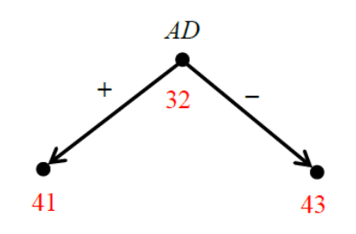
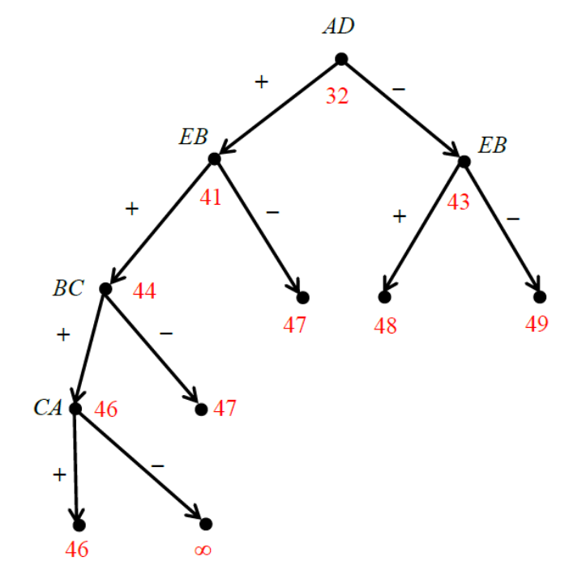

# 🎯 Метод ветвей и границ

Метод ветвей и границ – это один из методов решения задач комбинаторной оптимизации. Он позволяет найти точку максимума (или минимума) целевой функции $f(x_{1},x_{2},\dots ,x_{n})$ в пространстве поиска $P$, состоящем из большого числа точек (возможных вариантов). 

Метод ветвей и границ особенно эффективен, когда пространство поиска $P$ содержит слишком много возможных вариантов – настолько много, что их полный перебор нельзя выполнить за разумное время.

Метод ветвей и границ успешно работает, например, при решении задачи о рюкзаке в следующей постановке:
1. имеется рюкзак, вместимость которого равна $V$;
2. имеется множество из $n$ предметов;
3. каждый предмет имеет объём $v_{i}$ и стоимость $s_{i}$, причем суммарный объём всех предметов превосходит вместимость рюкзака (т.е. сразу все предметы не помещаются в рюкзак);
4. требуется найти такой набор предметов, который помещается в рюкзак и имеет максимально возможную стоимость.

Целевая функция $f(x_{1},x_{2},\dots ,x_{n})$ в этой задаче — это суммарная стоимость набора предметов, положенных в рюкзак.

Пространство поиска $P$ — это множество всех допустимых вариантов заполнения рюкзака. Если перебрать все его точки, то, очевидно, задача будет решена. Однако, из комбинаторных соображений следует, что множество $P$ может содержать почти $2^{n}$ вариантов. При больших $n$ перебрать все эти варианты за разумное время не представляется возможным.

Метод ветвей и границ позволяет справиться с этим перебором за счёт быстрого отбрасывания (отсечения) многих заведомо не перспективных вариантов заполнения рюкзака, которые точно не могут быть ответом к задаче. Не случайно другое название метода ветвей и границ — **поиск с отсечением**. 

Скорость работы метода ветвей и границ зависит от того, насколько удачно были подобраны две его основные процедуры — ветвление и оценивание. Подбор этих процедур зависит от конкретной решаемой задачи. После конкретизации этих двух процедур метод ветвей и границ превращается в полноценный алгоритм.

С помощью процедуры ветвления мы выбираем из множества поиска $P$ некоторое его подмножество вариантов $P^{\star}$ , а с помощью процедуры оценивания мы оцениваем перспективность подмножества $P^{\star}$ и подмножества остальных вариантов $P\setminus P^{\star}$.

Если мы уверены, что наилучший вариант из подмножества $P^{\star}$ не может быть ответом к задаче, то мы отбрасываем всё подмножество $P^{\star}$, тем самым сужая область поиска ответа к задаче до множества $P\setminus P^{\star}$. Если же ответом к задаче не может быть наилучший вариант из множества $P\setminus P^{\star}$, то новой областью поиска становится подмножество $P^{\star}$. В любом случае новая область поиска всегда содержит меньшее число возможных вариантов, чем исходная область $P$. Далее в новой области поиска снова выбираем некоторое его подмножество вариантов $P^{\star\star}$ , оцениваем перспективность подмножества $P^{\star\star}$ и подмножества остальных вариантов, и корректируем область поиска и т.д. Иногда выбор очередного подмножества вариантов выполняется рекурсивно. 

Разумный выбор процедур ветвления и оценивания — это наиболее сложный этап разработки алгоритма, основанного на методе ветвей и границ. Процедура ветвления не должна быть ни слишком примитивной, ни слишком сложной. Хотя примитивное ветвление быстро выполняется, но зато оно может привести к тому, что оба подмножества $P^{\star}$ и $P\setminus P^{\star}$ окажутся одинаково перспективными, ни одно из них нельзя будет исключить из дальнейшего рассмотрения и, следовательно, не произойдёт сужения области поиска. Иногда примитивное ветвление приводит к тому, что отсекаемые множества вариантов слишком малы. В результате процесс сужения области поиска идёт слишком медленно. В итоге алгоритм работает неприемлемо долго, почти как алгоритм полного перебора вариантов. Слишком сложное ветвление, при котором долго формируется подмножество $P^{\star}$, также не выгодно, поскольку это замедляет работу всего алгоритма. Идеальное ветвление — когда подмножества $P^{\star}$ и $P\setminus P^{\star}$ оказываются равными по количеству содержащихся в них вариантов. В этом случае получаем процедуру бинарного поиска (дихотомию). 

То же самое относится и к процедуре оценивания. Она тоже не должна быть ни слишком грубой, ни излишне точной. Слишком грубая оценка перспективности подмножеств $P^{\star}$ и $P\setminus P^{\star}$ может привести к тому, что оба они будут оценены как одинаково перспективные, из-за чего ни одно из них нельзя будет исключить из дальнейшего рассмотрения. Излишне точное оценивание требует долгих вычислений, а это может сильно затормозить работу алгоритма. Заметим, что при поиске максимума целевой функции $f(x_{1},x_{2},\dots ,x_{n})$ оценивание перспективности подмножества вариантов сводится к вычислению верхней оценки целевой функции на этом подмножестве. При поиске минимума целевой функции вычисляют её нижнюю оценку на подмножестве вариантов.

Пошаговую работу алгоритма можно визуализировать, строя ориентированное от корня бинарное дерево. Каждая вершина дерева соответствует какому-либо подмножеству вариантов и помечена числом – оценкой перспективности соответствующего подмножества вариантов. Ответ к задаче будет располагаться в одной из концевых вершин дерева. Особенностью дерева является свойство монотонности оценок перспективности. Оно выражается в том, что при движении от корня к концевой вершине дерева оценки перспективности монотонно убывают, если мы ищем максимум целевой функции $f(x_{1},x_{2},\dots ,x_{n})$, либо возрастают, если мы ищем минимум целевой функции. 

> На английском языке метод называется Branch and Bound, что отражает ключевые операции алгоритма: branching — разбиение пространства поиска на подмножества (ветвление), и bounding — вычисление границ целевой функции для отсечения неперспективных ветвей. Метод предложен в 1960 году Алисой Лэнд и Элисон Дойг в работе по целочисленному программированию «An Automatic Method of Solving Discrete Programming Problems».

Рассмотрим, как происходит ветвление и оценивание в методе ветвей и границ для решения задачи о рюкзаке. 

## 📝 Пример

Пусть решить задачу для рюкзака вместимости $V=5$ и четырёх предметов, объёмы и стоимости которых указаны в таблице:  

| стоимость $s_{i}$ | 4 | 2 | 1 | 3 |
|-------------------|---|---|---|---|
| объём $v_{i}$     | 3 | 1 | 1 | 2 | 

В этой задаче все предметы не помещаются в рюкзак, т.к. их суммарный объём равен 7, что превосходит вместимость рюкзака. Требуется найти такой набор предметов, чтобы он помещался в рюкзак и имел максимально возможную стоимость. 

Вычислим для каждого предмета его ценность $c_{i}$ по формуле $c_{i}=s_{i}/v_{i}$ и отсортируем предметы в порядке уменьшения их ценности: 

| номер предмета    | 2 | 4   | 1   | 3 | 
|-------------------|---|-----|-----|---|
| ценность предмета | 2 | 3/2 | 4/3 | 1 |

Вычислим верхнюю оценку целевой функции, т.е. оценим сверху суммарную стоимость предметов, помещающихся в рюкзак. Поскольку вместимость рюкзака равна 5, а максимальная ценность предметов равна 2, то максимальная стоимость рюкзака, заполненного предметами, не может превосходить $2\cdot 5=10$. Тем самым мы вычислили оценку перспективности начального пространства поиска $P$.

Разложим теперь множество $P$ на два подмножества: 
- $P^{\star}$ — это множество всех вариантов, при которых предмет номер 2 кладём в рюкзак,
- $P\setminus P^{\star}$ — это все варианты, при которых предмет номер 2 не кладём в рюкзак. 

Оценим перспективность каждого из этих двух подмножеств. 
1. Рассмотрим $P^{\star}$ множество всех вариантов, при которых предмет номер 2 кладём в рюкзак. Если предмет номер 2 уже в рюкзаке, то его вместимость уменьшилась с 5 до 4, а его стоимость выросла с 0 до 2. Если бы мы заполнили 4 единицы свободного места в рюкзаке вторым по ценности предметом (это предмет номер 4, ценность которого равна $3/2$), то мы бы увеличили стоимость рюкзака ещё на $4\cdot 3/2=6$, после чего его стоимость возросла бы с 2 до 8. Следовательно, оценка перспективности подмножества $P^{\star}$ равна 8. По сути, оценка перспективности подмножества вариантов $P^{\star}$ — это наши максимальные ожидания от всех тех вариантов заполнения рюкзака, при которых предмет номер 2 положен в рюкзак.
2. Оценим теперь перспективность альтернативного подмножества $P\setminus P^{\star}$ (это все варианты, при которых предмет номер 2 не кладём в рюкзак). Поскольку мы отказались класть в рюкзак предмет номер 2, максимальная стоимость рюкзака, на которую мы можем рассчитывать, равна $5\cdot 3/2=7,5$. Следовательно, число 7,5 и есть оценка перспективности подмножества $P\setminus P^{\star}$.

Выполненные шаги позволяют нам нарисовать начальный фрагмент бинарного дерева: 

Согласно общей идее метода ветвей и границ дальнейшее построение дерева происходит из наиболее перспективной концевой вершины, т.е. в данном примере из вершины с оценкой 8. Вспомним, что она соответствует подмножеству $P^{\star}$ всех таким вариантам заполнения рюкзака, при которых предмет номер 2 положен в рюкзак. Поэтому именно подмножество $P^{\star}$ теперь является текущим пространством поиска. 

| номер предмета    | 2 | **4**   | 1   | 3 | 
|-------------------|---|---------|-----|---|
| ценность предмета | 2 | **3/2** | 4/3 | 1 |

Следующий по убыванию ценности — это предмет номер 4. 

Разобьём все варианты из текущего пространства поиска $P^{\star}$ на две группы. Первая группы — это варианты, когда предмет номер 4 кладём в рюкзак, а вторая группа — когда предмет номер 4 не кладём в рюкзак. 

Вычислим оценку перспективности каждой из этих групп. 
1. Если в рюкзак положили предметы номер 2 и 4, то его вместимость уменьшилась с 5 до 2, а стоимость возросла с 0 до 5. Значит, если бы мы заполнили оставшиеся 2 единицы вместимости самым ценным из оставшихся предметов (а это предмет номер 1 с ценностью $4/3$), то стоимость рюкзака возросла бы ещё на $2\cdot 4/3=8/3$. В итоге мы бы получили рюкзак стоимости $5+8/3=7\frac{2}{3}$. Это и есть оценка перспективности подмножества всех вариантов, при которых предметы номер 2 и 4 будут положены в рюкзак.
2. Если в рюкзак положили предмет номер 2, но не положили предмет номер 4, то его вместимость уменьшилась с 5 до 4, а стоимость возросла с 0 до 2. Значит, если бы мы заполнили оставшиеся 4 единицы вместимости самым ценным из оставшихся предметов (а это предмет номер 1 с ценностью $4/3$), то стоимость рюкзака возросла бы ещё на $4\cdot 4/3=16/3$. В итоге мы бы получили рюкзак стоимости $2+16/3=7\frac{1}{3}$. Это и есть оценка перспективности подмножества всех вариантов, при которых предмет номер 2 будет положен в рюкзак, а предмет номер 4 — нет. 

Новые выполненные шаги позволяют достроить дерево из вершины $P^{\star}$.

Наиболее перспективной концевой в данном дереве является вершина с оценкой $7\frac{2}{3}$, поэтому, согласно общей идее метода ветвей и границ, построение дерева следует продолжать именно из этой вершины. Ей соответствуют все такие варианты заполнения рюкзака, при которых предметы с номерами 2 и 4 лежат в рюкзаке. Ветвление дерева в этой вершине будет идти по принципу «кладём» или «не кладём» в рюкзак следующий по убыванию ценности предмет, т.е. предмет номер 1. 

| номер предмета    | 2 | 4   | **1**   | 3 | 
|-------------------|---|-----|---------|---|
| ценность предмета | 2 | 3/2 | **4/3** | 1 |

Рассмотрим оба этих случая: 
1. Если в рюкзак положить попытаться предметы с номерами 2, 4 и 1, то это превысит вместимость рюкзака. Значит, не существует ни одного варианта, при котором в рюкзаке будут находиться предметы с номерами 2, 4 и 1. Следовательно, перспективность такого подмножества вариантов равна 0.
2. Если в рюкзак положить предметы с номерами $\mathbf{2}$ и $\mathbf{4}$, но не класть предмет номер $\mathbf{1}$, то вместимость рюкзака уменьшится с $\mathbf{5}$ до $\mathbf{2}$, а стоимость возрастёт с $\mathbf{0}$ до $\mathbf{5}$. Поскольку мы отказались класть в рюкзак предмет номер $\mathbf{1}$, то оставшийся объём величины $\mathbf{3}$ можно заполнить только предметом номер $\mathbf{3}$, ценность которого равна $\mathbf{1}$. Значит, мы сможем рассчитывать получить рюкзак стоимости максимум $\mathbf{5+2=7}$. Следовательно, $\mathbf{7}$ — это и есть оценка перспективности рассматриваемой группы заполнения рюкзака.

После добавления двух новых вершин дерево будет иметь вид:

Очередная вершина, из которой следует продолжать построение дерева, **должна быть концевой** и иметь максимальную оценку перспективности. В данном случае — это вершина с оценкой 7,5. Она соответствует таким вариантам заполнения рюкзака, при которых предмет номер 2 точно не будет положен в рюкзак. Тогда далее возможны две альтернативы: «кладём» или «не кладём» в рюкзак следующий по убыванию ценности предмет. Это предмет номер 4, ценность которого равна $3/2$. 

| номер предмета    | 2 | **4**   | 1   | 3 | 
|-------------------|---|---------|-----|---|
| ценность предмета | 2 | **3/2** | 4/3 | 1 |

Рассмотрим каждую из двух альтернатив. 
1. Предмет номер 4 положен в рюкзак. Его «остаточная» вместимость равна 3. Если её заполнить следующим по убыванию ценности предметом (это предмет номер 1 с ценностью $4/3$), то получим стоимость рюкзака $3+3\cdot 4/3=7$. Это оценка перспективности подмножества всех таких вариантов заполнения рюкзака, при которых в рюкзак положены предметы с номерами 4 и 1.
2. Предмет 4 не положен в рюкзак, поэтому его «остаточная» вместимость равна 5. Если её заполнить следующим по убыванию ценности предметом номер 1, то получим стоимость рюкзака $5\cdot 4/3=6\frac{2}{3}$. Это оценка перспективности подмножества всех таких вариантов заполнения рюкзака, при которых в рюкзак точно не будут положены предметы с номерами 2 и 4.

Продолжив построение дерева из самой перспективной вершины, получим новое дерево:

Наиболее перспективная концевая вершина этого дерева имеет оценку $\mathbf{7}\frac{\mathbf{1}}{\mathbf{3}}$. Она соответствует таким вариантам заполнения рюкзака, при которых предмет номер 2 положен в рюкзак, а предмет номер 4 — нет. В дальнейшем возможны две альтернативы: следующий по убыванию ценности предмет (это предмет номер 1) «кладём» либо «не кладём» в рюкзак. 

| номер предмета    | 2 | 4   | **1**   | 3 | 
|-------------------|---|-----|---------|---|
| ценность предмета | 2 | 3/2 | **4/3** | 1 |

Вычислим оценку перспективности каждой из альтернативных групп вариантов.
1. Предмет номер 1 кладём в рюкзак. Поскольку в нём уже лежит предмет номер 2, то «остаточная» вместимость рюкзака равна 1. Если её заполнить самым ценным из оставшихся предметов (т.е. предметом номер 3), то рюкзак будет иметь стоимость $4+2+1=7$. Значит, оценка перспективности соответствующей группы вариантов равна 7. 
2. Предмет номер 1 не кладём в рюкзак. Поскольку в нём уже лежит предмет номер 2, то «остаточная» вместимость рюкзака равна 4. Если её заполнить самым ценным из оставшихся предметов (т.е. предметом номер 3), то рюкзак будет иметь стоимость $2+4\cdot 1=6$. Значит, оценка перспективности соответствующей группы вариантов равна 6. 

После добавления двух вершин, получим новое дерево:

На данный момент в дереве имеется три концевых вершины с одинаковой максимальной оценкой $7$. В таких случаях дерево продолжают строить **из вершины наиболее удаленной от корня**, т.е. в самом нижнем ярусе дерева. В данном случае можно выбрать вершину либо $A$, либо $B$.

Вершина $A$ соответствует вариантам, при которых в рюкзаке лежат предметы с номерами $2$ и $4$, но точно не лежит предмет номер $1$. Далее возможны две альтернативы: «положить» или «не положить» в рюкзак предмет номер $3$. Оценка для первой альтернативы равна $6$, а для второй — $5$. Поскольку обе оценки оказались хуже, чем оценка в вершине $B$, то нужно рассмотреть альтернативы, следующие после вершины $B$.

| номер предмета    | 2 | 4   | 1   | **3** | 
|-------------------|---|-----|-----|-------|
| ценность предмета | 2 | 3/2 | 4/3 | **1** |

Вершина В соответствует вариантам, при которых в рюкзаке лежат предметы с номерами $\mathbf{1}$ и $\mathbf{2}$, но точно не лежит предмет номер $\mathbf{4}$. Далее возможны две альтернативы: «положить» или «не положить» в рюкзак предмет номер $\mathbf{3}$. Оценка для первой альтернативы равна $\mathbf{7}$, а для второй — $\mathbf{6}$. 

В итоге окончательно получаем дерево: 

Ответ к задаче содержится в концевой вершине $\mathbf{C}$. Он является окончательным и правильным, поскольку ни одна концевая вершина дерева не имеет оценку выше, чем вершина $\mathbf{C}$. Как видно из дерева, вершина $\mathbf{C}$ соответствует варианту, когда в рюкзаке лежат предметы с номерами $\mathbf{1}$, $\mathbf{2}$, $\mathbf{3}$. Стоимость такого рюкзака равна $\mathbf{7}$, а «остаточная» вместимость равна $\mathbf{0}$ (т.е. в рюкзаке не осталось свободного места). 

Рассмотренный алгоритм, основанный на методе ветвей и границ, хотя и находит правильное решение, но **не является эффективным**, потому что в худшем случае количество выполняемых им операций экспоненциально зависит от $n$ – количества предметов. Действительно, конкретные числовые данные для этой задачи могут оказаться настолько «неудачными», что алгоритму придётся часто делать back-tracking (возврат назад из нижних ярусов «дерева решений» к верхним ярусам). В результате алгоритм строит почти полное бинарное дерево «дерево решений» и исследует почти все $2^{n}$ вариантов заполнения рюкзака (т.е. выполняет почти полный перебор). 

И всё же рассмотренный алгоритм успешно применяется на практике, особенно тогда, когда его используют массово, запуская многократно на разных наборах входных данных. Это объясняется тем, что «неудачные» наборы входных данных встречаются крайне редко, а в большинстве случаев (или, как говорят, «в среднем») алгоритм находит правильный ответ гораздо быстрее, чем метод полного перебора.

# 🎯 Алгоритм Литтла

Алгоритм Литтла основан на методе ветвей и границ. Он решает задачу коммивояжёра и относится к числу точных (поскольку находит правильное решение на любом наборе входных данных), но не эффективных алгоритмов (т.к. иногда он осуществляет полный перебор всех вариантов). 

Задача коммивояжёра – это типичная задача комбинаторной оптимизации, в которой требуется минимизировать целевую функцию $f(x_{1},x_{2},...,x_{n})$. Целевая функция в данной задаче – это суммарная длина гамильтонова цикла в ориентированном $n$-вершинном графе. Напомним, что гамильтонов цикл – это цикл, проходящий через каждую вершину графа ровно один раз. Значение целевой функции зависит от порядка обхода вершин графа. Пространство поиска $P$ в задаче коммивояжёра состоит из всех $n!$ перестановок чисел $1,2,3,...,n$ номеров вершин. При больших значениях $n$ оно настолько велико, что полный перебор всех вариантов из пространства поиска $P$ в реальном времени не возможен. 

**Принцип ветвления** в алгоритме Литтла является бинарным, из-за чего бинарным получается соответствующее «дерево решений». Полным это дерево бывает только в редких случаях, поэтому алгоритм Литтла, как правило, достаточно быстро находит точное решение. Ветвление в каждой вершине «дерева решений» разбивает текущее пространство поиска на два непересекающихся подмножества. Одно подмножество состоит из маршрутов коммивояжёра, содержащих определённую дугу графа (указанную в данной вершине «дерева решений»), а другое подмножество – из маршрутов, не содержащих эту дугу. Очевидно, что количество тех и других маршрутов совпадает. Правило выбора дуги в точке ветвления является частью процедуры оценивания перспективности обоих потомков этой вершины. 

**Оценивание перспективности** каждой конкретной вершины «дерева решений» в алгоритме Литтла – это вычисление нижней оценки целевой функции $f(x_{1},x_{2},...,x_{n})$ сразу для всех вариантов из подпространства поиска, отвечающего именно этой вершине. 

## 📝 Пример

Рассмотрим работу алгоритма Литтла на примере конкретного графа.

Требуется с помощью алгоритма Литтла решить задачу коммивояжёра для ориентированного графа $G$, заданного матрицей расстояний: 

$$
\left(\begin{matrix}
\infty & 12 & 9 & 9 & 12 \\
9 & \infty & 8 & 19 & 15 \\
7 & 1 & \infty & 17 & 11 \\
5 & 9 & 12 & \infty & 16 \\
14 & 6 & 12 & 22 & \infty
\end{matrix}\right)
$$

Пусть $A$, $B$, $C$, $D$, $E$ – вершины исходного графа $G$. Упростим заданную матрицу, применив к ней две операции – **редукции строк и столбцов**.

> Редукция строк – это вычитание из всех элементов каждой строки одной и той же константы, равной минимальному элементу этой строки. После этой операции в каждой строке матрицы появится хотя бы один нулевой элемент.

В данном примере после редукции матрица будет иметь вид:

|     | *A* | *B* | *C* | *D* | *E* | |
|:----|:--- | :--- | :--- | :--- | :--- | :--- |
| *A* | $\infty$ | 3 | 0 | 0 | 3 | **9** |
| *B* | 1 | $\infty$ | 0 | 11 | 7 | **8** |
| *C* | 6 | 0 | $\infty$ | 16 | 10 | **1** |
| *D* | 0 | 4 | 7 | $\infty$ | 11 | **5** |
| *E* | 8 | 0 | 6 | 16 | $\infty$ | **6** |

В правом крайнем столбце представлены константы редукции. Они различны для разных строк матрицы. Редукция строки A означает, что все дуги, выходящие из вершины A, стали короче на 9 единиц. А поскольку искомый кратчайший гамильтонов цикл содержит ровно одну дугу, выходящую из вершины A, то длина этого цикла после редукции строки A также уменьшится на 9, но порядок следования вершин в самом цикле (т.е. его «структура») не изменится. Из этого следует, что после редукции всех строк матрицы расстояний длина искомого гамильтонова цикла уменьшится на $9+8+1+5+6=29$ единиц, но «структура» цикла останется прежней. 

Ещё одно упрощение матрицы – это редукция столбцов. После неё матрица будет иметь вид: 

| | *A* | *B* | *C* | *D* | *E* | |
| :--- | :--- | :--- | :--- | :--- | :--- | :--- |
| *A* | $\infty$ | 3 | 0 | 0 | 0 | **9** |
| *B* | 1 | $\infty$ | 0 | 11 | 4 | **8** |
| *C* | 6 | 0 | $\infty$ | 16 | 7 | **1** |
| *D* | 0 | 4 | 7 | $\infty$ | 8 | **5** |
| *E* | 8 | 0 | 6 | 16 | $\infty$ | **6** |
| | **0** | **0** | **0** | **0**| **3** | **32** |

В правом крайнем столбце и нижней строке представлены константы редукции. 

Редукция столбца E означает, что все дуги, входящие в вершину E, стали короче на 3 единицы. Очевидно, что на 3 единицы стал короче и искомый гамильтонов цикл, но его «структура» осталась прежней. Это означает, что, **решив задачу коммивояжёра для редуцированной матрицы, мы найдём тем самым и решение для исходной матрицы**.

После редукции строк и столбцов матрицы в каждой её строке и каждом её столбце обязательно будет хотя бы по одному нулевому элементу. Иногда из этих нулевых элементов удаётся «собрать» граф с ориентированным гамильтоновым циклом. Тогда, очевидно, этот цикл является искомым решением задачи коммивояжёра, а **сумма констант редукции - это его длина**. 

В данном примере из 7 нулевых элементов получился следующий граф:

В нём нет гамильтонова цикла. Сумма констант редукции в данном примере оказалась равна 32. Это означает, что искомый кратчайший гамильтонов цикл не может быть короче, чем 32. Значит, 32 – это нижняя оценка целевой функции $f(x_{1},x_{2},...,x_{n})$ и она же – оценка перспективности корня бинарного «дерева решений». 

Чтобы выбрать дугу, по которой будет осуществляться ветвление в корне «дерева решений», вычислим «штраф» каждого из 7 нулевых элементов редуцированной в матрицы:

| Дуга | *AC* | **AD** | *AE* | *BC* | *CB* | *DA* | *EB* |
| :--- | :--- | :--- | :--- | :--- | :--- | :--- | :--- |
| Штраф | $0+0=0$ | $0+11=11$ | $0+4=4$ | $1+0=1$ | $6+0=6$ | $4+1=5$ | $6+0=6$ |

Штраф нулевого элемента, расположенного в $i$-й строке $j$-м столбце, равен сумме минимального элемента $i$-й строки и $j$-го столбца, если сам этот нулевой элемент временно исключить из рассмотрения. Максимальный штраф в данном случае равен 11, его имеет нулевой элемент $AD$. Поэтому, согласно алгоритму Литтла, ветвление в корне «дерева решений» следует выполнять по дуге $AD$.

Пусть левому потомку корневой вершины «дерева решений» соответствует множество всех гамильтоновых циклов, содержащих дугу AD, а правому потомку - не содержащих дугу AD. Выполним оценивание перспективности обоих этих потомков. Для этого вычислим нижнюю оценку целевой функции $f(x_{1},x_{2},...,x_{n})$ отдельно для циклов, содержащих и не содержащих дугу AD. 

В алгоритме Литтла оценка правого потомка любой вершины получается сложением оценки этой вершины и её штрафа. В данном случае оценка правого потомка корневой вершины будет равна $32+11=43$. При этом правый потомок корневой вершины соответствует задаче коммивояжёра для графа, у которого длина дуги AD заменена на $\infty $. 

Оценка левого потомка корневой вершины получается сложением оценки корневой вершины и всех констант редукции новой матрицы. Эта новая матрица получается из исходной матрицы после удаление из неё строки и столбца, содержащего элемент AD. Кроме того, в ней элемент DA заменён на $\infty $. В данном случае новая матрица имеет вид:

| | *A* | *B* | *C* | *E* |
| :--- | :--- | :--- | :--- | :--- |
| *B* | 1 | $\infty$ | 0 | 4 |
| *C* | 6 | 0 | $\infty$ | 7 |
| *D* | $\infty$ | 4 | 7 | 8 |
| *E* | 8 | 0 | 6 | $\infty$ |

Матрица левого потомка корневой вершины по смыслу соответствует но-вой задаче коммивояжёра, у которой граф содержит 4 вершины: $AD$, $B$, $C$, и $E$. При этом все дуги, входящие в первоначальном графе в вершину $A$, в новом графе входят в вершину $AD$, а все дуги, выходящие из вершины $D$, теперь вы-ходят из вершины $AD$. 

Ниже приведена матрица левого потомка после редукции и её константы редукции:

| I | *A* | *B* | *C* | *E* | |
| :--- | :--- | :--- | :--- | :--- | :--- |
| *B* | 0 | $\infty$ | 0 | 0 | **0** |
| *C* | 5 | 0 | $\infty$ | 3 | **0** |
| *D* | 8 | 0 | 3 | 0 | **4** |
| *E* | 7 | 0 | 6 | $\infty$ | **0** |
| | **1** | **0** | **0** | **4** | **9** |

Согласно алгоритму Литтла, оценка левого потомка корневой вершины равна $32+9=41$. В итоге получаем начальный фрагмент «дерева решений»: 

Дерево решений продолжим строить из более перспективной концевой вершины, т.е. из вершины с более низкой оценкой $41$ (левый потомок). Она действительно является более перспективной, т.к. все гамильтоновы циклы, соответствующие этой вершине, имеют длину не меньше $41$, в то время как правому потомку соответствуют гамильтоновы циклы с длиной не короче, чем $43$. Заметим, что в алгоритме Литтла левый потомок всегда является более перспективным (или иногда имеет такую же оценку перспективности, что и у правого потомка). 

Чтобы определить дугу, по которой будет осуществляться ветвление в левом потомке корневой вершины, вычислим штраф каждого из 7 нулевых элементов редуцированной в матрицы I:

| Дуга | BA | BC | BE | CB | DB | DE | **EB** |
| :--- | :--- | :--- | :--- | :--- | :--- | :--- | :--- |
| Штраф | $0+5=5$ | $0+3=3$ | $0+0=0$ | $3+0=3$ | $0+0=0$ | $0+0=0$ | $6+0=6$ |

Максимальный штраф имеет элемент EB, поэтому ветвление в данной вершине «дерева решений» будет выполняться по принципу: левый потомок отвечает гамильтоновым циклам, проходящим через дугу EB, а правый потомок – циклам, не проходящим через эту дугу. Оценка перспективности правого потомка получается легко, она равна $41+6=47$. 

Оценку же перспективности левого потомка вычислить сложнее. Для этого нужно сначала из матрицы I получить новую матрицу размера 3x3, а затем выполнить её редукцию. Матрица 3x3 получается удалением из матрицы I строки и столбца, в котором расположен элемент EB. Одновременно с этим элемент BE заменяем на $\infty$. В итоге получаем матрицу 3x3: 

| | *A* | *C* | *E* |
| :--- | :--- | :--- | :--- |
| *B* | 0 | 0 | $\infty$ |
| *C* | 5 | $\infty$ | 3 |
| *D* | $\infty$ | 3 | 0 |

Эта матрица по смыслу соответствует новой задаче коммивояжёра, у которой граф содержит 3 вершины: $DA$, $EB$ и $C$. При этом все дуги, входящие прежде в вершину $EB$, теперь входят в вершину $E$, а все дуги, выходящие из вершины $B$, теперь выходят из вершины $EB$.

Ниже приведена матрица II, получающаяся после редукции матрицы 3x3, и её константы редукции:

| II | *A* | *C* | *E* | |
| :--- | :--- | :--- | :--- | :--- |
| *B* | 0 | 0 | $\infty$ | 0 |
| *C* | 2 | $\infty$ | 0 | 3 |
| *D* | $\infty$ | 3 | 0 | 0 |
| | 0 | 0 | 0 | 3 | 3 |

Поскольку сумма констант редукции равна 3, то оценка перспективности левого потомка, отвечающего матрице II, равна $41+3=44$. В итоге получаем второй ярус в «дереве решений». 

Построение «дерева решений» продолжаем из наиболее перспективной концевой вершины. В данном случае это вершина с оценкой 43. Ей соответствуют маршруты коммивояжёра, **не проходящие** через дугу AD, в графе с матрицей расстояний: 

$$
\left(\begin{matrix}
\infty &12&9&\infty &12\\ 
9&\infty &8&19&15\\ 
7&1&\infty &17&11\\ 
5&9&12&\infty &16\\ 
14&6&12&22&\infty 
\end{matrix}\right)
$$

Эта матрица отличается от исходной только элементом $AD$, который теперь равен $\infty $. Чтобы продолжить строить «дерево решений» из правого потомка корневой вершины, нужно выполнить редукцию этой матрицы и затем найти в ней нулевой элемент с максимальным штрафом. Редуцированная матрица будет иметь вид: 

| III | *A* | *B* | *C* | *D* | *E* |
| :--- | :--- | :--- | :--- | :--- | :--- |
| *A* | $\infty$ | 3 | 0 | $\infty$ | 0 |
| *B* | 1 | $\infty$ | 0 | 0 | 4 |
| *C* | 6 | 0 | $\infty$ | 5 | 7 |
| *D* | 0 | 4 | 7 | $\infty$ | 8 |
| *E* | 8 | 0 | 6 | 5 | $\infty$ |

Вычислим штрафы всех 7 нулевых элементов этой матрицы:

| Дуга | *AC* | *AE* | *BC* | *BD* | *CB* | *DA* | **EB** |
| :--- | :--- | :--- | :--- | :--- | :--- | :--- | :--- |
| Штраф | $0+0=0$ | $0+4=4$ | $0+0=0$ | $0+5=5$ | $5+0=5$ | $4+1=5$ | $6+0=6$ |

Максимальный штраф имеет элемент $EB$, поэтому ветвление в правом потомке корневой вершины выполняется по принципу «включаем» (левый потомок) или «не включаем» (правый потомок) дугу $EB$ в искомый гамильтонов цикл. Правый потомок будет иметь оценку $43+6=49$. А для вычисления оценки левого потомка нужно удалить из матрицы III строку и столбец, в котором расположен элемент $EB$, заменить на $\infty$ элемент $BE$, а затем выполнить редукцию полученной матрицы размера 4х4. До редукции эта матрица будет иметь вид:

| | A | C | D | E |
| :--- | :--- | :--- | :--- | :--- |
| A | $\infty$ | 0 | $\infty$ | 0 |
| B | 1 | 0 | 0 | $\infty$ |
| C | 6 | $\infty$ | 5 | 7 |
| D | 0 | 7 | $\infty$ | 8 |

После редукции её строки C на 5 единиц мы получим матрицу IV:

| IV | *A* | *C* | *D* | *E* |
| :--- | :--- | :--- | :--- | :--- |
| *A* | $\infty$ | 0 | $\infty$ | 0 |
| *B* | 1 | 0 | 0 | $\infty$ |
| *C* | 1 | $\infty$ | 0 | 2 |
| *D* | 0 | 7 | $\infty$ | 8 |

Оценка перспективности соответствующей вершины «дерева решений» будет равна $43+5=48$, а в самом «дереве решений» появятся новые вершины второго яруса:

Продолжим строить «дерево решений» из наиболее перспективной вершины, т.е. вершины с оценкой 44. Ей соответствует задача коммивояжера с матрицей расстояний II:

| II | *A* | *C* | *E* |
| :--- | :--- | :--- | :--- |
| *B* | 0 | 0 | $\infty$ |
| *C* | 2 | $\infty$ | 0 |
| *D* | $\infty$ | 3 | 0 |

Дуга, по которой будет выполняться ветвление в этой вершине, должна иметь максимальный штраф: 

| Дуга | *BA* | **BC** | *CE* | **DE** |
| :--- | :--- | :--- | :--- | :--- |
| Штраф | $0+2=2$ | $0+3=3$ | $2+0=2$ | $3+0=3$ |

В данном случае можно выбрать либо дугу BC, либо дугу DE. Пусть мы выбрали дугу BC. Тогда правый потомок данной вершины будет иметь оценку перспективности $44+3=47$. Оценку левого потомка найдём из матрицы 2х2, которая получается из матрицы II после удаления из неё строки и столбца, содержащего элемент BC. Кроме того, в полученной матрице 2х2 надо заменить элемент CE на $\infty $. Это вызвано тем, что левый потомок соответствует маршрутам, проходящим через дуги EB и BC. А такие маршруты, очевидно, не могут проходить через дугу CE (иначе бы маршрут коммивояжёра замкнулся раньше времени). 

Следовательно, матрица 2х2 будет иметь вид:

| | *A* | *E* |
| :--- | :--- | :--- |
| *C* | 2 | $\infty$ |
| *D* | $\infty$ | 0 |

После её редукции получаем матрицу V:

| V | *A* | *E* |  |
| :--- | :--- | :--- | :--- |
| *C* | 0 | $\infty$ | 2 |
| *D* | $\infty$ | 0 | 0 |
| | 0 | 0 | 2 |

Поскольку суммарная константа редукции равна 2, оценка левого потомка будет равна $44+2=46$. В итоге получаем третий ярус «дерева решений»:

Продолжим строить «дерево решений» из концевой вершины с минимальной оценкой 46. Штрафы обоих нулевых элементов CA и DE соответствующей этой вершине матрицы V равны $\infty $, поэтому для ветвления можно выбрать любую из дуг CA и DE. Предположим, что мы выбрали дугу CA. Тогда правый потомок данной вершины будет иметь оценку $\infty $, а левый потомок – оценку 46, поскольку константа редукции матрицы V равна нулю. Таким образом получаем четвёртый ярус в «дереве решений».

Самая перспективная вершина в этом дереве – это концевая вершина с оценкой 46. Ей соответствует матрица размера 1x1 следующего вида:

| | *E* |
| :--- | :--- |
| *D* | 0 |

Данная вершина отвечает дуге $DE$, а путь в неё из корня «дерева решений» искомому маршруту коммивояжёра $A\rightarrow D\rightarrow E\rightarrow B\rightarrow C\rightarrow A$. Проверкой убеждаемся, что его длина действительно равна 46.

$$
\left(\begin{matrix}
\infty &12&9&9&12\\ 
9&\infty &8&19&15\\ 
7&1&\infty &17&11\\ 
5&9&12&\infty &16\\ 
14&6&12&22&\infty 
\end{matrix}\right)
$$

Обратим внимание на следующие свойства «дерева решений» в алгоритме Литтла: 
1.  Монотонность оценок перспективности вершин. Она выражается в том, что при движении от корня к концевой вершине дерева оценки перспективности вершин монотонно не убывают, поскольку мы ищем минимум целевой функции $f(x_{1},x_{2},...,x_{n})$.
2. Оценка перспективности левого потомка никогда не бывает хуже, чем оценка у правого потомка.
3. Если несколько концевых вершин имеют одинаковую оценку перспективности, то «дерево решений» следует продолжать строить из вершины, наиболее удалённой от корня. 

Алгоритм Литтла в худшем случае может выполнить перебор почти всех $n!$ маршрутов коммивояжера. Однако такие случаи встречаются крайне редко. В большинстве случаев он работает достаточно быстро. Это делает алгоритм Литтла вполне пригодным для практического применения, особенно при многократном использовании на различных наборах входных данных.
