# 🎯 Генетический алгоритм

Область применения - решение сложных задач комбинаторной оптимизации.

Генетический алгоритм (ГА) - эвристический метод оптимизации, вдохновлённый принципами естественного отбора и эволюции живых организмов. Алгоритм работает с популяцией потенциальных решений (особей), каждое из которых кодируется в виде хромосомы. На каждой итерации алгоритма особи подвергаются генетическим операторам - скрещиванию и мутации — а отбор лучших решений осуществляется через фитнес-функцию, оценивающую качество решения. ГА особенно эффективен для задач комбинаторной оптимизации, где пространство решений слишком велико для полного перебора (например, задача о рюкзаке или задача коммивояжера), однако требует тщательной настройки операторов и параметров для достижения приемлемых результатов. Алгоритм не гарантирует точного решения, но позволяет найти хорошее приближённое решение за разумное время там, где классические методы неприменимы.

## Недостатки ГА:
1. часто в качестве ответа выдают не точное, а приближённое решение;
2. нет никаких оценок погрешности работы ГА;
3. много настраиваемых параметров, которые не понятно, как выбирать, но которые влияют на точность найденного решения.

## Преимущества ГА:
1. быстрый поиск решения;
2. возможность в любой момент прекратить работу алгоритма и получить хотя бы какое-то решение;
3. возможность продолжить работу алгоритма, чтобы улучшить найденное решение;
4. возможность распараллеливания;
5. хорошая адаптируемость под любую задачу;
6. возможность повторного использования кода;
7. не требуется «выдающихся» познаний в области математики, программирования и алгоритмов.

## Основные понятия и термины:

### Хромосома

*Хромосома (особь)* — решение, закодированное в виде символьной строки;

#### 📝 Пример для задачи о рюкзаке
Задача о рюкзаке для 10 предметов (пример бинарного кодирования):

| 0 | 1 | 1 | 0 | 0 | 1 | 0 | 1 | 1 | 0 |
| :--- | :--- | :--- | :--- | :--- | :--- | :--- | :--- | :--- | :--- |

#### 📝 Пример для задачи коммивояжера
Задача коммивояжера для 9 городов (пример натурального кодирования):

| 4 | 8 | 3 | 2 | 5 | 7 | 1 | 9 | 6 |
| :--- | :--- | :--- | :--- | :--- | :--- | :--- | :--- | :--- |

### Популяция
*Популяция (поколение)* — множество особей (фиксированное количество особей, которое является настраиваемым параметром ГА);

| $x_1$ | 0 | 1 | 1 | 0 | 0 | 1 | 0 | 1 | 1 | 0 |
| :--- | :--- | :--- | :--- | :--- | :--- | :--- | :--- | :--- | :--- | :--- |
| $x_2$ | 1 | 1 | 0 | 0 | 1 | 0 | 0 | 0 | 1 | 1 |
| $x_3$ | 0 | 0 | 1 | 1 | 1 | 0 | 1 | 0 | 0 | 0 |
| $x_4$ | 0 | 1 | 0 | 0 | 1 | 1 | 0 | 0 | 1 | 0 |

### Приспособленность
*Приспособленность особи* — числовой показатель близости решения, закодированного с помощью данной особи, к точному ответу; приспособленность особи вычисляется через Фитнес-функцию;

### Фитнес-функция
*Фитнес-функция* — функция, вычисляющая приспособленность особи;

#### 📝 Пример для задачи о рюкзаке
В задаче о рюкзаке Фитнес-функция $f(x)$ — это суммарная стоимость предметов, положенных в рюкзак в соответствии с хромосомой $x$ (в хромосоме $x$ эти предметы кодируются единицами);

#### 📝 Пример для задачи коммивояжера
В задаче коммивояжера Фитнес-функция $f(x)$ — это длина маршрута, закодированного с помощью данной конкретной хромосомы $x$.

### Скрещивание
*Скрещивание (кроссинговер)* — генетический оператор, применяется к двум родительским особям, в результате получаются два *потомка* (существует несколько видов операторов скрещивания);

Применим к родительским особям $x_1$ и $x_2$ одноточечное скрещивание. Точка разрыва хромосомы выбирается произвольно, например, между 3-й и 4-й позициями:

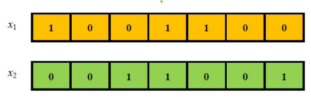

После обмена частями родительских хромосом получаем двух потомков $x_3$ и $x_4$:

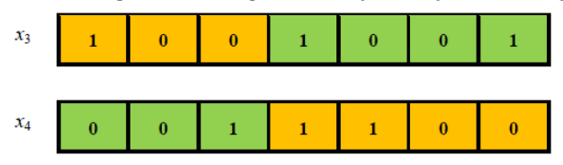

### Мутация
*Мутация* — генетический оператор, применяется к особи, в результате получается новая особь (частота мутаций — настраиваемый параметр ГА; существует несколько видов оператора мутации);

#### 📝 Пример для задачи о рюкзаке
Применим операцию мутации к особи $x_5$.

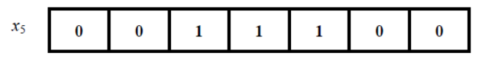

Мутация в одной позиции — это инверсия одного из разрядов. Например, инвертируя 4-й разряд, получим новую особь $x_6$:

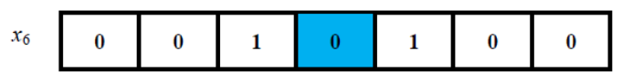

#### 📝 Пример для задачи коммивояжера

В задаче коммивояжера для 9 городов особь до мутации:

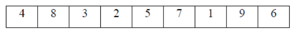

особь после мутации:

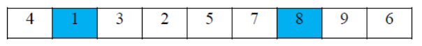

### Отбор
*Отбор родительских особей для скрещивания* — процедура выбора родительских особей из популяции для последующего скрещивания (доля $K\%$ отбираемых особей — настраиваемый параметр ГА; существует несколько способов отбора и организации пар для скрещивания):
* *принцип элитизма* (для скрещивания выбирается $K\%$ наиболее приспособленных особей популяции, из них произвольно составляются пары);
*  *принцип рулетки* (каждая особь имеет шанс принять участие в скрещивании, этот шанс для особи прямо пропорционален её приспособленности, вычисленной через Фитнес-функцию);
*  *принцип турнира* (вся популяция случайным образом разбивается на пары, внутри каждой пары выбирается «победитель» — это более приспособленная особь, далее победители снова разбиваются на пары, внутри каждой пары выбирается «победитель», далее из новых «победителей» составляются пары, в которых выявляются «победители» и т.д., пока число «победителей» не сравняется с долей в $K\%$ от объема популяции; в турнирном способе отбора особей для скрещивания каждая особь, кроме самых слабых, имеет шанс участвовать в скрещивании);

### Формирование новой популяции
*Формирование новой популяции* — процедура формирования следующего поколения на основе предыдущего (доля особей, переходящих из предыдущего поколения в следующее — настраиваемый параметр ГА);

### Завершение ГА
*Условие завершения работы ГА* — наступление хотя бы одной причины, из-за которой происходит завершение работы ГА;

Возможные причины завершения ГА:
* закончилось время, отведённое на работу ГА;
* количество поколений достигло заданной величины, которая является настраиваемым параметром ГА;
* отсутствие заметного прогресса (приспособленность лучшей особи изменялась незначительно на протяжении нескольких подряд идущих поколений; величина изменения приспособленности лучшей особи и количество поколений — настраиваемые параметры ГА).

### Общая схема Генетического алгоритма

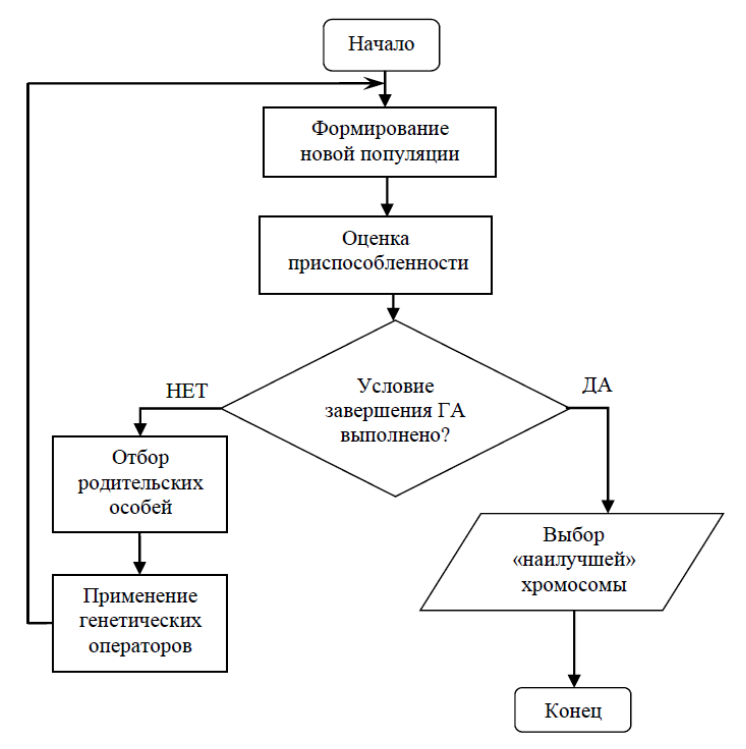

# 🎯 Генетический алгоритм для задачи о рюкзаке
## 📝 Пример
Рассмотрим пример работы ГА для решения задачи о рюкзаке, вместимость которого равна 20, а веса и стоимости предметов указаны в таблице:

| Номер предмета | 1 | 2 | 3 | 4 | 5 | 6 | 7 |
| :--- | :---: | :---: | :---: | :---: | :---: | :---: | :---: |
| Вес предмета | 10 | 6 | 11 | 4 | 1 | 4 | 3 |
| Стоимость предмета | 15 | 10 | 22 | 7 | 1 | 9 | 4 |

Анализ таблицы показывает, что все предметы не могут одновременно поместиться в рюкзак, т.к. их общий вес равен 39, что превышает вместимость рюкзака.

### 1. *Хромосома (особь)* — решение, закодированное в виде символьной строки;

| $x_1$ | 1 | 0 | 0 | 1 | 1 | 0 | 0 |
| :--- | :---: | :---: | :---: | :---: | :---: | :---: | :---: |

Данная хромосома кодирует следующее решение: в рюкзак кладём предметы с номерами 1, 4 и 5. Это пример бинарного кодирования решений.

### 2. *Популяция (поколение)* — множество особей (фиксированное количество, которое является одним из настраиваемых параметров ГА);

Пусть каждое поколение насчитывает 4 особи. Ниже приведены особи, образующие первое поколение (они сгенерированы случайным образом):

| $x_1$ | 1 | 0 | 0 | 1 | 1 | 0 | 0 |
| :--- | :---: | :---: | :---: | :---: | :---: | :---: | :---: |

| $x_2$ | 0 | 1 | 0 | 1 | 0 | 0 | 1 |
| :--- | :---: | :---: | :---: | :---: | :---: | :---: | :---: |

| $x_3$ | 0 | 1 | 1 | 0 | 0 | 1 | 1 |
| :--- | :---: | :---: | :---: | :---: | :---: | :---: | :---: |

| $x_4$ | 0 | 0 | 1 | 1 | 0 | 0 | 1 |
| :--- | :---: | :---: | :---: | :---: | :---: | :---: | :---: |

### 3ю *Приспособленность особи* — числовой показатель близости решения, закодированного с помощью данной особи, к точному ответу;

В данном примере приспособленность особи — это стоимость предметов, положенных в рюкзак.

| Номер предмета | 1 | 2 | 3 | 4 | 5 | 6 | 7 |
| :--- | :---: | :---: | :---: | :---: | :---: | :---: | :---: |
| Вес предмета | 10 | 6 | 11 | 4 | 1 | 4 | 3 |
| Стоимость предмета | 15 | 10 | 22 | 7 | 1 | 9 | 4 |

### 4. *Фитнес-функция* — функция $f$, вычисляющая приспособленность особи;

| $x_1$ | 1 | 0 | 0 | 1 | 1 | 0 | 0 |
| :--- | :---: | :---: | :---: | :---: | :---: | :---: | :---: |

$f(x_1) = 15 + 7 + 1 = 23$ (вес 15);

| $x_2$ | 0 | 1 | 0 | 1 | 0 | 0 | 1 |
| :--- | :---: | :---: | :---: | :---: | :---: | :---: | :---: |

$f(x_2) = 10 + 7 + 4 = 21$ (вес 13);

| $x_3$ | 0 | 1 | 1 | 0 | 0 | 1 | 1 |
| :--- | :---: | :---: | :---: | :---: | :---: | :---: | :---: |

$f(x_3) = 0$, т.к. выбранные предметы имеют суммарный вес 24 и не помещаются в рюкзак. Особь $x_3$ считается **нежизнеспособной**. Сгенерируем вместо неё новую особь $x_3$:

| $x_3$ | 0 | 0 | 0 | 1 | 1 | 1 | 1 |
| :--- | :---: | :---: | :---: | :---: | :---: | :---: | :---: |

$f(x_3) = 7 + 1 + 9 + 4 = 21$ (вес 12);

| $x_4$ | 0 | 0 | 1 | 1 | 0 | 0 | 1 |
| :--- | :---: | :---: | :---: | :---: | :---: | :---: | :---: |

$f(x_4) = 22 + 7 + 4 = 33$ (вес 18);

Как видим, самой приспособленной особью оказалась $x_4$.

### 5. *Отбор родительских особей* — процедура выбора родительских особей из популяции для последующего скрещивания (доля отбираемых особей — настраиваемый параметр ГА; существует несколько способов отбора);

Пусть в скрещивании участвует 50% особей популяции (в данном случае это две особи). Как выбрать эти две особи? Есть несколько правил выбора.

Например, можно выбрать две самые приспособленные особи. В данном случае это особи $x_1$ и $x_4$ с максимальными значениями фитнес-функции 23 и 33.

### 6. *Скрещивание (кроссинговер)* — генетический оператор, применяется к двум родительским особям, в результате получаются два потомка (существует несколько видов операторов скрещивания);

Применим к особям $x_1$ и $x_4$ одноточечное скрещивание. Точка разрыва хромосомы выбирается произвольно, например, между 3-й и 4-й позициями:

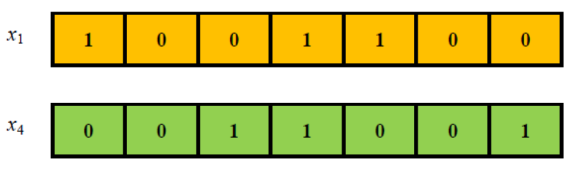

После обмена частями родительских хромосом получаем двух потомков $x_5$ и $x_6$:

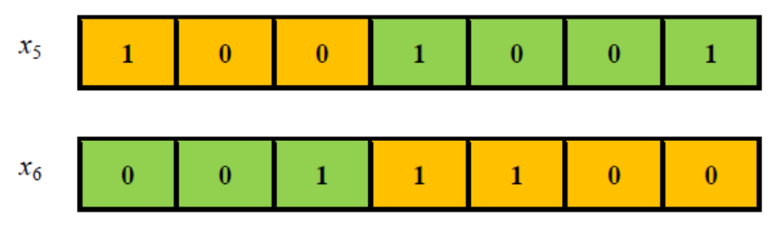

Их фитнес-функции:
$f(x_5) = 15 + 7 + 4 = 26$ (вес 17);
$f(x_6) = 22 + 7 + 1 = 30$ (вес 16).

Как видим, оба потомка оказались более приспособленными, чем первый из родителей, но менее приспособленными, чем второй.

### 7. *Мутация* — генетический оператор, применяется к особи, в результате получается новая особь (частота мутаций — настраиваемый параметр ГА; существует несколько видов оператора мутации);

Применим операцию мутации к особи $x_6$. Мутация в одной позиции — это инверсия одного из разрядов. Например, инвертируя 4-й разряд, получим новую особь $x_6$:

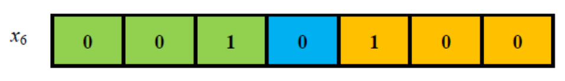

Её фитнес-функция $f(x_6) = 22 + 1 = 23$ (вес 12). Заметим, что мутация потомка $x_6$ привела к его ослаблению.

### 8. *Формирование новой популяции* — процедура формирования следующего поколения на основе предыдущего (доля особей, переходящих из предыдущего поколения в следующее — настраиваемый параметр ГА);

Пусть 50% лучших особей из первого поколения гарантированно переходит во второе поколение, а также лучшие из всех остальных особей первого поколения и их потомков. В данном случае во второе поколение войдут особи $x_1$ и $x_4$, а также их потомки $x_5$ и особь $x_6$:

| $x_1$ | 1 | 0 | 0 | 1 | 1 | 0 | 0 |
| :--- | :---: | :---: | :---: | :---: | :---: | :---: | :---: |

$f(x_1) = 15 + 7 + 1 = 23$ (вес 15);

| $x_4$ | 0 | 0 | 1 | 1 | 0 | 0 | 1 |
| :--- | :---: | :---: | :---: | :---: | :---: | :---: | :---: |

$f(x_4) = 22 + 7 + 4 = 33$ (вес 18);

| Номер предмета | 1 | 2 | 3 | 4 | 5 | 6 | 7 |
| :--- | :---: | :---: | :---: | :---: | :---: | :---: | :---: |
| Вес предмета | 10 | 6 | 11 | 4 | 1 | 4 | 3 |
| Стоимость предмета | 15 | 10 | 22 | 7 | 1 | 9 | 4 |

| $x_5$ | 1 | 0 | 0 | 1 | 0 | 0 | 1 |
| :--- | :---: | :---: | :---: | :---: | :---: | :---: | :---: |

$f(x_5) = 15 + 7 + 4 = 26$ (вес 17);

| $x_6$ | 0 | 0 | 1 | 0 | 1 | 0 | 0 |
| :--- | :---: | :---: | :---: | :---: | :---: | :---: | :---: |

$f(x_6) = 22 + 1 = 23$ (вес 12).

Как видим, суммарная приспособленность второго поколения ($23+33+26+23=105$) ожидаемо оказалась выше, чем первого поколения ($23+18+21+33=95$). Это напоминает процесс «эволюции» в живой природе.

### 9. *Условие завершения работы ГА* — наступление хотя бы одной причины, из-за которой происходит завершение работы ГА;

Возможные причины завершения ГА:
* закончилось время, отведённое на работу ГА;
* количество поколений достигло заданной величины, которая является настраиваемым параметром ГА;
* отсутствие заметного прогресса (приспособленность лучшей особи изменялась незначительно на протяжении нескольких подряд идущих поколений; величина изменения приспособленности лучшей особи и количество поколений — настраиваемые параметры ГА).

Пусть в нашем случае алгоритм завершит работу по прошествии трёх поколений. Это означает, что нам нужно повторить процедуру выбора особей для скрещивания из второго поколения, выполнить скрещивание и сформировать третье поколение.

Для скрещивания выберем две особи второго поколения по принципу «рулетки». Согласно принципу рулетки все особи имеют шанс участвовать в скрещивании, но этот шанс для каждой конкретной особи пропорционален значению фитнес-функции этой особи.

Очевидно, что в данной ситуации самые высокие шансы участвовать в скрещивании имеют особи $x_4$ и $x_5$. Однако, у остальных особей второго поколения такие шансы тоже есть. Пусть эти шансы реализовались у особей $x_4$ и $x_6$.

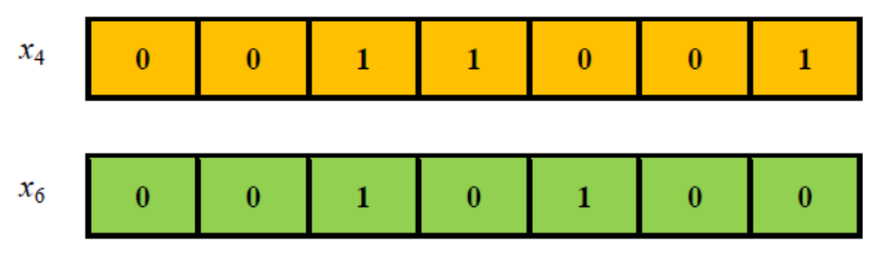

Применим двухточечное скрещивание. Выберем две произвольные точки разбиения хромосом. Пусть это будет точка между 3-й и 4-й позициями и точка между 5-й и 6-й позициями. Тогда получим потомков $x_7$ и $x_8$:

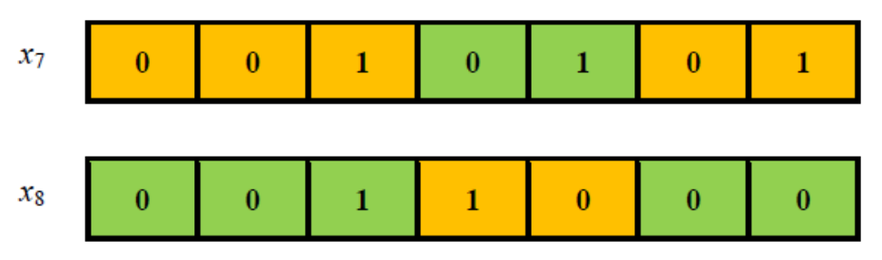

$f(x_7) = 22 + 1 + 4 = 27$ (вес 15);
$f(x_8) = 22 + 7 = 29$ (вес 15).

Осталось сформировать третье поколение. В него войдут особи $x_4, x_5, x_7, x_8$. Их суммарная приспособленность $33 + 26 + 27 + 29 = 115$. Она ещё выше, чем у особей второго поколения, т.е. наблюдается «эволюция». При этом лидер (самая приспособленная особь $x_4$) не менялся на протяжении трёх поколений.

На этом генетический алгоритм завершит работу и выдаст в качестве ответа наилучшую особь третьего поколения $x_4$. Она кодирует набор предметов с номерами 3, 4 и 7. Стоимость соответствующего рюкзака равна 33. При этом рюкзак имеет вес 18.

Заметим, что правильный ответ в рассмотренном примере – это рюкзак со стоимостью 39, что достигается при наборе предметов с номерами 3, 4, 5, 6.

| Номер предмета | 1 | 2 | **3** | **4** | **5** | **6** | 7 |
| :--- | :---: | :---: | :---: | :---: | :---: | :---: | :---: |
| Вес предмета | 10 | 6 | 11 | 4 | 1 | 4 | 3 |
| Стоимость предмета | 15 | 10 | 22 | 7 | 1 | 9 | 4 |

## Настройка параметров ГА
Рассмотрим ещё некоторые процедуры, применяемые в генетических алгоритмах, которые не были задействованы в данном примере.

### Несменяемость лидера
Одной из причин завершения работы генетического алгоритма может быть несменяемость лидера на протяжении нескольких поколений (в рассмотренном примере лидер оставался неизменным на протяжении трёх поколений). Разработчик алгоритма может установить параметр несменяемости, например, равный 10. Тогда ГА завершит работу, если лидер не будет меняться на протяжении 10 поколений подряд.

Несменяемость лидера на протяжении многих поколений не означает, что лидер является правильным решением задачи. Существует опасность, что лидер — это лишь точка локального экстремума, не совпадающая с искомой точкой глобального экстремума:

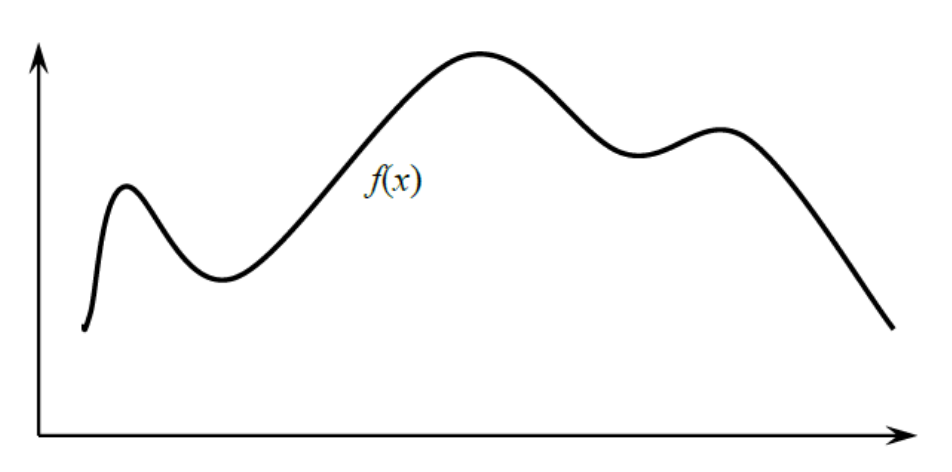

В процессе «эволюции» особи последующих поколений будут всё плотнее группироваться около такого лидера, вся популяция вместе с лидером попадёт в «ловушку» вблизи точки локального экстремума и наступит стабилизация. Шансов у популяции выбраться из такой «ловушки» почти нет. Чтобы такие шансы появились, применяют мутацию к некоторому малому числу особей популяции (около 3-5% от численности популяции). Возможно, что какие-то мутации окажутся полезными в том смысле, что они приведут появлению особей с высокой приспособленностью, сильно отличающихся от остальных особей популяции. Они сами (или их потомки) могут стать новыми лидерами, которые благодаря последующей «эволюции» выведут популяцию из «ловушки» локального экстремума.

### Турнир
В рассмотренном примере мы отбирали для скрещивания две самые приспособленные особи. Однако, если в скрещивании должно участвовать многие, но не все особи популяции, то возникает проблема выбора таких особей. Один из способов их выбора — метод рулетки — мы уже применяли. Его суть в том, что каждая особь имеет шанс участвовать в скрещивании. Этот шанс тем выше, чем выше приспособленность особи. Более строго: шанс конкретной особи оставить потомство прямо пропорционально её приспособленности.

Другой метод отбора особей для скрещивания — это использование турнира. Суть метода состоит в следующем: пусть популяция насчитывает 16 особей, а для скрещивания нужно отобрать только 2 из них. Тогда определим  параметр Размер турнира $k$, например $k = 4$, и выполним следующую процедуру:
1. Из всей популяции случайным образом выберем подмножество из 4 особей ($k = 4$),
2. Среди этих особей выберем одну с наивысшей приспособленностью.

Описанную процедуру будем выполнять столько раз, сколько особей требуется отобрать для скрещивания, то есть 2 раза для нашего примера. Каждый турнир проводится независимо, следовательно одна и та же особь может участвовать в нескольких турнирах или не участвовать ни в одном.  

Заметим, что турнирный метод отбора особей даёт шанс для скрещивания даже мало приспособленным особям. Это способствует большему разнообразию особей в популяции и, как следствие, снижает риск сползания популяции в точку локального экстремума. Размер турнира $k$ регулирует «давление отбора»: при малых значениях $k$ слабые особи имеют заметный шанс быть выбранными, то есть в популяции сохраняется разнообразие, при $k → n$ отбор приближается к элитизму.

### Равномерное скрещивание
Наряду с одноточечным и двухточечным скрещиванием иногда применяется равномерное скрещивание (кроссовер, кроссинговер). Принцип равномерного скрещивания особей заключается в следующем: пусть родительские хромосомы — это последовательности $(x_1, x_2, \dots, x_n)$ и $(y_1, y_2, \dots, y_n)$. Генерируется случайная последовательность $(z_1, z_2, \dots, z_n)$ из 0 и 1. Два потомка наследуют ча-
сти родительских хромосом согласно правилу: первый потомок получает от первого родителя только те номера $i = 1, 2, 3, \dots, n$ разрядов его хромосом, у которых $z_i = 1$. Оставшиеся разряды он получает от другого родителя. Для второго потомка применяется противоположное правило. Например, пусть

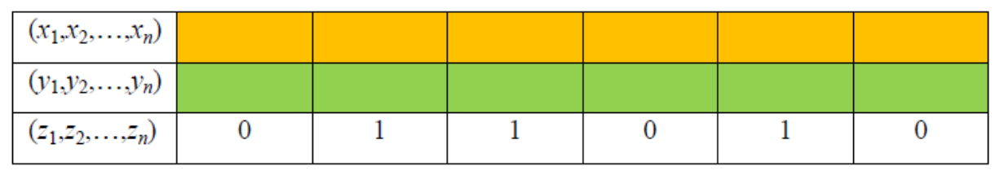

Тогда потомки наследуют фрагменты родительских хромосом по правилу:

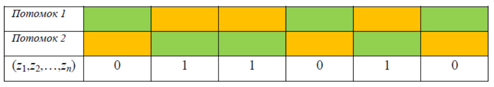

### Выводы

Настройка параметров генетического алгоритма – сама по себе сложная задача, потому что, во-первых, таких параметров много. Часть из них являются числовыми параметрами: численность популяции, процент особей допущенных к скрещиванию, процент особей подверженных мутациям. Часть параметров не выражается числом: причина завершения работы ГА, принцип отбора особей для скрещивания, тип оператора скрещивания.

Во-вторых, во время работы ГА часто используются генераторы псевдослучайных чисел. Из-за этого повторный запуск ГА, даже при фиксированных параметрах, приводит, как правило, к разным ответам – более точным или менее точным.

В-третьих, нет никаких конкретных рекомендаций по правильному выбору параметров ГА. Подходящие их значения подбираются экспериментально, в результате многочисленных запусков ГА и статистической обработки результатов его работы.
