# 🎯 Генетический алгоритм для задачи коммивояжера

Задача коммивояжера о кратчайшем гамильтоновом цикле — это типичная задача комбинаторной оптимизации. Её точное решение можно найти полным перебором всех замкнутых маршрутов, проходящих ровно по одному разу через каждую вершину графа. Если зафиксировать начальную вершину, в которую нужно вернуться, обойдя все вершины, то число таких маршрутов для ориентированного полного $n$-вершинного графа равно $(n - 1)!$, а для неориентированного графа $(n - 1)!/2$. Выполнить полный перебор всех маршрутов при больших $n$ за разумное время не представляется возможным.

Если пользователь не готов ждать, пока завершится полный перебор всех маршрутов, и согласен на приближенный ответ, то ему вполне может подойти генетический алгоритм. Рассмотрим, какие структуры данных мы будем применять в генетическом алгоритме и как будут выглядеть его основные логические блоки на примере конкретной задачи коммивояжера.

## 📝 Пример

Пусть имеется полный неориентированный 8-вершинный граф с матрицей расстояний (она симметрична относительно главной диагонали):

| | **1** | **2** | **3** | **4** | **5** | **6** | **7** | **8** |
| :---: | :---: | :---: | :---: | :---: | :---: | :---: | :---: | :---: |
| **1** | – | 8 | 2 | 7 | 6 | 3 | 5 | 7 |
| **2** | 8 | – | 9 | 3 | 9 | 3 | 9 | 4 |
| **3** | 2 | 9 | – | 7 | 9 | 4 | 6 | 5 |
| **4** | 7 | 3 | 7 | – | 3 | 8 | 9 | 7 |
| **5** | 6 | 9 | 9 | 3 | – | 7 | 4 | 3 |
| **6** | 3 | 3 | 4 | 8 | 7 | – | 5 | 6 |
| **7** | 5 | 9 | 6 | 9 | 4 | 5 | – | 4 |
| **8** | 7 | 4 | 5 | 7 | 3 | 6 | 4 | – |

Пронумеруем вершины графа числами 1, 2, 3, 4, 5, 6, 7, 8. Для кодирования замкнутых маршрутов будем использовать **натуральное кодирование**, при котором хромосома, кодирующая допустимое решение, представляет собой произвольную перестановку натуральных чисел от 1 до 8. Если считать, что начальная вершина маршрута всегда имеет номер 1, то все хромосомы будут начинаться с 1.

Примеры хромосом $x_1$ и $x_2$ для заданной матрицы расстояний:

| $x_1$ | 1 | 7 | 4 | 3 | 8 | 6 | 2 | 5 |
| :---: | :-: | :-: | :-: | :-: | :-: | :-: | :-: | :-: |

| $x_2$ | 1 | 2 | 5 | 8 | 4 | 7 | 3 | 6 |
| :---: | :-: | :-: | :-: | :-: | :-: | :-: | :-: | :-: |

Они кодируют соответственно маршруты (над стрелками указаны длины рёбер):

$x_1: 1 \xrightarrow{5} 7 \xrightarrow{9} 4 \xrightarrow{7} 3 \xrightarrow{5} 8 \xrightarrow{6} 6 \xrightarrow{3} 2 \xrightarrow{9} 5 \xrightarrow{6} 1$

$x_2: 1 \xrightarrow{8} 2 \xrightarrow{9} 5 \xrightarrow{3} 8 \xrightarrow{7} 4 \xrightarrow{9} 7 \xrightarrow{6} 3 \xrightarrow{4} 6 \xrightarrow{3} 1$

Фитнесс-функция $f(x)$ (т.е. степень приспособленности) конкретной особи $x$ — это длина маршрута, задаваемого этой особью (хромосомой). Например, для указанных выше особей $x_1$ и $x_2$

$$
f(x_1) = 5 + 9 + 7 + 5 + 6 + 3 + 9 + 6 = 50
$$

$$
f(x_2) = 8 + 9 + 3 + 7 + 9 + 6 + 4 + 3 = 49
$$

Работа генетического алгоритма начинается с формирования *начальной популяции*. Количество особей в популяции является одним из параметров алгоритма, который не меняется на протяжении всей его работы. Пусть в нашем случае популяция состоит из двух особей, например, указанных выше $x_1$ и $x_2$.

В результате скрещивания у двух родительских особей образуются два потомка. Оба они наследуют фрагменты родительских хромосом. В нашем алгоритме будем использовать процедуру одноточечного скрещивания, при которой родительские хромосомы разбиваются на два фрагмента. Каждый потомок получает по одному фрагменту от обоих родителей.

Заметим, что применять одноточечное скрещивание к хромосомам с *натуральным кодированием* маршрута нельзя, поскольку при таком кодировании в хромосомах потомков некоторые вершины графа могут отсутствовать. Действительно, если бы мы разбили родительские хромосомы $x_1$ и $x_2$ на две равные части, то получили бы хромосомы потомков $x_3$ и $x_4$ следующего вида:

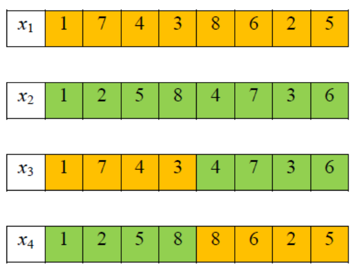

Как видим, в хромосоме $x_3$ отсутствуют вершины 2,5,8, а в хромосоме $x_4$ — вершины 3,4,7. Это означает, что особи $x_3$ и $x_4$ являются «нежизнеспособными», т.к. они не задают гамильтонова цикла в графе.

Чтобы скрещивание любых двух родительских особей гарантированно приводило к образованию двух «жизнеспособных» потомков, будем применять операцию скрещивания к **альтернативному способу кодирования** гамильтонова цикла. Альтернативный код особи $x_1$ выглядит следующим образом:

| $x_1$ | 1 | 6 | 3 | 2 | 4 | 3 | 1 | 1 |
| :---: | :-: | :-: | :-: | :-: | :-: | :-: | :-: | :-: |

Альтернативный код особи получается из её натурального кода в результате следующих операций: прочитывая слева направо числа в натуральном коде особи, будем последовательно удалять их из натурального кода и возрастающей перестановки 1,2,3,4,5,6,7,8. Номера позиций, на которых находились удалённые числа, будем записывать последовательно слева направо в альтернативный код особи $x_1$. После удаления очередного числа из возрастающей перестановки количество позиций в ней уменьшается на 1, а номера позиций оставшихся в ней чисел пересчитываются.

Ниже приведена последовательность действий по преобразованию натурального кода особи $x_1$ в её альтернативный код (красным цветом отмечено очередное удаляемое число, синим цветом в альтернативном коде отмечен номер позиции удаляемого числа в возрастающей перестановке):

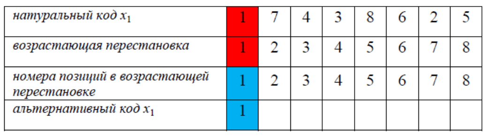

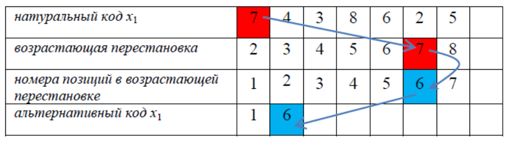

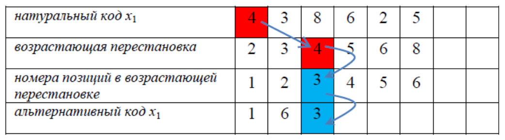

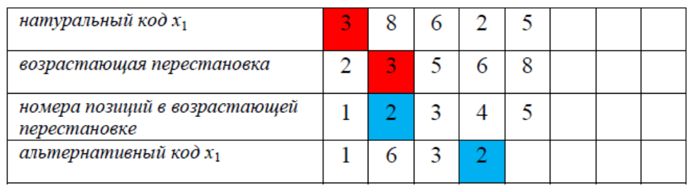

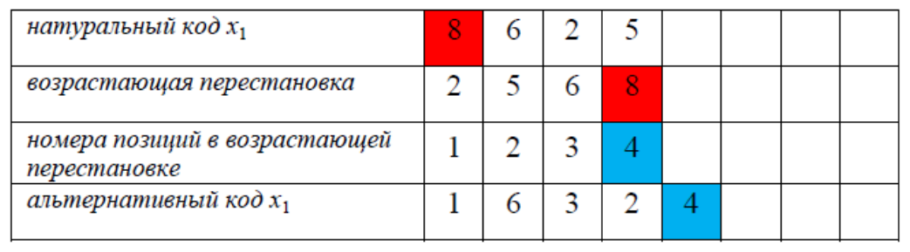

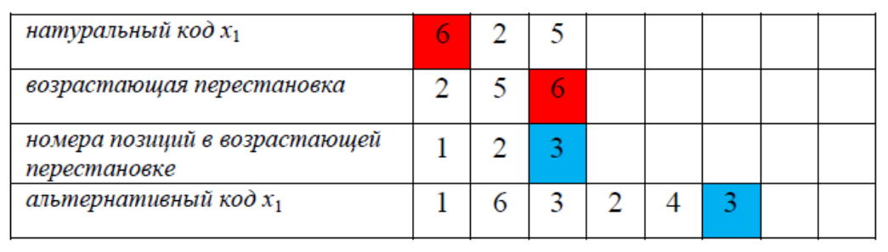

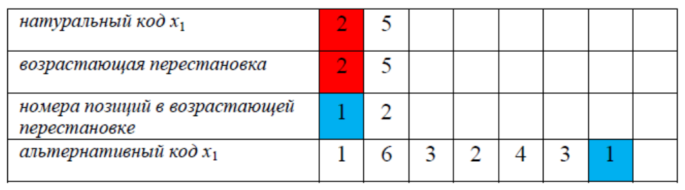

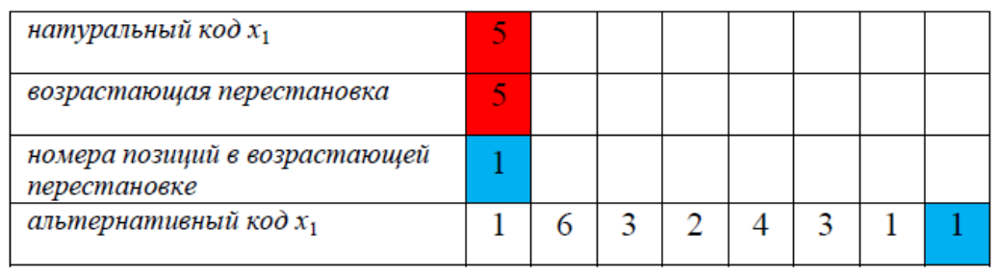

Аналогично преобразуем натуральный код особи $x_2$ в её альтернативный код:

| натуральный код $x_2$ | 1 | 2 | 5 | 8 | 4 | 7 | 3 | 6 |
| :--- | :---: | :---: | :---: | :---: | :---: | :---: | :---: | :---: |
| альтернативный код $x_2$ | 1 | 1 | 3 | 5 | 2 | 3 | 1 | 1 |

Отметим некоторые важные свойства альтернативного кода:
1) по альтернативному коду особи можно однозначно восстановить её натуральный код;
2) при скрещивании альтернативных кодов двух особей оба их потомка всегда являются «жизнеспособными»;
3) альтернативный код всегда начинается с единицы;
4) в альтернативном коде числа могут повторяться;
5) число, стоящее на $i$-ой позиции альтернативного кода, не превосходит величины $(n - i + 1)$, где $n$ — количество вершин в графе (отсюда следует, что в последней позиции альтернативного кода всегда стоит 1).

Наиболее важными для корректной работы генетического алгоритма являются первые два свойства альтернативного кода. Первое свойство позволяет легко вычислять фитнес-функцию хромосомы по заданной матрице расстояний. Второе свойство гарантирует, что любые две родительские особи порождают двух «жизнеспособных» потомков.

Выполним одноточечное скрещивание особей $x_1$ и $x_2$, используя их альтернативные коды:

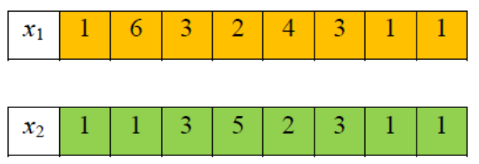

Пусть точка разбиения хромосом располагается между их 4-й и 5-й позициями. Тогда альтернативные коды потомков $x_3$ и $x_4$ будут иметь вид:

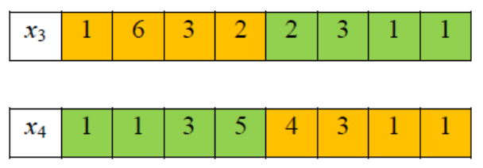

Чтобы вычислить приспособленность потомков, построим соответствующие им маршруты в графе. Для этого восстановим их натуральные коды, исходя из указанных выше альтернативных кодов. Восстановление натурального кода на основе альтернативного осуществляется также с использованием возрастающей перестановки 1,2,3,4,5,6,7,8. Ниже изображены последовательные шаги при построении натурального кода осо-би $x_3$:

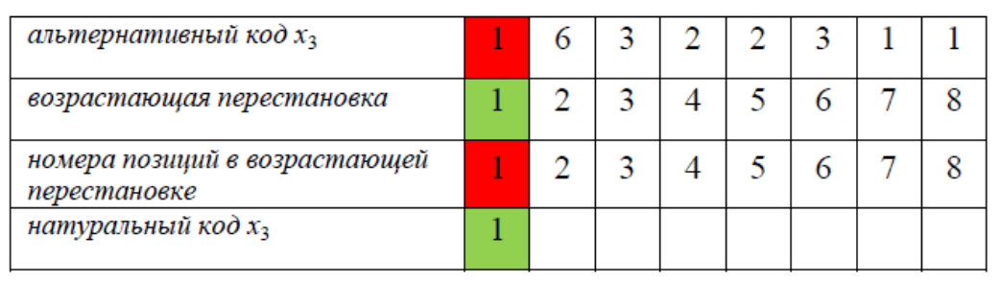

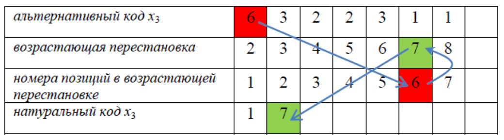

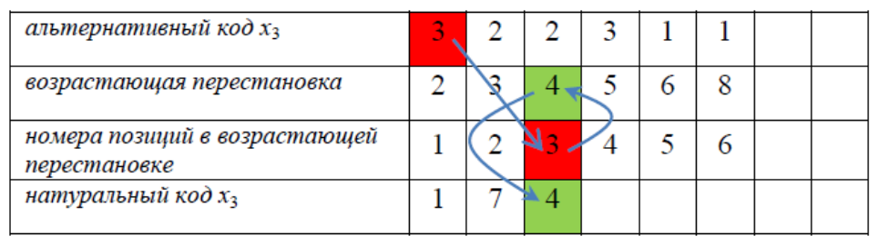

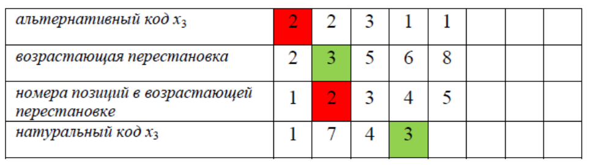

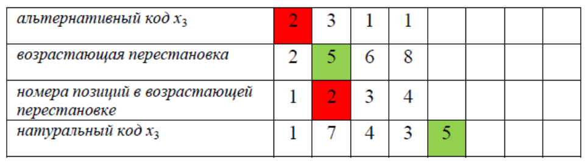

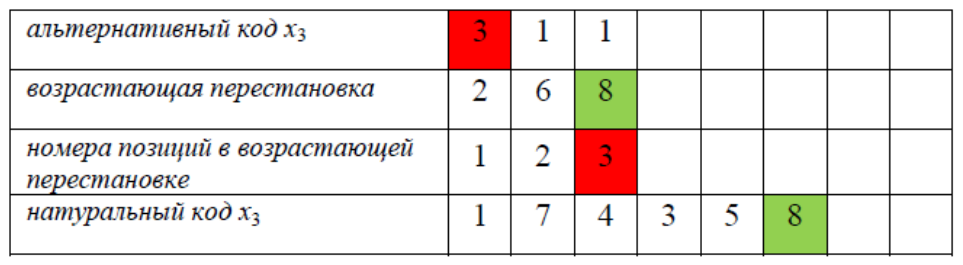

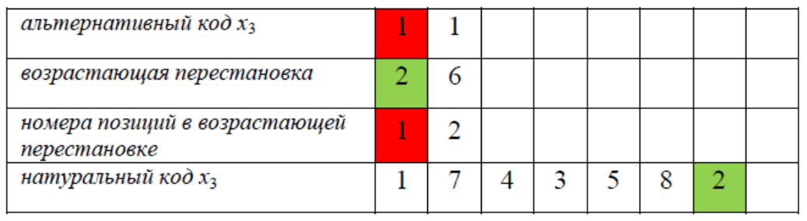

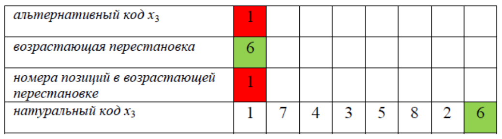

Зная теперь натуральный код особи $x_3$, вычислим длину соответствующего ей маршрута:

$$x_3: 1 \xrightarrow{5} 7 \xrightarrow{9} 4 \xrightarrow{7} 3 \xrightarrow{9} 5 \xrightarrow{3} 8 \xrightarrow{4} 2 \xrightarrow{3} 6 \xrightarrow{3} 1$$

Длина маршрута (она же приспособленность) оказалась равна 43, т.е. $f(x_3) = 43$.

Аналогично из альтернативного кода особи $x_4$ получим её натуральный код:

| альтернативный код $x_4$ | 1 | 1 | 3 | 5 | 4 | 3 | 1 | 1 |
| :--- | :---: | :---: | :---: | :---: | :---: | :---: | :---: | :---: |
| натуральный код $x_4$ | 1 | 2 | 5 | 8 | 7 | 6 | 3 | 4 |

Зная натуральный код особи $x_4$, построим соответствующий ей маршрут в графе:

$$x_4: 1 \xrightarrow{8} 2 \xrightarrow{9} 5 \xrightarrow{3} 8 \xrightarrow{4} 7 \xrightarrow{5} 6 \xrightarrow{4} 3 \xrightarrow{7} 4 \xrightarrow{7} 1$$

Длина этого маршрута равна 47, т.е. $f(x_4) = 47$. Как видим, оба потомка $x_3$ и $x_4$ оказались более приспособленными, чем родительские особи $x_1$ и $x_2$. Заметим, что потомки унаследовали начальные фрагменты родительских хромосом:

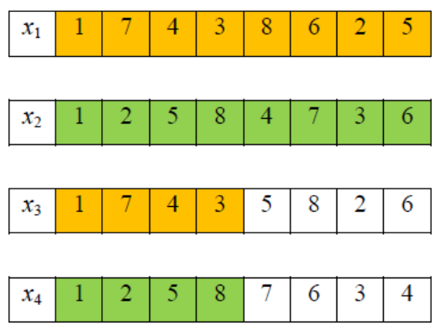

Согласно «принципу элитизма» второе поколение должно состоять из двух самых приспособленных особей среди $x_1, x_2, x_3$ и $x_4$, т.е. в данном случае из $x_3$ и $x_4$:

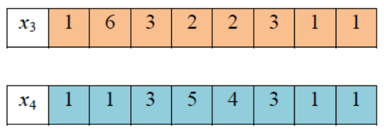

Применим к ним оператор двухточечного скрещивания, разбивая их альтернативные коды, например, между 3-й и 4-й позициями. В результате получим альтернативные коды двух потомков $x_5$ и $x_6$:

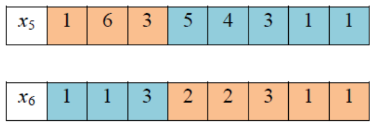

Чтобы построить маршруты, соответствующие потомкам $x_5$ и $x_6$, восстановим их натуральные коды:

| альтернативный код $x_5$ | 1 | 6 | 3 | 5 | 4 | 3 | 1 | 1 |
| :--- | :---: | :---: | :---: | :---: | :---: | :---: | :---: | :---: |
| натуральный код $x_5$ | 1 | 7 | 4 | 8 | 6 | 5 | 2 | 3 |

| альтернативный код $x_6$ | 1 | 1 | 3 | 2 | 2 | 3 | 1 | 1 |
| :--- | :---: | :---: | :---: | :---: | :---: | :---: | :---: | :---: |
| натуральный код $x_6$ | 1 | 2 | 5 | 4 | 6 | 8 | 3 | 7 |

Натуральным кодам потомков $x_5$ и $x_6$ соответствуют следующие маршруты в графе:

$$x_5: 1 \xrightarrow{5} 7 \xrightarrow{9} 4 \xrightarrow{7} 8 \xrightarrow{6} 6 \xrightarrow{7} 5 \xrightarrow{9} 2 \xrightarrow{9} 3 \xrightarrow{2} 1$$

$$x_6: 1 \xrightarrow{8} 2 \xrightarrow{9} 5 \xrightarrow{3} 4 \xrightarrow{8} 6 \xrightarrow{6} 8 \xrightarrow{5} 3 \xrightarrow{6} 7 \xrightarrow{5} 1$$

Длины этих маршрутов $f(x_5) = 54, f(x_6) = 50.$

Особь $x_5$ оказалась наименее приспособленной. Применим к ней операцию мутации в расчёте на то, что мутация повысит её приспособленность. Для этого изменим случайную позицию в альтернативном коде особи $x_5$. В силу свойства 5 альтернативного кода, число, стоящее на его $i$-ой позиции, не превосходит величины $(n - i + 1)$, где $n$ — количество вершин в графе. В нашем случае $n = 8$. Пусть, например, $i = 3$. В альтернативном коде особи $x_5$ в 3-й позиции записано число 3. Его можно заменить любым натуральным числом, не превосходящим $8 - 3 + 1 = 6$, например, числом 4. В результате такой мутации получим особь $x_7$, с альтернативным и натуральным кодом следующего вида:

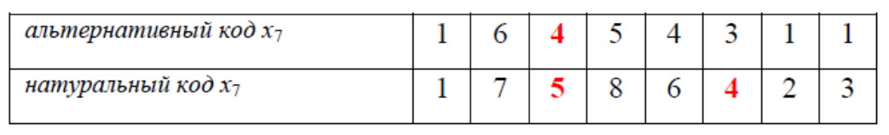

Заметим, что изменение 3-й позиции в альтернативном коде привело к изменению двух позиций (3-й и 6-й) в натуральном коде. Вычисляя длину маршрута, отвечающего особи $x_7$

$$x_7: 1 \xrightarrow{5} 7 \xrightarrow{4} 5 \xrightarrow{3} 8 \xrightarrow{6} 6 \xrightarrow{8} 4 \xrightarrow{3} 2 \xrightarrow{9} 3 \xrightarrow{2} 1,$$

получаем $f(x_7) = 40$. Таким образом, мутация хромосомы $x_5$ привела к значительному повышению её приспособленности.

Всякий генетический алгоритм завершает работу при наступлении определённого события. Таким событием может стать, например:
1) исчерпание лимита времени, отведённого на работу алгоритма;
2) генерация определённого числа поколений, которое задаётся в самом начале работы алгоритма и является его параметром;
3) несменяемость наиболее приспособленной особи (лидера популяции) на протяжении определённого числа поколений.

Пусть в нашем случае генетический алгоритм завершает работу, выдав в качестве ответа лидера 4-го поколения. Чтобы его найти, сформируем 3-е поколение и выполним скрещивание принадлежащих ему особей. Третье поколение состоит из двух наиболее приспособленных особей среди особей второго поколения $x_3$ и $x_4$ и их потомков $x_5$ и $x_7$ (с учётом мутации), т.е. из $x_3$ и $x_7$:

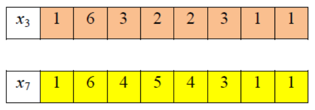

Выполним одноточечное скрещивание особей $x_3$ и $x_7$, разбивая их хромосомы на две равные части. В результате получим альтернативные коды потомков $x_8$ и $x_9$:

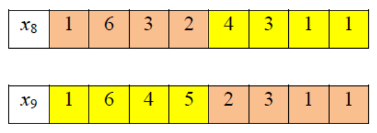

Натуральные коды потомков $x_8$ и $x_9$ имеют вид:

| $x_8$ | 1 | 7 | 4 | 3 | 8 | 6 | 2 | 5 |
| :---: | :-: | :-: | :-: | :-: | :-: | :-: | :-: | :-: |

| $x_9$ | 1 | 7 | 5 | 8 | 3 | 6 | 2 | 4 |
| :---: | :-: | :-: | :-: | :-: | :-: | :-: | :-: | :-: |

а соответствующие им маршруты:

$x_8: 1 \xrightarrow{5} 7 \xrightarrow{9} 4 \xrightarrow{7} 3 \xrightarrow{5} 8 \xrightarrow{6} 6 \xrightarrow{3} 2 \xrightarrow{9} 5 \xrightarrow{6} 1$

$x_9: 1 \xrightarrow{5} 7 \xrightarrow{4} 5 \xrightarrow{3} 8 \xrightarrow{5} 3 \xrightarrow{4} 6 \xrightarrow{3} 2 \xrightarrow{3} 4 \xrightarrow{7} 1$

Длины маршрутов $f(x_8) = 50$, $f(x_9) = 34$. Наиболее приспособленной среди особей третьего поколения и их потомков оказалась особь $x_9$. Длина задаваемого ею маршрута равна 34.

Таким образом, результатом работы нашего генетического алгоритма является маршрут

$$1 \xrightarrow{5} 7 \xrightarrow{4} 5 \xrightarrow{3} 8 \xrightarrow{5} 3 \xrightarrow{4} 6 \xrightarrow{3} 2 \xrightarrow{3} 4 \xrightarrow{7} 1.$$

Правильным ответом к данной задаче является маршрут

$$1 \xrightarrow{3} 6 \xrightarrow{3} 2 \xrightarrow{3} 4 \xrightarrow{3} 5 \xrightarrow{4} 7 \xrightarrow{4} 8 \xrightarrow{5} 3 \xrightarrow{2} 1,$$

длина которого равна 27. Его можно было бы найти полным перебором всех гамильтоновых циклов в данном графе. Таким образом, относительная погрешность результата, полученного генетическим алгоритмом, составляет

$$\Delta = \frac{34 - 27}{27} \cdot 100\% \approx 26\%$$

Очевидно, что увеличивая число поколений, можно было бы продлить работу нашего генетического алгоритма и получить более точный результат.
