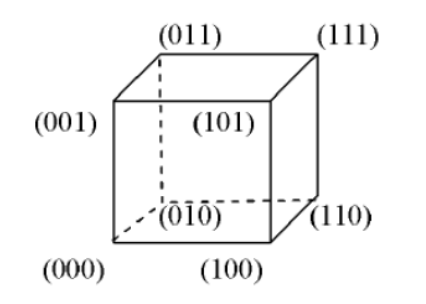
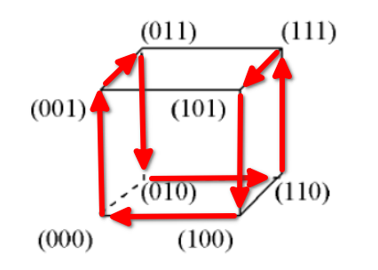
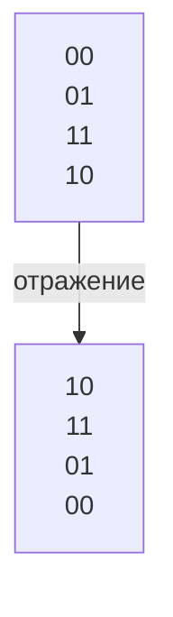
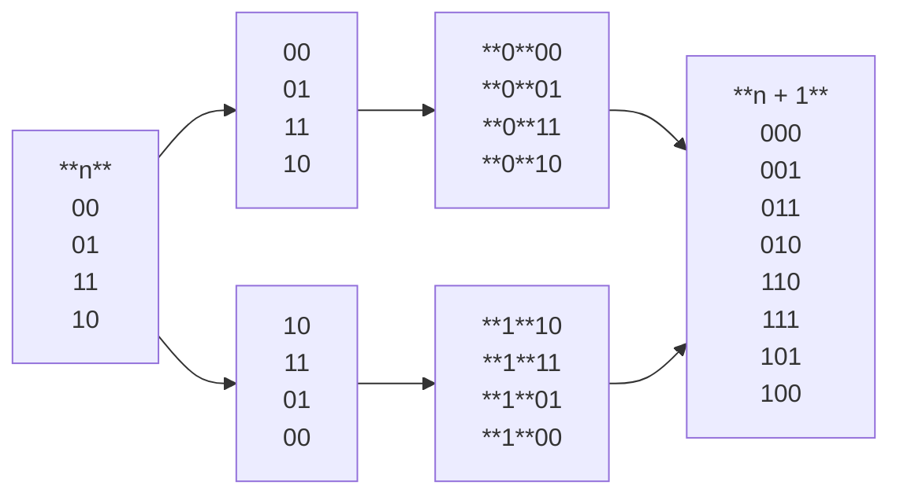
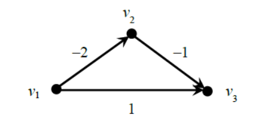
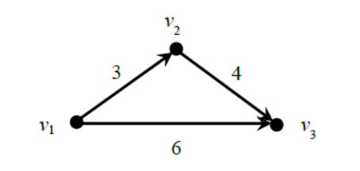
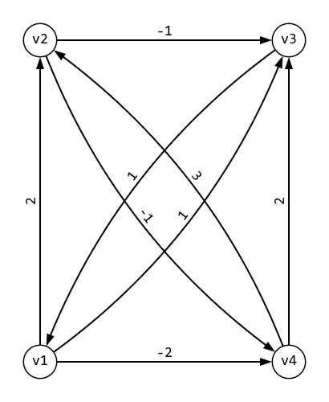
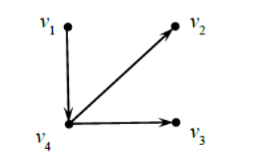

# Рекурсивные алгоритмы

Ранее мы начали рассматривать особый класс алгоритмов - рекурсивные алгоритмы. Было отмечено, что:
- В рекурсивном алгоритме используется понятие размерности задачи;
- При разработке рекурсивного алгоритма используется идея сведения исходной задачи к одной или нескольким похожим задачам меньшей размерности (если такое сведение возможно);
- При анализе сложности рекурсивного алгоритма часто возникают рекуррентные соотношения (которые иногда удаётся решить математическими методами);
- При программной реализации рекурсивного алгоритма рекурсию иногда можно заменить итерацией (что существенно уменьшает время работы алгоритма и объём используемой памяти);
- Встречаются более сложные виды рекурсии - двойная (тройная) рекурсия и взаимная рекурсия.

---

Теперь мы рассмотрим примеры рекурсивных алгоритмов (в том числе двойной, тройной и взаимной рекурсии) из разных областей дискретной математики: арифметики, комбинаторики, комбинаторной оптимизации, кодирования, теории графов.

## 📌 Арифметика. НОД.

Рассмотрим задачу нахождения $НОД(N, K)$ наибольшего общего делителя чисел $N$ и $К$. Для её решения хорошо известен алгоритм Евклида, который основан на следующем математическом факте:

$$
\text{если } N \leq K \text{, то } НОД(N, K) = НОД(К - N, N)
$$

Как видим, в этой формуле НОД от двух параметров $N$ и $К$ вычисляется через НОД, но от двух параметров $К - N$ и $N$. По сути, это двойная рекурсия.

Для того, чтобы «запустить» рекурсивный процесс, нужно ещё указать базу рекурсии. В данном случае она имеет вид:

$$
НОД(0, К) = К
$$

---

При вычислении, например, $НОД(36,56)$ согласно этому алгоритму придётся прежде вычислить $НОД(20,36)$, а до этого - вычислить $НОД(16,20)$, а перед этим - $НОД(4,16)$, $НОД(4,12)$, $НОД(4,8)$, $НОД(4,4)$ и $НОД(0,4)$, которое равно 4 из базы рекурсии. Таким образом получаем ответ: $НОД(36,56) = 4$.

Описанный алгоритма Евклида представляет собой его «медленную» версию, потому что есть ещё и «быстрая» версия. Она тоже рекурсивная, но использует менее очевидный математический факт:

$$
\text{если } N \leq K \text{, то }НОД(N, K) = НОД((К~mod~N), N)
$$

где $К mod N$ - это остаток от деления $К$ на $N$.

---

Сравним работу «медленной» и «быстрой» версии алгоритма Евклида при вычислении $НОД(2,99)$.

Последовательность вычислений в «медленной» версии:

$$
НОД(2,99) \longleftarrow НОД(2,97) \longleftarrow НОД(2,95) \longleftarrow НОД(2,93) \longleftarrow НОД(2,91) … \\
… НОД(2,5) \longleftarrow НОД(2,3) \longleftarrow НОД(1,2) \longleftarrow НОД(1,1) \longleftarrow НОД(0,1) = 1.
$$

Здесь мы видим, что для вычисления $НОД(2,99)$ надо вычислить НОД для 51 пары чисел, включая базу рекурсии.

Последовательность вычислений в «быстрой» версии намного короче:

$$
НОД(2,99) \longleftarrow НОД((99 mod 2),2) = НОД(1,2) \longleftarrow НОД((2 mod 1),1) = НОД(0,1) = 1.
$$

Здесь мы видим, что для вычисления $НОД(2,99)$ надо вычислить НОД лишь для двух пар чисел, включая базу рекурсии.

Заметим, что обе версии алгоритма Евклида можно использовать и для нахождения НОК - наименьшего общего кратного двух чисел, если применить правило:

$$
НОК(N, K) = \frac{N \cdot K} {НОД(N, K)}
$$

---

## 📌 Комбинаторика. Перестановки.

Один из самых часто встречающихся комбинаторных объектов - это перестановка первых N натуральных чисел. Известно, что существует ровно $N!$ таких перестановок. Вот, например, все 6 перестановок чисел 1,2,3, записанные в **лексикографическом** порядке:

$$
(1,2,3), (1,3,2), (2,1,3), (2,3,1), (3,1,2), (3,2,1).
$$

При решении некоторых задач методом полного перебора требуется сгенерировать все $N!$ перестановок, не пропустив случайно какую-нибудь, и не сгенерировав какую-нибудь перестановку дважды. Существует рекурсивный алгоритм, позволяющий это сделать. В отличие от рассмотренного выше рекурсивного алгоритма Евклида в данном примере мы будем иметь дело не с рекурсивной **функцией**, а с рекурсивной **процедурой**. На прошлой лекции у нас уже был пример двух рекурсивных процедур, вызывающих взаимно друг друга и генерирующих набор символьных строк в алфавите {0,1} с определёнными свойствами.

---

Рекурсивная процедура генерации всех перестановок из $N$ элементов $1,2,3,...,N$ получает на вход один единственный параметр - натуральное число $N$. Она вызывает саму себя, но с параметром $N- 1$, и получает список всех $(N- 1)!$ перестановок из элементов $1,2,3,...,N - 1$ (ниже в таблице $Т_0$ они перечислены в лексикографическом порядке):

| 1   | 2   | 3   | ... | N-2 | N-1 |
|-----|-----|-----|-----|-----|-----|
| 1   | 2   | 3   | ... | N-1 | N-2 |
| ... | ... | ... | ... | ... | ... |
| N-2 | N-1 | N-3 | ... | 2   | 1   |
| N-1 | N-2 | N-3 | ... | 2   | 1   |

---

Затем число $N$ вставляется в каждую строку таблицы $T_0$ перед её первым элементом и получается таблица $T_1$:

| **N** | 1   | 2   | 3   | ... | N-2 | N-1 |
|:-----:|:---:|:---:|:---:|:---:|:---:|:---:|
| **N** | 1   | 2   | 3   | ... | N-1 | N-2 |
| **N** | ... | ... | ... | ... | ... | ... |
| **N** | N-2 | N-1 | N-3 | ... | 2   | 1   |
| **N** | N-1 | N-2 | N-3 | ... | 2   | 1   |

Очевидно, что все строки таблицы $Т_1$ отличаются между собой. Затем в таблице $Т_1$ меняются местами первый и второй столбец. Получается таблица $Т_2$:

| 1   | **N** | 2   | 3   | ... | N-2 | N-1 |
|:---:|:-----:|:---:|:---:|:---:|:---:|:---:|
| 1   | **N** | 2   | 3   | ... | N-1 | N-2 |
| ... | **N** | ... | ... | ... | ... | ... |
| N-2 | **N** | N-1 | N-3 | ... | 2   | 1   |
| N-1 | **N** | N-2 | N-3 | ... | 2   | 1   |

Очевидно, что все её строки различаются между собой и отличаются от строк таблицы $Т_1$. Далее в таблице $Т_2$ меняются местами второй и третий столбец и получается таблица $Т_3$:

| 1   | 2   | **N** | 3   | ... | N-2 | N-1 |
|:---:|:---:|:-----:|:---:|:---:|:---:|:---:|
| 1   | 2   | **N** | 3   | ... | N-1 | N-2 |
| ... | ... | **N** | ... | ... | ... | ... |
| N-2 | N-1 | **N** | N-3 | ... | 2   | 1   |
| N-1 | N-2 | **N** | N-3 | ... | 2   | 1   |

Далее каждая следующая таблица $Т_{k+1}$ получается из предыдущей таблицы $T_k$ перестановкой $k$-го и $(k + 1)$-го столбцов. Последняя таблица $Т_N$ будет иметь вид:

| 1   | 2   | 3   | ... | N-2 | N-1 | **N** |
|:---:|:---:|:---:|:---:|:---:|:---:|:-----:|
| 1   | 2   | 3   | ... | N-1 | N-2 | **N** |
| ... | ... | ... | ... | ... | ... | **N** |
| N-2 | N-1 | N-3 | ... | 2   | 1   | **N** |
| N-1 | N-2 | N-3 | ... | 2   | 1   | **N** |

Очевидно, что все строки таблиц $T_1,T_2,T_3,…,T_N$ попарно различны, суммарное количество строк равно $N!$ и все они представляют собой искомые перестановки чисел $1,2,3,…,N$ (без повторений и пропусков).

## 📌 Теория кодирования. Коды Грэя.

В практических приложениях часто встречаются зеркальные коды Грэя. Коды Грэя следует отнести к классу равномерных двоичных кодов. Это означает, что все кодовые слова кода Грэя имеют одинаковую длину, а сами они состоят из 0 и 1.

Перечислим некоторые наиболее важные свойства кода Грэя:
1. Полный $n$-разрядный код Грэя содержит ровно $2^n$ кодовых слов (ровно столько же строк содержит таблица булевой функции от $n$ аргументов, причём все $2^n$ наборов аргументов в этой таблице являются кодовыми словами кода Грэя). например, для $n= 3$:

| 000 |
|:---:|
| 001 |
| 010 |
| 011 |
| 100 |
| 101 |
| 110 |
| 111 |

---

2. Существует *стандартная нумерация* кодовых слов $n$-разрядного кода Грэя числами $1,2,3,…, 2^n$ такая, что для каждого $і$ слова с номерами $і$ и $(і + 1)$ будут отличаться ровно в одном разрядке (т.е. расстояние Хэмминга между словами с соседними номерами будет равно 1), и слова с номерами 1 и $2^n$ тоже будут отличаться ровно в одном разряде), например, для = 3:

|  1  | 000 |
|:---:|:---:|
|  2  | 001 |
|  3  | 011 |
|  4  | 010 |
|  5  | 110 |
|  6  | 111 |
|  7  | 101 |
|  8  | 100 |

---

3. Геометрически кодовые слова кода Грэя можно изобразить в виде вершин $n$-мерного единичного куба в $n$-мерном пространстве (при этом сами кодовые слова будут означать координаты вершин), например, для $n = 3$:

---

4. Если перечислять кодовые слова кода Грэя в стандартной нумерации, то получим обход по рёбрам всех вершин этого графа ровно по одному разу (дважды посещаем только первую вершину); такой обход называется *гамильтоновым циклом* (он существует не во всех графах):

Из-за указанного свойства кода Грэя его иногда называют *циклическим* кодом. Оно означает, что в графе, представляющем собой $n$-мерный куб, существует гамильтонов цикл и его можно построить, используя стандартную нумерацию слов кода Грэя. Заметим, что даже проверка существования гамильтонова цикла в произвольном графе (а тем более - его построение) - это очень сложная задача. для решения которой до сих пор не известно ни одного эффективного алгоритма.

---

5. Сгенерировать кодовые слова $n$-разрядного кода Грэя в стандартной нумерации можно с помощью рекурсивной процедуры, зависящей от параметра $n$ - длины кодовых слов. Рассмотрим её более подробно: пусть мы уже построили кодовые слова $n$-разрядного кода Грэя и расположили их в порядке стандартной нумерации:

$$
G(n) = \begin{cases}
0 \cdot G(n-1), \\
1 \cdot rev(G(n-1))
\end{cases}
$$

где $rev$ — обращение порядка.

База рекурсии $G(1) = \\{ 0, 1 \\}$

Слева - имеющиеся кодовые слова $n$-разрядного кода Грэя, справа - искомые кодовые слова $(n+1)$-разрядного кода Грэя, расположенные в порядке стандартной нумерации. Последовательность действий объясняет, почему коды Грэя иногда называют зеркальными (или отражёнными) кодами.

---

## 📌 Теория графов. Алгоритм Флойда.

Важной прикладной задачей, достаточно подробно изученной в рамках теории графов, является задача о минимальном пути. Она возникает, например, когда в сети дорог, соединяющих несколько населённых пунктов, требуется найти такой путь из пункта А в пункт В (проходящий, возможно, через другие населённые пункты), чтобы суммарная длина дорог, составляющих этот путь, была минимальной. Иногда требуется, чтобы такой путь обеспечивал минимальные затраты на перевозку груза или минимальное время доставки груза. Всё это разные варианты задачи о минимальном пути.

Существует несколько алгоритмов, решающих задачу поиска минимального пути. Из курса дискретной математики нам известен алгоритм Дейкстры. Однако, этот алгоритм нельзя применять, когда некоторые элементы исходной матрицы $D$ «расстояний» - отрицательные числа. В некоторых практических задачах такое вполне возможно. Например, элементы матрицы $D$ могут означать величину получаемой прибыли или выплачиваемого штрафа при выборе ребра, соответствующего данному элементу матрицы. Здесь естественно считать, что прибыль выражается положительным числом, а штраф - отрицательным.

---

Иногда программисты допускают ошибку, исправляя исходную матрицу расстояний $D$ так, чтобы все её элементы стали строго положительными, и затем применяя к новой матрице алгоритм Дейкстры. Почему так нельзя делать?

Рассмотрим конкретный пример. Пусть задана матрица расстояний ориентированного графа:

$$
D=\begin{pmatrix}
& 0 & -2 & 1 \\
& \infty & 0 & -1 \\
& \infty & \infty & 0 \\
\end{pmatrix}
$$

Сам граф изображён на рисунке.

Очевидно, что кратчайший ориентированный путь из $v_1$ в $v_3$ имеет длину $-3$ и состоит из двух дуг: $v_1 \longrightarrow v_2 \longrightarrow v_3$.

---

Однако, после добавления числа 5 к элементам матрицы (чтобы длины всех дуг стали положительными), мы получим граф вида

Если теперь применить к нему алгоритм Дейкстры, то получим, что кратчайший путь из $v_1$ в $v_3$ имеет длину 6 и состоит из одной дуги $v_1 \longrightarrow v_3$ Это не соответствует первоначальному графу.

**Вывод**: если в матрице расстояний присутствуют отрицательные числа, нельзя корректировать матрицу и применять к ней алгоритм Дейкстры! Нужно использовать другие алгоритмы, например, рекурсивный алгоритм Флойда.

---

В отличие от алгоритма Дейкстры, алгоритм Флойда находит кратчайшие пути сразу для всех пар вершин. Исходными данными является квадратная матрица $n$-го порядка $D_0$ - матрица длин дуг ориентированного $n$-вершинного графа. Считается, что отсутствующие ребра имеют бесконечно большую длину, а соответствующие им элементы в матрице $D_0$ равны $\infty$. Матрицы $D_0$ и $Т_0$ порождают последовательность квадратных матриц п-го порядка $D_1, T_1, D_2, T_2, ..., D_n, Т_n$, элементы которых вычисляются с помощью рекуррентных соотношений

$$
\begin{align}
& d^{(k)}_{i,j} = min \\{ d^{(k-1)}_{i,j},d^{(k-1)}_{i,k} + d^{(k-1)}_{k,j} \\} \\
& t^{(k)}_{i,j} = \begin{cases}
t^{(k-1)}_{i,j}\text{, если }d^{(k)}_{i,j}=d^{(k-1)}_{i,j},\\
t^{(k-1)}_{i,k}\text{ иначе, }
\end{cases}\\
& t^{(0)}_{i,j} = j, \\
& i,j,k =1, 2,…, n,
\end{align}
$$

где $d^{(k)}_{i,j}$ элемент $i$-й строки $j$-го столбца в матрице $D_k$,

$t^{(k)}_{i,j}$ элемент $i$-й строки $j$-го столбца в матрице $T_k$.

---

Для каждой пары $і$ и $j$, где $і \neq j$, элемент $d^{(k)}_{i,j}$ равен длине пути, который является кратчайшим среди всех ориентированных путей, 
идущих из вершины $v_i$ в вершину $v_j$ и, возможно, проходящих через какие-либо из вершин $v_1, v_2, …, v_k$. 

В таком случае элемент $d^{(n)}_{i,j}$ матрицы $D_n$, равен длине искомого кратчайшего пути, идущего из $v_i$, в $v_j$, и, возможно, проходящего через какие угодно вершины графа.

Последовательность, в которой вершины встречаются вдоль искомого кратчайшего пути, определяется с помощью матрицы $T_n$. 

Элемент $t^{(n)}_{i,j}$ равен номеру вершины, следующей сразу же за вершиной $v_i$, в кратчайшем пути из $v_i$ в $v_j$. 

Например, равенство $t^{(n)}_{2,5} = 6$ означает, что для перехода по кратчайшему пути из $v_2$ в $v_5$ нужно сначала по дуге перейти из $v_2$ в $v_6$, а затем по кратчайшему пути попасть из $v_6$ в $v_5$. 

В свою очередь, кратчайший путь из $v_6$ в $v_5$ определяется элементом $t^{(n)}_{6,5}$. 

Если, например, $t^{(n)}_{6,5} = 4$, то для перехода по кратчайшему пути из $v_6$ в $v_5$ нужно сначала пройти по дуге $[v_6,v_4]$, а затем двигаться по кратчайшему пути из $v_4$ в $v_5$ и т.д.

---

Работу алгоритма Флойда рассмотрим на примере орграфа с заданной матрицей длин дуг

$$
D_0=\begin{pmatrix}
& 0 & 2 & 1 & -2 \\
& \infty & 0 & -1 & -1 \\
& 1 & \infty & 0& \infty  \\
& \infty & 3 & 2 & 0
\end{pmatrix}
$$

Заметим, что алгоритм Дейкстры в данном случае применять нельзя, т.к. некоторые дуги имеют отрицательную длину.

Матрица $Т_0$ в данном случае имеет вид

$$
T_0=\begin{pmatrix}
& 1 & 2 & 3 & 4 \\
& 1 & 2 & 3 & 4 \\
& 1 & 2 & 3 & 4 \\
& 1 & 2 & 3 & 4
\end{pmatrix}
$$

Вычисляя элементы матриц $D_1, T_1, D_2, T_2, D_3, T_3, D_4, T_4$, с помощью указанных выше рекуррентных соотношений, получаем

$$
D_1=\begin{pmatrix}
& 0 & 2 & 1 & -2 \\
& \infty & 0 & -1 & -1 \\
& 1 & 3 & 0& -1  \\
& \infty & 3 & 2 & 0
\end{pmatrix},
T_1=\begin{pmatrix}
& 1 & 2 & 3 & 4 \\
& 1 & 2 & 3 & 4 \\
& 1 & 1 & 3 & 1 \\
& 1 & 2 & 3 & 4
\end{pmatrix}
$$

Почему изменился элемент $d^{(1)}_{3,2}$?

$$
d^{(1)}_{3,2} = min\\{d^{(0)}_{3,2},d^{(0)}_{3,1} + d^{(0)}_{1,2} \\} = min\\{\infty, 1 + 2\\} = 3
$$

Как вычислили элемент $t^{(1)}_{3,2}$?

$$
t^{(1)}_{3,2} = t^{(0)}_{3,2} = 1
$$

Продолжаем рекурсивные вычисления:

$$
D_2=\begin{pmatrix}
& 0 & 2 & 1 & -2 \\
& \infty & 0 & -1 & -1 \\
& 1 & 3 & 0& -1  \\
& \infty & 3 & 2 & 0
\end{pmatrix},
T_2=\begin{pmatrix}
& 1 & 2 & 3 & 4 \\
& 1 & 2 & 3 & 4 \\
& 1 & 1 & 3 & 1 \\
& 1 & 2 & 3 & 4
\end{pmatrix}
$$

Почему не изменился элемент $d^{(2)}_{4,1}$ ?

$$
d^{(2)}_{4,1} = min\\{d^{(2)}_{4,1},d^{(1)}_{4,2} + d^{(1)}_{2,1} \\} = min\\{\infty, 3 + \infty\\} = \infty
$$

---

Продолжаем рекурсивные вычисления:

$$
D_3=\begin{pmatrix}
& 0 & 2 & 1 & -2 \\
& 0 & 0 & -1 & -2 \\
& 1 & 3 & 0& -1  \\
& 3 & 3 & 2 & 0
\end{pmatrix},
T_3=\begin{pmatrix}
& 1 & 2 & 3 & 4 \\
& 3 & 2 & 3 & 3 \\
& 1 & 1 & 3 & 1 \\
& 3 & 2 & 3 & 4
\end{pmatrix}
$$

Почему изменился элемент $d^{(3)}_{4,1}$ ?

$$
d^{(3)}_{4,1} = min\\{d^{(2)}_{4,1},d^{(2)}_{4,3} + d^{(2)}_{3,1} \\} = min\\{\infty, 2 + 1\\} = 3
$$

Как вычислили элемент $t^{(3)}_{4,1}$?

$$
t^{(3)}_{4,1} = t^{(2)}_{4,3} = 3
$$

Завершаем рекурсивные вычисления:

$$
D_4=\begin{pmatrix}
& 0 & 1 & 0 & -2 \\
& 0 & 0 & -1 & -2 \\
& 1 & 2 & 0 & -1  \\
& 3 & 3 & 2 & 0
\end{pmatrix},
T_4=\begin{pmatrix}
& 1 & 4 & 4 & 4 \\
& 3 & 2 & 3 & 3 \\
& 1 & 1 & 3 & 1 \\
& 3 & 2 & 3 & 4
\end{pmatrix}
$$

Длины кратчайших ориентированных путей указаны в матрице $D_4$, а сами пути нетрудно восстановить, используя матрицу $Т_4$. Таким образом получаем следующие кратчайшие пути (в скобках указаны их длины):

$$
\begin{align}
& v_1 \longrightarrow v_4 \longrightarrow v_2 (1), v_1 \longrightarrow v_4 \longrightarrow v_3 (0), \\
& v_1 \longrightarrow v_4 (-2), v_2 \longrightarrow v_3 \longrightarrow v_1 (0), \\
& v_2 \longrightarrow v_3 (-1), v_2 \longrightarrow v_3 -> v_1 \longrightarrow v_4 (-2), \\
& v_3 \longrightarrow v_1 (1), v3 \longrightarrow v_1 \longrightarrow v_4 \longrightarrow v_2 (2),\\
& v_3 \longrightarrow v_1 \longrightarrow v_4 (-1), v_4 \longrightarrow v_3 \longrightarrow v_1 (3), \\
& v_4 \longrightarrow v_2 (3), v_4 \longrightarrow v_3 (2).
\end{align}
$$

---

Почему, например, кратчайший путь из $v_2$ в $v_4$ состоит из трёх дуг $v_2 \longrightarrow v_3 -> v_1 \longrightarrow v_4$?

Согласно матрице $Т_4$ элемент $t^{(4)}_{2,4} = 3$. 

Следовательно, из $v_2$ нужно сначала идти в $v_3$. Чтобы понять, куда двигаться дальше, посмотрим на элемент $t^{(3)}_{3,4} = 1$.

Значит из $v_3$ надо дальше идти в $v_1$. Теперь посмотрим на элемент $t^{(2)}_{1,4} = 4$ 

Поскольку мы уже попали в нужную нам вершину v4, то получаем, что кратчайший путь из $v_2$ B $v_4$ имеет вид:

$$
v_2 \longrightarrow v_3 -> v_1 \longrightarrow v_4
$$

а его длина - это элемент $d^{(4)}_{2,4}$. Проверка: $(-1)+1+(-2)=(-2)$.

На рисунке изображено дерево кратчайших путей от вершины $v_1$ до остальных вершин графа.

---

Обсудим программную реализацию алгоритма Флойда. Для $n$-вершинного графа алгоритм Флойда последовательно строит $2n$ квадратных матриц $n$-го порядка $D_1, T_1, D_2, T_2, …, D_n, T_n$, элементы которых вычисляются с помощью рекуррентных соотношений

$$
\begin{align}
& d^{(k)}_{i,j} = min\\{d^{(k-1)}_{i,j},d^{(k-1)}_{i,k} + d^{(k-1)}_{k,j} \\} \\
& t^{(k)}_{i,j} = \begin{cases}
t^{(k-1)}_{i,j}\text{, если }d^{(k)}_{i,j}=d^{(k-1)}_{i,j},\\
t^{(k-1)}_{i,k}\text{ иначе, }
\end{cases}\\
& t^{(0)}_{i,j} = j, \\
& i,j,k =1, 2,…, n,
\end{align}
$$

где $d^{(k)}_{i,j}$ элемент $i$-й строки $j$-го столбца в матрице $D_k$,

$t^{(k)}_{i,j}$ элемент $i$-й строки $j$-го столбца в матрице $T_k$.

Очевидно, что указанные рекуррентные соотношения можно программно реализовать с помощью итерации. Однако, сделать это можно двумя способами, один из которых существенно более экономно расходует память.

---

Первый (менее экономный) способ состоит в том, чтобы использовать два *трёхмерных* массива $D(i,j,k)$ и $T(i,j,k)$, где $i,j,k=1,2,…,n$. Оба массива состоят из $n^3$ элементов, причём $D$ содержит в себе матрицы $D_1, D_2, …, D_n$, а массив $T$ - матрицы $T_1, Т_2, …, Т_n$. При больших $n$ хранение массивов $D$ и $Т$ может потребовать значительного объема памяти.

Второй (более экономный) способ использует два факта:
1. Ответ к задаче всегда содержится в двух последних матрицах $D_n$, $Т_n$, причем длины кратчайших путей указаны в матрице $D_n$, а их структура - в матрице $Т_n$;
2. Каждая последующая матрица в ряду $D_1, D_2, …, D_n$, вычисляется только через предыдущую матрицу этого ряда, и каждая матрица в ряду $T_1, Т_2, …, T_n$ также вычисляется только через предыдущую матрицу этого ряда.

---

Это означает, что нам не нужно хранить оба ряда матриц $D_1, D_2, …, D_n, и T_1, T_2,..., T_n$, а достаточно использовать лишь 4 двумерных массива $D_{old}$, $D_{new}$, $T_{old}$, $T_{new}$ - Массивы $D_{new}$ и $T_{new}$ будут вычисляться через $D_{old}$ и $T_{old}$ с помощью рекуррентных соотношений, а затем элементы из массивов $D_{new}$ и $T_{new}$ будут переноситься в массивы $D_{old}$ и $T_{old}$.

Такой приём позволяет заменить двумерную рекурсию одномерной, а трёхмерную - двумерной и т.д. Его можно (и нужно) использовать при написании программного кода тогда, когда рекуррентное соотношение имеет фиксированную глубину (т.н. глубину рекурсии). Для арифметической и геометрической прогрессии глубина рекурсии равна 1, а для чисел Фибоначчи - 2. «Глубина рекурсии» по сути совпадает с глубиной стека, который можно использовать в итерационном программном коде.
