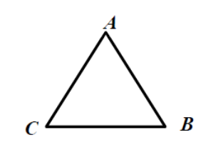

# Решение рекуррентных соотношений

Программный инженер может столкнуться с рекуррентным соотношением при разработке рекурсивных вычислительных алгоритмов, а также при оценке их сложности. Поэтому очень важно иметь представление о том, как такие рекуррентные соотношения возникают и как их решать.

**Рекуррентное соотношение** — это уравнение, в котором значение последовательности выражается через предыдущие значения.

В настоящее время далеко не все рекуррентные соотношения удаётся решить с помощью чётких правил или алгоритмов. Однако для некоторых соотношений это возможно. Например, для соотношений вида:

$$
x_n = C_1 \cdot x_{n-1} + C_2 \cdot x_{n-2} + C_3 \cdot x_{n-3} + ... + C_{k} \cdot x_{n-k}
$$

где $C_1, C_2, C_3, …, C_k$ - некоторые константы.

Это так называемое **линейное однородное рекуррентное соотношение с постоянными коэффициентами и фиксированной глубиной $k$**.

---

Что означают отдельные слова в таком длинном названии?
- «линейное» означает, что все переменные $x$, встречаются в этом равенстве только в **первой** степени;
- «однородное» означает, что в этом равенстве нет никаких **дополнительных слагаемых в виде функций, зависящих от $n$**;
- с постоянными коэффициентами» означает, что каждая переменная $x$ умножается на свою **константу $C$**;
- «фиксированная глубина» означает, что при всех $n$ переменная $x_n$, выражается через $k$ предыдущих переменных, где $k$ - фиксированное число.

---
## 📌 Примеры рекуррентных соотношений
| Пример | Характеристики |
|:----|:----|
| $b_n = b_{n - 1} \cdot q$ | линейное однородное рекуррентное соотношение с постоянными коэффициентами глубины 1 |
| $f_{n+2} = f_{n+1} + f_n$ | линейное однородное рекуррентное соотношение с постоянными коэффициентами глубины 2 |
| $а_n = а_{n-1} + d$ | линейное **неоднородное** рекуррентное соотношение с постоянными коэффициентами глубины 1 |
| $z_n = n \cdot z_{n-1} + 2n - 1$ | линейное **неоднородное** рекуррентное соотношение с **переменными коэффициентами** глубины 1 |
| $х_n = 5(x_{n-3})^2 + log_2n$ | **нелинейное неоднородное** глубины 3|

---

## 📌 Метод неопределённых коэффициентов

Для того чтобы решить рекуррентное соотношение глубины $k$, нужно задать ровно $k$ начальных условий. Например, указать, чему равны $x_1, x_2, x_3, …, x_k$. Существует универсальный метод для решения линейного однородного рекуррентного соотношения с постоянными коэффициентами и фиксированной глубиной. Его можно назвать методом неопределённых коэффициентов. Он состоит из следующих шагов:

1. Составить и решить характеристическое уравнение

$$
\lambda^n= C_1 \cdot \lambda^{n-1} + C_2 \cdot \lambda^{n-2} + C_3 \cdot \lambda^{n-3} + ... + C_k \cdot \lambda^{n-k}
$$

где неизвестным является $\lambda$;

2. Если все корни $\lambda_1, \lambda_2, \lambda_3, …,\lambda_k$ характеристического уравнения различны, то можно записать ответ к рекуррентному соотношению в виде *формулы общего решения*:

$$
x_n = A_1 \cdot \lambda^n_1 + A_2 \cdot \lambda^n_2 + A_3 \cdot \lambda^n_3 + ... + A_k \cdot \lambda^n_k
$$

где константы $А_1, А_2, А_3,…, A_k$ находятся однозначно через $k$ начальных условий $x_1, x_2, x_3, ..., x_k$.

3. Если среди корней характеристического уравнения есть только $s$ различных корней $\lambda_1, \lambda_2, \lambda_3, …, \lambda_s$, с кратностями $m_1, m_2, m_3, ..., m_s$, соответственно (т.е. у характеристического уравнения имеются повторяющиеся корни), то ответ к рекуррентному соотношению следует записать в виде *формулы общего решения*:

$$
x_n = P_1(n) \cdot \lambda^n_1 + P_2(n) \cdot \lambda^n_2 + P_3(n) \cdot \lambda^n_3 + ... + P_s(n) \cdot \lambda^n_s
$$

где $P_1(n), P_2(n), …, P_s(n)$ - полиномы от $n$ степени $(m_1 - 1), (m_2 - 1), (m_3 - 1),… (m_s - 1)$ соответственно. Коэффициенты в этих полиномах находятся однозначно через $k$ начальных условий $x_1, x_2, x_3, ..., x_k$.

Произведение полинома на экспоненту называется *квазиполиномом*. Можно сказать, что *общее решение* представляет собой сумму квазиполнномов с *разными* экспонентами.

В указанном методе сначала записывается *формула общего решения*, а затем в этой формуле уточняются коэффициенты, исходя из начальных условий. Полученная в результате формула будет задавать т.н. *частное решение*.

---

## 📌 Пример 1. Ленточный определитель

Требуется вычислить определитель $n$-го порядка

$$
x_n =     
 \begin{vmatrix}    
  6 & 9 & 0 & 0 & \cdots & 0 & 0 & 0 \\    
  1 & 6 & 9 & 0 & \cdots & 0 & 0 & 0 \\    
  0 & 1 & 6 & 9 & \cdots & 0 & 0 & 0 \\    
  0 & 0 & 1 & 6 & \cdots & 0 & 0 & 0 \\    
  \vdots  & \vdots & \vdots& \vdots & \ddots & \vdots & \vdots & \vdots \\    
  0 & 0 & 0 & 0 & \cdots & 6 & 9 & 0 \\    
  0 & 0 & 0 & 0 & \cdots & 1 & 6 & 9 \\    
  0 & 0 & 0 & 0 & \cdots & 0 & 1 & 6 \\     
 \end{vmatrix}
$$

### Решение

Обозначим искомый определитель через $х_n$. Тогда, вычисляя его разложением по первой строке, а затем возникший определитель $(n - 1)$-го порядка разложением по первому столбцу, приходим к равенству

$$
x_n =     
 \begin{vmatrix}    
  6 & 9 & 0 & 0 & \cdots & 0 & 0 & 0 \\    
  1 & 6 & 9 & 0 & \cdots & 0 & 0 & 0 \\    
  0 & 1 & 6 & 9 & \cdots & 0 & 0 & 0 \\    
  0 & 0 & 1 & 6 & \cdots & 0 & 0 & 0 \\    
  \vdots  & \vdots & \vdots& \vdots & \ddots & \vdots & \vdots & \vdots \\    
  0 & 0 & 0 & 0 & \cdots & 6 & 9 & 0 \\    
  0 & 0 & 0 & 0 & \cdots & 1 & 6 & 9 \\    
  0 & 0 & 0 & 0 & \cdots & 0 & 1 & 6 \\     
 \end{vmatrix} =
 6 \cdot  
 \begin{vmatrix}    
  6 & 9 & 0 & \cdots & 0 & 0 & 0 \\    
  1 & 6 & 9 & \cdots & 0 & 0 & 0 \\    
  0 & 1 & 6 & \cdots & 0 & 0 & 0 \\    
  \vdots & \vdots& \vdots & \ddots & \vdots & \vdots & \vdots \\    
  0 & 0 & 0 & \cdots & 6 & 9 & 0 \\    
  0 & 0 & 0 & \cdots & 1 & 6 & 9 \\    
  0 & 0 & 0 & \cdots & 0 & 1 & 6 \\     
 \end{vmatrix} -9 \cdot  
 \begin{vmatrix}
  1 & 9 & 0 & \cdots & 0 & 0 & 0 \\    
  0 & 6 & 9 & \cdots & 0 & 0 & 0 \\    
  0 & 1 & 6 & \cdots & 0 & 0 & 0 \\    
  \vdots & \vdots& \vdots & \ddots & \vdots & \vdots & \vdots \\    
  0 & 0 & 0 & \cdots & 6 & 9 & 0 \\    
  0 & 0 & 0 & \cdots & 1 & 6 & 9 \\    
  0 & 0 & 0 & \cdots & 0 & 1 & 6 \\     
 \end{vmatrix} = 6 \cdot x_{n-1} - 9 \cdot 1 \cdot
 \begin{vmatrix}
  6 & 9 & \cdots & 0 & 0 & 0 \\    
  1 & 6 & \cdots & 0 & 0 & 0 \\    
  \vdots& \vdots & \ddots & \vdots & \vdots & \vdots \\    
  0 & 0 & \cdots & 6 & 9 & 0 \\    
  0 & 0 & \cdots & 1 & 6 & 9 \\    
  0 & 0 & \cdots & 0 & 1 & 6 \\     
 \end{vmatrix} =  6 \cdot x_{n-1} - 9 \cdot x_{n-2}
$$

---

Таким образом мы получили линейное однородное рекуррентное соотношение с постоянными коэффициентами глубины 2. Чтобы его решить, надо добавить два начальных условия:

$$
x_1 = 6, \\
x_2 = 
\begin{vmatrix}
6 & 9 \\
1 & 6
\end{vmatrix}
= 6 \cdot 6 - 9 \cdot 1 = 27
$$

Применим описанный выше метод решения рекуррентных соотношений:

#### 1. Составим и решим характеристическое уравнение

Оно в данном случае будет иметь вид:

$$
\lambda^n= 6 \cdot \lambda^{n-1} - 9 \cdot \lambda^{n-2}
$$

или после упрощения

$$
\lambda^2 - 6 \cdot \lambda + 9 = 0
$$

---

Его корни $\lambda_1= 3, \lambda_2= 3$, т.е. характеристическое уравнение имеет один корень, равный 3, кратности 2. Далее, согласно пункту 3, ответ к рекуррентному соотношению запишем в виде формулы общего решения

$$
x_n = P_1(n) \cdot 3^n
$$

где $P_1(n)$ - полином от $n$ степени 1, т.е. выражение вида $а \cdot n + b$. Константы $а$ и $b$ найдём из начальных условий $х_1 = 6, х_2 = 27$. Подставляя вместо $n$ числа 1 и 2 в формулу общего решения

$$
x_n = (а \cdot n + b) \cdot 3^n
$$

получим систему уравнений для нахождения $а$ и $b$:

$$
\begin{cases}
6 = (a + b) \cdot 3, \\
27 = (2a + b) \cdot 9
\end{cases}
$$

---

Эта система имеет единственное решение $а=b=1$. В итоге получаем окончательный ответ, т.е. формулу частного решения

$$
x_n = (n + 1) \cdot 3^n
$$

Сделаем проверку, вычислив $х_3$ по нашей формуле и исходя из постановки задачи. Согласно полученной формуле $x_3 = 4:33 = 108$. Исходя из постановки задачи, получаем такой же результат

$$
x_3 = 
\begin{vmatrix}
6 & 9 & 0 \\
1 & 6 & 9 \\
0 & 1 & 6
\end{vmatrix} = 6 \cdot 
\begin{vmatrix}
6 & 9 \\
1 & 6 
\end{vmatrix} - 9 \cdot 
\begin{vmatrix}
1 & 9 \\
0 & 6 
\end{vmatrix} = 6 \cdot (36-9) - 9 \cdot 6 = 162-54=108
$$

В рассмотренном примере корни характеристического уравнения оказались совпадающими, т.е. был один корень, равный 3, кратности 2. Если бы корни были разные, например, 3 и (-3), то формула общего решения была бы такая

$$
x_n= a \cdot 3^n + b \cdot (-3)^n,
$$

где коэффициенты $а$ и $b$ далее нужно было бы вычислить, исходя из начальных условий $х_1 = 6, x_2 = 27$.

---

## 📌 Пример 2. Количество маршрутов

Пусть некий путешественник перемещается между тремя городами А, В, С по трём дорогам.

Каждый день он переходит из одного города в какой-то соседний город. Спрашивается, сколько различных замкнутых маршрутов, **начинающихся и заканчивающихся в городе А**, может проделать путешественник за $n$ дней?

При малых $n$ это количество можно найти перебором:

| n | Маршруты | Количество |
|:---:|:---:|:---:|
|  1  | -   |  0  |
|  2  |$(A \longrightarrow B \longrightarrow A), (A \longrightarrow C \longrightarrow A)$ |  2  |
|  3  |$(A \longrightarrow B \longrightarrow C \longrightarrow A), (A \longrightarrow C \longrightarrow B \longrightarrow A)$ |  2  |
|  4  |$(A \longrightarrow B \longrightarrow A \longrightarrow B \longrightarrow A), (A \longrightarrow C \longrightarrow A \longrightarrow C \longrightarrow A),\\ (A \longrightarrow B \longrightarrow A \longrightarrow C \longrightarrow A), (A \longrightarrow C \longrightarrow A \longrightarrow B \longrightarrow A),\\ (A \longrightarrow B \longrightarrow C \longrightarrow B \longrightarrow A), (A \longrightarrow C \longrightarrow B \longrightarrow C \longrightarrow A)$ |  6  |

---

Введём обозначения:
- $a_n$ - количество различных маршрутов, начинающихся и заканчивающихся в городе А и состоящих из $n$ дорог;
- $b_n$ - количество различных маршрутов, начинающихся в А, а заканчивающихся в В и состоящих из $n$ дорог;
- $c_n$ количество различных маршрутов, начинающихся в А, а заканчивающихся в С и состоящих из и $n$ дорог.

Можно проверить, что

$$
a_1 = 0, b_1 = 1, c_1 = 1,
$$

$$
a_2 = 2, b_2 = 1, c_2 = 1.
$$

Из комбинаторного принципа сложения можно получить систему равенств:

$$
\begin{cases}
a_n = b_{n-1} + c_{n-1} \\
b_n = a_{n-1} + c_{n-1} \\
c_n = a_{n-1} + b_{n-1}
\end{cases}
$$

Заметим, что с точки зрения программной реализации эта система представляет собой взаимную рекурсию трёх рекурсивных функций - $a(n), b(n), c(n)$. Нам нужно получить формулу для вычисления $а_n$ решив эту систему.

---

Очевидно, что в силу симметрии задачи: $b_{n-1} = c_{n-1}, b_n= c_n$. Тогда можно исключить из системы $c_n$ и получить систему из двух уравнений:

$$
\begin{cases}
a_n = 2b_{n-1} \\
b_n = a_{n-1} + b_{n-1}
\end{cases}
$$

Из первого уравнения следует, что $а_{n-1} = 2b_{n-2}$. Это позволяет исключить $а_{n-1}$ из второго уравнения. Тогда вместо системы мы получаем одно уравнение:

$$
b_n = 2b_{n-2} + b_{n-1}
$$

Это - *линейное однородное рекуррентное соотношение с постоянными коэффициентами и фиксированной глубиной 2*. Решим его, используя описанный выше алгоритм, через характеристическое уравнение и его корни.

---

Характеристическое уравнение в данном случае имеет вид:

$$
\lambda^n= 2 \cdot \lambda^{n-2} + \cdot \lambda^{n-1}
$$

или после упрощения

$$
\lambda^2 - \lambda - 2 = 0
$$

Его корни $\lambda_1 = 2, \lambda_2 = -1$. Тогда ответ к рекуррентному соотношению запишем в виде **формулы общего решения**:

$$
b_n = C_1 \cdot 2^n + C_2 \cdot (-1)^n
$$

где константы $C_1$ и $C_2$ найдём исходя из начальных условий $b1 = 1, b2 = 1$.

Подставляя вместо $n$ числа 1 и 2 в *формулу общего решения*, получим систему уравнений для нахождения констант $С_1$ и $C_2$:

$$
\begin{cases}
1 = 2 \cdot C_1 - C_2, \\
1 = 4 \cdot C_1 + C_2
\end{cases}
$$

---

Эта система имеет единственное решение $С_1 = \frac{1}{3}, С_2 = -\frac{1}{3}$. В итоге получаем формулу для вычисления $b_n$:,

$$
b_n = \frac{1}{3} \cdot 2^n - \frac{1}{3} \cdot(-1)^n
$$

Используя связь $а_n = 2b_{n-1}$, получаем окончательный ответ для вычисления искомого количества $а$:

$$
a_n = \frac{2}{3} \cdot 2^{n-1} - \frac{2}{3} \cdot (-1)^{n-1} = \frac{1}{3} \cdot 2^n + \frac{2}{3} \cdot (-1)^n
$$

Сделаем проверку, вычислив $а_1, а_2, а_3$ по нашей формуле и исходя из постановки задачи. Согласно полученной формуле:

$$
a_1 = \frac{2}{3} - \frac{2}{3} = 0, \\
a_2 = \frac{4}{3} + \frac{2}{3} = 2, \\
a_3 = \frac{8}{3} - \frac{2}{3} = 2.
$$

Исходя из постановки задачи, получаем такой же результат.

---

На самом деле, мы узнали даже больше, чем требовалось. Мы нашли не только $a_n$ - количество замкнутых маршрутов длины $n$, начинающихся и заканчивающихся в городе А, но также и $b_n$ и $c_n$ - число маршрутов длины $n$, начинающихся в А, а заканчивающихся в В и С соответственно:

$$
b_n = \frac{1}{3} \cdot 2^n - \frac{1}{3} \cdot (-1)^n \\
c_n = \frac{1}{3} \cdot 2^n - \frac{1}{3} \cdot (-1)^n
$$

Суммарное число маршрутов длины $n$, начинающихся в А, равно $a_n + b_n + c_n = 2^n$. Тогда доля искомых маршрутов $a_n$ от суммарного числа маршрутов длины $n$, начинающихся в А, составляет

$$
\frac{a_n}{2^n} = \frac{\frac{1}{3} \cdot 2^n + \frac{2}{3} \cdot (-1)^n}{2^n} = \frac{1}{3} + \frac{2}{3} \cdot \frac{(-1)^n}{2^n}
$$

Заметим, что величина $\frac{a_n}{2^n}$ - это вероятность того, что через $n$ дней путешественник вновь окажется в городе А. При увеличении $n$ эта доля стремится к $\frac{1}{3}$, т.к.

$$
\lim_{n \to \infty}(\frac{1}{3} + \frac{2}{3} \cdot \frac{(-1)^n}{2^n}) = \frac{1}{3}
$$

При $n \to \infty$ доли $b_n$ и $c_n$ также стремятся к 1/3. Это означает, что по прошествии многих дней (в «далёком будущем») мы с равной вероятностью можем увидеть нашего путешественника в любом из городов А, В или С, хотя начинал он свой путь в городе А. Интуитивно это понятно, т.к. при длительном путешествии память о начале пути постепенно «стирается».

## 📌 Итоги

Метод неопределённых коэффициентов — универсальный инструмент для **линейных однородных рекуррентных соотношений с постоянными коэффициентами**.  

Ключевые шаги:  
  1. Составить характеристическое уравнение.  
  2. Найти его корни.  
  3. Записать общее решение.  
  4. Подобрать коэффициенты по начальному условию.  