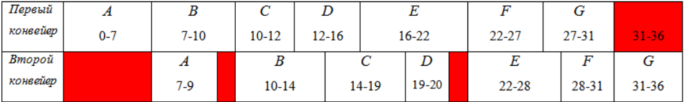
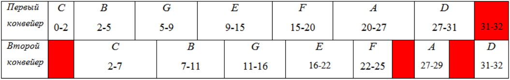
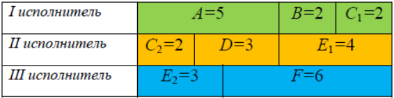
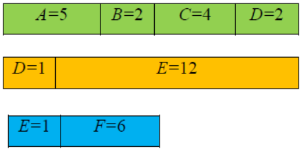
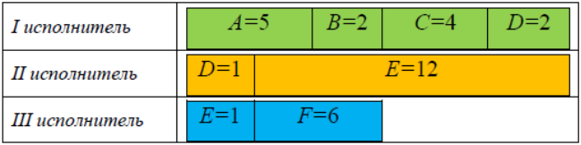

# Эффективные алгоритмы теории расписаний

Исследование операций – научный метод выработки количественно обоснованных рекомендаций по принятию решений. Важность количественного фактора и целенаправленность сформулированных рекомендаций позволяют определить исследование операций как теорию принятия оптимальных решений. Исследование операций способствует превращению искусства принятия решений в математическую дисциплину. Термин “Исследование операций” возник в результате буквального перевода выражения “operation research”, введенного в конце 30-х годов 20-го века как условное наименование одного из подразделений британских ВВС, занимающегося вопросами использования радиолокационных установок в общей системе обороны. Первоначально исследование операций было связано с решением задач военного содержания, но уже с конца 40-х годов прошлого века оно используется для решения технических, технико-экономических задач, а также задач управления на различных уровнях.

В первой половине 20-го века был сформулирован ряд практических
и теоретических задач составления расписаний. В 1956-м году Ричард
Беллман предложил термин “Теория расписаний” для обозначения совокупности данных задач и относящихся к ним научных знаний.

Теория расписаний – это раздел исследования операций, в котором строятся и анализируются математические модели календарного планирования (т.е. упорядочивания во времени) различных целенаправленных действий с учетом целевой функции и различных ограничений.

Содержательно многие задачи теории расписаний являются оптимизационными, т.е. состоят в выборе среди множества допустимых расписаний (расписаний, допускаемых условиями задачи) тех решений, на которых достигается “оптимальное” значение целевой функции. Обычно под “оптимальностью” понимается минимальное или максимальное значение некоторой целевой функции. Допустимость расписания понимается в смысле его осуществимости, а оптимальность — в смысле его целесообразности.

---

В теории расписаний рассматриваются, как правило, задачи составления оптимальных расписаний с помощью детерминированных алгоритмов. При этом оптимальность расписания может пониматься по-разному. Это может быть минимизация суммарного времени выполнения работ, или максимизация загрузки исполнителей работ, или минимизация их количества и т.п.

Особый интерес вызывают эффективные алгоритмы для составления оптимальных расписаний, где эффективность подразумевает две самые важные характеристики алгоритма - его надёжность и быстроту его работы. Более точно, надёжным считается алгоритм, который выдаёт правильный результат при любом наборе входных данных, а быстрым - алгоритм, который затрачивает время и объем памяти, ограниченные сверху каким-либо полиномом от длины массива входных данных.

---

К сожалению, на данный момент в теории расписаний известно лишь небольшое количество эффективных алгоритмов. Для решения же подавляющего большинства задач приходится использовать не эффективные, т.е. медленно работающие переборные, либо быстрые приближенные или эвристические алгоритмы. Существует также класс задач, для решения которых в принципе нет никаких алгоритмов. Это не удивляет, поскольку, как известно, во многих областях существуют т.н. алгоритмически неразрешимые проблемы.

В рамках нашего курса мы рассмотрим именно эффективные алгоритмы. Знать их полезно не только потому, что их можно сразу применять для решения практических задач, на практике, но и потому, что идеи, заложенные в этих алгоритмах, могут оказаться полезными, если на практике вам придётся разрабатывать качественный алгоритм для задачи, для которой эффективного алгоритма пока ещё не существует.

---

Задачи в теории расписаний очень разнообразны. Это объясняется тем, что в постановке задачи приходится учитывать много факторов и параметров. При этом в теории расписаний известны аномалии, когда незначительно изменение одного из параметров в постановке сравнительно простой задачи может существенно её усложнить, или даже привести к тому, что она перейдёт в разряд задач, для решения которых вообще не известно ни одного эффективного алгоритма.

Перечислим факторы и параметры, которые обычно явно проговариваются в постановке задачи из теории расписаний. 

Факторы 1-4 ⚙️ относятся к выполняемым работам (заданиям), факторы 5-7 👩‍🔧 относятся к исполнителям заданий (работникам), фактор 8 📅 - к указанию на то, какое расписание считается «оптимальным»:
1. ⚙️ Каково количество работ (заданий), которые необходимо выполнить;
2. ⚙️ Имеют ли работы одинаковую длительность или у каждого задания своя длительность;
3. ⚙️ Можно ли выполнять работы одновременно, т.е. использовать «распараллеливание» (любые независимые работы можно выполнять одновременно, а если работы зависимы, то надо учитывать граф зависимостей между работами);
4. ⚙️ Можно ли прервать выполнение работы (если да, то может ли после прерывания работы продолжить её выполнять другой работник);
5. 👩‍🔧 Каково количество исполнителей работ (работников);
6. 👩‍🔧 Являются ли работники универсальными (т.е. могут ли они выполнять любую работу) или специализированными (т.е. выполнять только некоторые работы);
7. 👩‍🔧 Различаются ли работники по своей производительности, размеру оплаты труда и т.п.;
8. 📅 Какое расписание требуется построить (самое быстрое, самое дешёвое, наименее затратное по числу работников, с наименьшим числом прерываний и т.п.).

Мы сформулируем несколько задач (будем называть их модельными задачами), отличающихся постановкой, и для каждой из них рассмотрим эффективный алгоритм. Мы увидим, что иногда даже незначительные изменения в постановке задачи могут привести к её существенному усложнению и необходимости радикально менять алгоритм для её решения.

Важно подчеркнуть, что во всех модельных задачах соблюдается правило: **два исполнителя не могут одновременно выполнять одно и то же задание**. Им разрешается работать над одним и тем же заданием только по очереди, сменяя друг друга. При этом смена исполнителя считается прерыванием процесса выполнения задания.

В задачах теории расписаний время задается в условных единицах.

# 🎯 Первая модельная задача. Конвейерная задача

Постановка конвейерной задачи:
1. ⚙️ Количество заданий произвольно;
2. ⚙️ Каждое задание состоит из двух последовательных этапов, длительность которых произвольна;
3. ⚙️ Задания независимы;
4. ⚙️ Запрещены прерывания при выполнении заданий;
5. 👩‍🔧 Количество работников строго 2;
6. 👩‍🔧 Первый работник выполняет только первый этап каждого задания, второй работник - только второй этап каждого задания;
7. 👩‍🔧 Производительность работников, размеры оплаты из труда и т.д. не учитываются;
8. 📅 Требуется построить расписание выполнения всех заданий в кратчайшие сроки.

---

**Пояснения к постановке задачи**: выполнение второго этапа любого задания может начинаться только после завершения его первого этапа. Название «конвейерная задача» объясняется тем, что её можно интерпретировать следующим образом: имеется набор деталей и два конвейера, на которых происходит обработка деталей. Каждая деталь сначала попадает на первый конвейер, а затем на второй. Время обработки каждой детали на каждом конвейере индивидуально. Порядок, в котором детали обрабатываются на первом конвейере, может быть любым. Однако на втором конвейере порядок обработки деталей должен быть таким же.

## 📝 Пример
Имеется 7 заданий А, В, С, D, Е, F, G. Длительности их первого и второго этапов указаны в таблице:

|             | A   | B   | C   | D   | E   | F   | G   |
|:------------|:---:|:---:|:---:|:---:|:---:|:---:|:---:|
| Первый этап | 7   | 3   | 2   | 4   | 6   | 5   | 4   |
| Второй этап | 2   | 4   | 5   | 1   | 6   | 3   | 5   |

Если задания выполнять в алфавитном порядке, то получаем следующее расписание в виде диаграммы Ганта:

Длительность полученного расписания составляет 36. Красным цветом выделены интервалы времени, когда конвейеры простаивали. Простои на втором конвейере вызваны тем, что выполнение второго этапа любого задания не может начинаться, пока не завершится выполнение его первого этапа (на первом конвейере). Это расписание не является кратчайшим. Кратчайшее расписание мы найдём позже, используя **алгоритм Джонсона**, который является эффективным (т.е. быстрым и точным).

> В период с 1903 по 1919 гг. американский ученый Генри Гант публикует ряд научных работ и предлагает новый способ представления расписаний, получивший название “Диаграмма Гантта”. Гант занимался исследованием и улучшением менеджмента на промышленных предприятиях. Диаграмма Ганта – это схематичное изображение календарного плана. В ней работы представлены в виде прямоугольников, размещенных вдоль оси времени. Длина прямоугольника соответствует времени, необходимому на выполнение соответствующей работы. На диаграмме указаны как продолжительность работы так и время ее начала и окончания.

---

Очевидно, что общее время выполнения всех заданий (т.е. обработки всех деталей) зависит от выбранного порядка обработки деталей. Если имеется всего $n$ деталей, то количество возможных порядков равно $n!$. Если $n$ не велико, то найти расписание выполнения всех заданий в кратчайшие сроки можно полным перебором вариантов. Однако для больших $n$ переборный алгоритм не приемлем.

Пусть $a$ и $b$ - это длительности первого и второго этапов $і$-го задания. 

Разобьём список всех заданий на две группы:
- В первую группу попадают задания, у которых $a_i \leq b_i$. 
- Во вторую группу - все остальные задания (т.е. у которых $a_i > b_i$). 

Задания из первой группы отсортируем в порядке возрастания величин $а$. 

Задания из второй группы отсортируем в порядке убывания величин $b_i$. 

Согласно алгоритму Джонсона, расписание получается кратчайшим, если сначала выполнить все задания из первой группы в отсортированном порядке, а затем - все задания из второй группы также в отсортированном порядке.

---

Применим алгоритм Джонсона, чтобы найти кратчайшее расписание для набора заданий из примера.

В первую группу попадают задания B(3,4), C(2,5), E(6,6), G(4,5). Во вторую группу - задания A(7,2), D(4,1), F(5,3). После сортировки заданий из первой группы в порядке возрастания величин $a_i$ получаем последовательность С, В, G, Е. После сортировки заданий из второй группы в порядке убывания величин $b_i$; получаем последовательность F, A, D. Таким образом, оптимальный порядок выполнения заданий: C, B, G, E, F, A, D. 

Построим соответствующее расписание в виде диаграммы Ганта:

Длительность полученного расписания равна 32. Оно является кратчайшим, хотя в нём есть моменты времени, когда конвейеры простаивают.

---

Несколько важных замечаний относительно конвейерной задачи и алгоритма Джонсона:
1. Есть строгое математическое доказательство того, что алгоритм Джонсона никогда не ошибается, т.е. он всегда находит кратчайшее расписание. А поскольку он имеет полиномиальную сложность относительно числа заданий $n$, то этот алгоритм относится к числу эффективных алгоритмов. Его можно применять при большом количестве заданий, когда невозможно использовать медленно работающий переборный алгоритм.
2. На практике часто возникают конвейерные задачи с тремя и более исполнителями. Например, можно считать, что каждая компьютерная программа в процессе своего выполнения проходит три этапа:
    - чтение входных данных,
    - обработка входных данных в соответствии с заданным программным кодом, 
    - формирование выходных данных (результатов работы программы).
Каждый этап занимает определённое время. Если нам нужно выполнить в кратчайшие сроки набор из $n$ независимых программ в многопроцессорной вычислительной системе с тремя процессорами, то мы получим конвейерную задачу для трёх конвейеров. К сожалению, на данный момент не известно ни одного эффективного алгоритма, решающего конвейерную задачу для трёх и более конвейеров. Большинство специалистов склоняется к мнению, что такого алгоритма в принципе не существует!
3. При большом количестве заданий и 3,4,5,… конвейерах приходится использовать приближенные или эвристические алгоритмы.

# 🎯 Вторая модельная задача

Мы рассмотрим несколько модельных задач, которые отличаются постановкой и алгоритмами для их решения. Всех их объединяет то, что эти алгоритмы являются эффективными. Однако, идеи, заложенные в эти алгоритмы, отличаются. И эти идеи могут оказаться полезными в дальнейшем, когда, например, потребуется разработать свой собственный оригинальный алгоритм для решения какой-либо новой задачи на составление оптимального расписания.

Вторая модельная задача имеет следующую формулировку:
1. ⚙️ Количество заданий произвольно;
2. ⚙️ Каждое задание имеет свою длительность;
3. ⚙️ Задания независимы (т.е. их можно выполнять одновременно);
4. ⚙️ **Разрешены прерывания при выполнении заданий**;
5. 👩‍🔧 **Количество работников произвольно, но фиксировано**;
6. 👩‍🔧 Работники универсальны (каждый может выполнять любое задание);
7. 👩‍🔧 Производительность работников, размеры оплаты из труда и т.д. не учитываются;
8. 📅 Требуется построить расписание выполнения всех заданий в кратчайшие сроки.

Для решения этой задачи существует эффективный алгоритм, основанный на **«ленточной» стратегии**. Пусть у нас имеется $n$ независимых заданий с длительностью $t_1, t_2, ..., t_n$ и $k$ универсальных исполнителей. Пусть

$$
T_{opt} = max \\{t_1, t_2, ..., t_n, \frac{t_1 + t_2 + ... + t_n}{k} \\}
$$

Известно, что величина $T_{opt}$ показывает длительность выполнения всех заданий в кратчайшие сроки, а само оптимальное расписание можно получить с помощью «ленточной» стратегии. Суть этой стратегии рассмотрим на конкретном примере.

## 📝 Пример 1

Требуется составить расписание выполнения заданий в кратчайшие сроки, если имеется 3 универсальных исполнителя и комплекс из 6 заданий:

| Задание      | A   | B   | C   | D   | E   | F   |
|:-------------|:---:|:---:|:---:|:---:|:---:|:---:|
| Длительность | 5   | 2   | 4   | 3   | 7   | 6   |

### Решение

1. Вычислим величину $T_{opt}$

$$
T_{opt} = max \\{5,2,4,3,7,6, \frac{5 + 2 + 4 + 3 + 7 + 6}{3} \\} = 9
$$

Уже можно сказать, что кратчайшая длительность расписания будет равна 9. Чтобы построить само расписание кратчайшей длительности, составим из заданий **«ленту»** длины 27.

Разрежем её на 3 равных части длины 9 (по числу исполнителей).

Уложим эти части в виде диаграммы Ганта:

Полученная диаграмма Ганта содержит искомое оптимальное расписание выполнения всех заданий в кратчайшие сроки, а именно:
- І исполнитель: от 0 до 5 - задание А, от 5 до 7 - задание В, от 7 до 9 - задание С. 
- II исполнитель: от 0 до 2 - задание С, от 2 до 5 - задание D, от 5 до 9 - задание Е.
- III исполнитель: от 0 до 3 - задание Е, от 3 до 9 - задание F.

Как видим, прерывалось выполнение заданий С н Е, причём начинал выполнять задание С второй исполнитель (от 0 до 2), а завершал его выполнение первый исполнитель (от 7 до 9). Также видим, что начинал выполнять задание Е третий исполнитель (от 0 до 3), а завершал его выполнение второй исполнитель (от 5 до 9).

---

В рассмотренном примере оказалось, что

$$
T_{opt} = \frac{t_1, t_2, ..., t_n}{k}
$$

А что делать, если окажется, что при некотором $і$

$$
T_{opt} = max \\{t_1, t_2, ..., t_n \\} = t_i > \frac{t_1 + t_2 + ... + t_n}{k}
$$

Это бывает, когда среди заданий есть очень «длинное» задание, длительность которого превосходит «среднюю» длину

$$
\frac{t_1 + t_2 + ... + t_n}{k}
$$

В этом случае ленту, составленную из заданий, нужно разрезать на части длины $t_i$. При этом последний фрагмент ленты будет короче всех остальных. Далее все фрагменты укладываем в диаграмму Ганта.

## 📝 Пример 2

В рассмотренном выше примере 1 увеличим с 7 до 13 длительность задания Е. 

| Задание      | A   | B   | C   | D   | E         | F   |
|:-------------|:---:|:---:|:---:|:---:|:---------:|:---:|
| Длительность | 5   | 2   | 4   | 3   |  **13**   | 6   |
Тогда

$$
T_{opt} = max \\{5,2,4,3,13,6, \frac{5 + 2 + 4 + 3 + 13 + 6}{3} \\} = 13
$$

Как видим, в этом случае длительность задания Е равна 13, что оказалось больше, чем средняя длительность

$$
T_{opt} = \frac{5 + 2 + 4 + 3 + 13 + 6}{3} = 11
$$

Поэтому ленту, составленную из заданий, режем на фрагменты длины 13.

Получим два фрагмента длины 13 и один фрагмент длины 7:

В итоге получаем диаграмму Ганта оптимального расписания длительности 13:

- I исполнитель: от 0 до 5 - задание А, от 5 до 7 - задание В, от 7 до 11 - задание С, от 11 до 13 - задание D;
- II исполнитель: от 0 до 1 - задание D, от 1 до 12 - задание Е;
- II исполнитель: от 0 до 1 - задание Е, от 1 до 6 - задание F.

В этом расписании прерывалось выполнение заданий D и Е. Причём, начинал выполнять задание D второй исполнитель, а завершал его первый исполнитель. Как видим из диаграммы Ганта, выполнение этого задания прерывалось на 10 (час). Также из диаграммы Ганта видно, что задание Е начинал выполнять третий исполнитель, а завершал его выполнение второй исполнитель, причём сразу же, без задержки.

---

Ленточная стратегия гарантирует, что:
1. Построенное расписание является оптимальным;
2. Прерывается выполнение не более чем k - 1 заданий, где k - число исполнителей;
3. Ни одно задание не выполняется двумя исполнителями одновременно (допускается только поочерёдное выполнение одного задания двумя разными исполнителями);
4. В случае, когда среди заданий имеется очень «длинное» задание, лента из заданий разрезается на фрагменты, определяемые длительностью такого задания; при этом последний фрагмент может быть короче всех остальных, а число фрагментов может оказаться меньше числа работников (т.е. некоторые работники являются лишними, и их можно удалить, не ухудшив расписание);
5. Время работы алгоритма полиномиально зависит от числа заданий $n$, т.е. «ленточная» стратегия является эффективным алгоритмом.
