# 🎯 Третья модельная задача

Модельные задачи, которые мы начали рассматривать в рамках теории расписаний, отличаются своей постановкой и методами решения. Каждую следующую задачу мы будем сравнивать с предыдущими, обращая внимание на сходство и различие.

Третья модельная задача имеет следующую постановку:
1. ⚙️ Количество заданий произвольно;
2. ⚙️ Все задания имеют **одинаковую длительность** (для удобства будем считать, что и длительность равна 1);
3. ⚙️ **Задания зависимы**, причём граф зависимостей имеет вид дерева ориентированного к корню (или ориентированного леса);
4. ⚙️ **Запрещены прерывания** при выполнении заданий;
5. 👩‍🔧 Количество работников произвольно;
6. 👩‍🔧 Работники универсальны (каждый может выполнять любое задание);
7. 👩‍🔧 Производительность работников, размеры оплаты из труда и т.д. не учитываются
8. 📅 Требуется построить расписание выполнения всех заданий в кратчайшие сроки.

**Пояснения к постановке задачи**: пример ориентированного леса, состоящего из двух ориентированных к корню деревьев, приведён на рисунке:

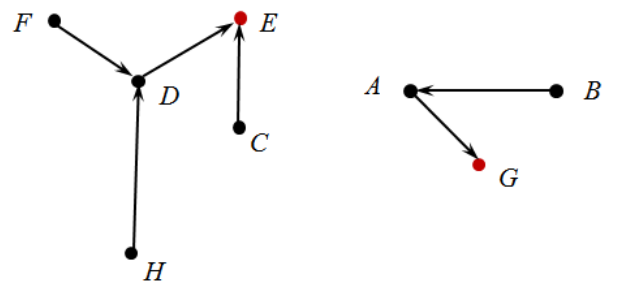

Дуги направлены от более ранних заданий к более поздним. Корни деревьев (красные вершины) и только они являются стоками, т.е. вершинами, из которых нет выходящих дуг.

---

Для решения второй модельной задачи существует эффективный алгоритм, основанный на «уровневой» стратегии. Чтобы понять её суть, заметим, что в каждый момент времени все задания можно разбить на три группы:
1. Выполненные задания;
2. Ещё не выполненные, но готовые к выполнению задания;
3. Ещё не выполненные и не готовые к выполнению задания.

В каждый момент времени каждое задание находится только в одной из этих групп, причём, сначала оно находится в третьей или второй группе, а затем переходит в первую группу и остаётся там навсегда. 

Например, в самом начале задания В, С, F, Н находятся во второй группе (готовые к выполнению задания). Все остальные задания находятся в третьей группе (не готовы к выполнению, т.к. ожидают завершения каких-либо предшествующих заданий). 

Очевидно, что задания из второй группы постепенно переходят в первую группу, а задания из третьей группы - во вторую. 

«Уровневая» стратегия позволяет выполнить эти переходы оптимальным образом. Для этого всем заданиям назначаются разные приоритеты - $1, 2, 3, …, n$, где $n$ - количество заданий. Приоритет $n$ считается самым высоким, 1 - самым низким.

---

Назначение приоритетов происходит следующим образом:
1. Сначала раздают приоритеты $1, 2, 3, …, k$. Они распределяются между стоками графа (очевидно, это корни деревьев).
2. Пусть приоритеты $1, 2, 3, …, t$ уже назначены. Тогда приоритет $(t + 1)$ назначается заданию, у которого прямой потомок имеет наименьший приоритет.

Если расставить приоритеты в соответствии с этим правилом, то это позволит перерисовать граф зависимостей таким образом, чтобы вершины располагались по уровням, причём, чем выше уровень - тем выше приоритет задания.

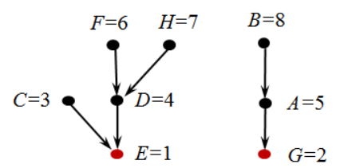

Зачем нужны приоритеты? Они позволяют разрешать конфликты при выполнении заданий, в случае их возникновения. Конфликт возникает тогда, когда освободился исполнитель и имеется несколько ещё не выполненных, но готовых к выполнению заданий. Какое именно из этих заданий должен выполнять освободившийся исполнитель? Ответ: задание с наивысшим приоритетом.

---

## 📝 Пример 1

Используя «уровневую» стратегию, составить расписание для выполнения единичных заданий в кратчайшие сроки тремя исполнителями. Исполнители универсальны, прерывания запрещены, граф зависимостей указан на рисунке:

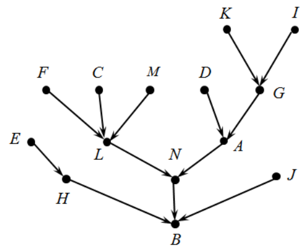

### Решение

Граф зависимостей представляет собой ориентированное к корню дерево. Все задания имеют длительность 1 (час). Постановка задачи подходит под требования второй модельной задачи. Можем применить «уровневую» стратегию.

---

Назначим всем заданиям разные приоритеты от 1 до 14. Получим следу граф:

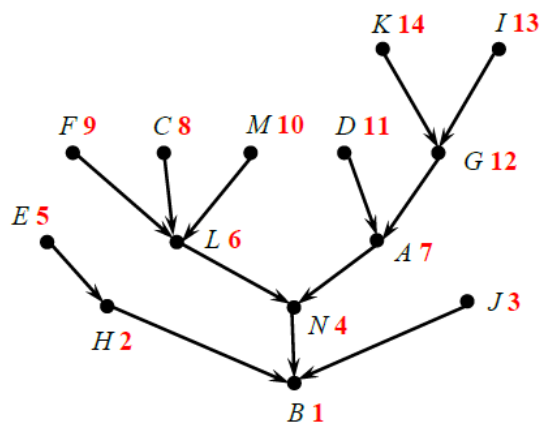

Оптимальное расписание отобразим в виде диаграммы Ганта для трёх исполнителей:

| исполнитель     | 1   | 2   |  3  |  4  |  5  |  6  |
|:----------------|:---:|:---:|:---:|:---:|:---:|:---:|
| І исполнитель   | 14  | 12  |  8  |  6  |  4  |  1  |
| ІІ исполнитель  | 13  | 10  |  7  |  3  |  -  |  -  | 
| ІІІ исполнитель | 11  |  9  |  5  |  2  |  -  |  -  |

Как видно из диаграммы Ганта, все задания выполнены за 6 (часов). Полученное расписание является кратчайшим.

Обратим внимание, что в некоторые моменты времени задания с меньшим приоритетом выполнялись раньше, чем задания с более высоким приоритетом. Это не является нарушением, т.к. приоритеты заданиям мы назначали сами. Зато это «нарушение» позволило сократить время выполнения всех заданий.

---

Попробуем в два раза увеличить количество исполнителей. Позволит ли это в два раза сократить время выполнения заданий? Построим диаграмму Ганта для шести исполнителей:

| исполнитель     | 1   | 2   |  3  |  4  |  5  |
|:----------------|:---:|:---:|:---:|:---:|:---:|
| І исполнитель   | 14  | 12  |  7  |  4  |  1  |
| ІІ исполнитель  | 13  |  6  |  2  |  -  |  -  |
| ІІІ исполнитель | 11  |  5  |  -  |  -  |  -  |
| ІV исполнитель  | 10  |  3  |  -  |  -  |  -  |
| V исполнитель   | 9   |  -  |  -  |  -  |  -  |
| VI исполнитель  | 8   |  -  |  -  |  -  |  -  |

Теперь задания можно выполнить за 5 часов, т.е. сократить расписание в два раза не получилось. Можно проверить, что кратчайшее расписание для семи исполнителей также потребует 5 часов, т.е. дальнейшее увеличение числа исполнителей не поможет сократить время выполнения всех заданий (почему?).

---

## 📝 Пример 2

Три работника должны покрасить 4 кубика. Покраска одной грани кубика занимает 1 минуту, т.е. на один кубик требуется 6 минут, поскольку два работника не могут одновременно красить один и тот же кубик. За какое минимальное время три работника смогут покрасить все грани 4 кубиков?

### Решение

Если бы каждый работник красил свой кубик, то на покраску 3 кубиков потребовалось бы 6 минут. И ещё 6 минут потребуется, чтобы покрасить 4-й кубик. Итого получается 12 минут.

Однако, используя уровневую стратегию, эту работу можно выполнить быстрее. Будем считать, что покраска одного кубика - это последовательность из 6 заданий единичной длительности. Тогда весь комплекс заданий можно представить в виде леса из 4 деревьев, ориентированных к корню:

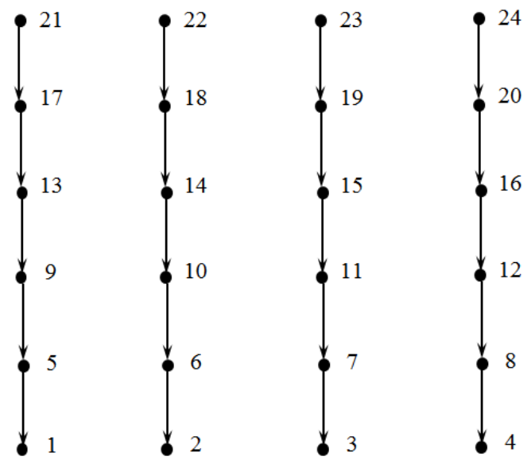

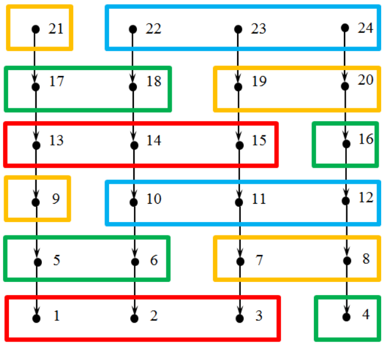

| работник     | 1   | 2   |  3  |  4  |  5  |  6  |  7  |  9  |
|:-------------|:---:|:---:|:---:|:---:|:---:|:---:|:---:|:---:|
| І работник   | 24  | 21  | 18  | 15  | 12  |  9  |  6  |  3  |
| ІІ работник  | 23  | 20  | 17  | 14  | 11  |  8  |  5  |  2  | 
| ІІІ работник | 22  | 19  | 16  | 13  | 10  |  7  |  4  |  1  |

Таким образом, уровневая стратегия позволила построить расписание для выполнения всех заданий за 8 минут, вместо 12.

---

По поводу уровневой стратегии важно отметить следующее: если граф зависимостей между заданиями представляет собой лес из ориентированных к корню деревьев, то распределение приоритетов должно применяться сразу ко всему лесу. Было бы ошибкой применять её по отдельности к каждому дереву. Это может привести к неоптимальному расписанию.

Во второй модельной задаче применяется очень распространённая и полезная в теории расписаний идея: назначать всем заданиям различные приоритеты. Это помогает при разрешении конфликтов, возникающих между заданиями, готовыми к выполнению, когда освобождается один или несколько исполнителей. В этой ситуации нужно принять решение - какое из заданий следует выполнять в первую очередь. Идея приоритетов используется в правилах дорожного движения, когда, например, транспортное средство, едущее по главной дороге, имеет преимущество (более высокий приоритет) при проезде через перекрёсток, а при пересечении равнозначных дорог меньший приоритет имеет тот, у кого «помеха справа».

# 🎯 Четвертая модельная задача

Постановка четвертой модельной задачи:
1. ⚙️ Количество заданий произвольно;
2. ⚙️ Все задания имеют **одинаковую длительность** (для удобства будем считать, что их длительность равна 1);
3. ⚙️ Задания зависимы, причём граф зависимостей **не содержит транзитивных дуг**;
4. ⚙️ Запрещены прерывания при выполнении заданий;
5. 👩‍🔧 **Количество работников строго 2**;
6. 👩‍🔧 Работники универсальны (каждый может выполнять любое задание);
7. 👩‍🔧 Производительность работников, размеры оплаты из труда и т.д. не учитывается;
8. 📅 Требуется построить расписание выполнения всех заданий в кратчайшие сроки.

**Пояснения к постановке задачи**: в ориентированных графах могут существовать так называемые транзитивные дуги.

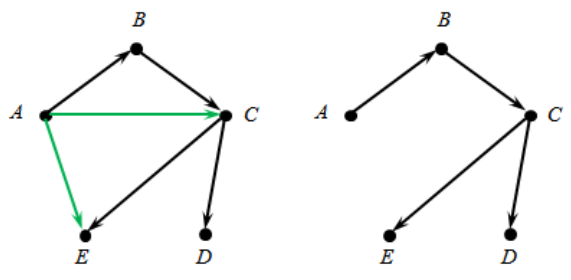

Если вершины этого графа интерпретировать как некие работы, а дугу считать направленной от более ранней работы к более поздней, то транзитивные дуги можно из графа удалить. После этого граф станет проще, но отношение предшествования между работами никак не поменяется.

В четвертой модельной задаче считается, что граф отношений предшествования между работами не содержит транзитивных дуг (либо их нужно предварительно удалить, если они там случайно оказались).

---

Для решения этой задачи существует эффективный алгоритм. Он основан на «лексикографической стратегии», которая используется для назначения различных приоритетов всем заданиям (работам). Однако правило назначения приоритетов здесь более сложное, чем в «уровневой стратегии».

Как и прежде, всем заданиям назначаются разные приоритеты - $1, 2, 3, …, n$, где $n$ - количество заданий. Приоритет считается самым высоким, 1 - самым низким. 

Назначение приоритетов происходит следующим образом:
1. Сначала раздают приоритеты $1, 2, 3, …, k$. Они распределяются между стоками графа, задающего отношение предшествования между заданиями.
2. Пусть приоритеты $1, 2, 3, …, t$ уже назначены. Рассмотрим задания, у которых все прямые потомки уже имеют приоритеты (прямых потомков может быть несколько!). Для каждого такого задания составим **строку из приоритетов всех прямых его потомков, записанных в убывающем порядке**. Тогда приоритет $(t + 1)$ назначается заданию, у которого строка из приоритетов является лексикографически наименьшей (т.е. самой первой строкой, если все строки расположить в алфавитном порядке).

Если расставить приоритеты в соответствии с этим правилом, то это позволит расположить вершины графа зависимостей между заданиями по уровням, причём, чем выше уровень - тем выше приоритет задания.

## 📝 Пример 1

Составить расписание выполнения единичных заданий без прерываний двумя исполнителями в кратчайшие сроки, если граф зависимостей между заданиями имеет вид:

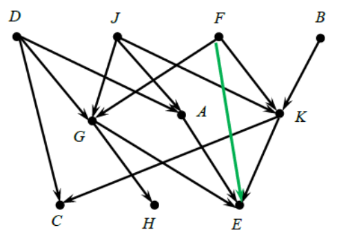

Назначим приоритеты заданиям, согласно «лексикографической стратегии»:

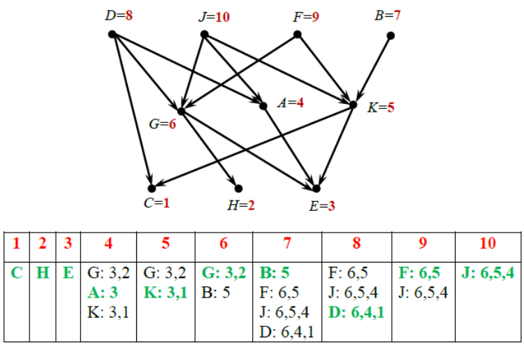

После назначения приоритетов остаётся только нарисовать диаграмму Ганта:

| исполнитель     | 1   | 2   |  3  |  4  |  5  |
|:----------------|:---:|:---:|:---:|:---:|:---:|
| І исполнитель   | 10  |  8  |  6  |  4  |  3  |
| ІІ исполнитель  |  9  |  7  |  5  |  2  |  1  |

Таким образом, «лексикографическая стратегия» позволила построить оптимальное расписание длительности 5.

---

Что может произойти, если при использовании «лексикографической стратегии» предварительно не удалить транзитивные дуги из графа зависимостей между заданиями? Это может привести к построению неоптимального расписания.

## 📝 Пример 2

Построить оптимальное расписание для набора единичных заданий, граф зависимостей которых имеет вид:

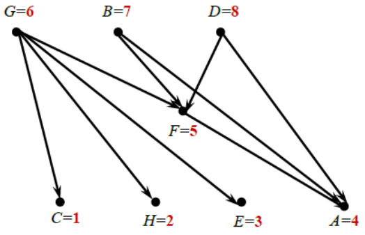

После назначения приоритетов получаем расписание длительности 5:

| исполнитель     | 1   | 2   |  3  |  4  |  5  |
|:----------------|:---:|:---:|:---:|:---:|:---:|
| І исполнитель   |  8  |  6  |  5  |  4  |  1  |
| ІІ исполнитель  |  7  |  -  |  3  |  2  |  -  |

Однако, в исходно графе были две транзитивные дуги (BA) и (DA). После их удаления получаем боле простой граф и новое распределение приоритетов:

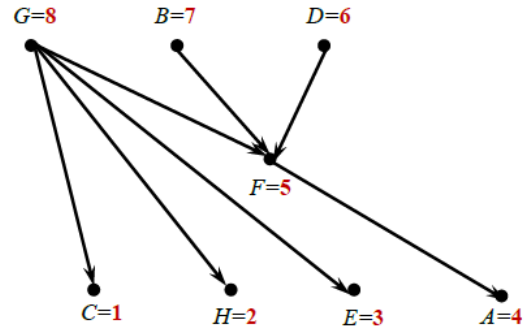

При таком назначении приоритетов получаем более короткое расписание:

| исполнитель     | 1   | 2   |  3  |  4  |
|:----------------|:---:|:---:|:---:|:---:|
| І исполнитель   |  8  |  6  |  5  |  4  |
| ІІ исполнитель  |  7  |  3  |  2  |  1  |

Заметим, что отношение предшествования между заданиями никак не поменялось.

---

Важные замечания о «лексикографической стратегии»:
1. Для трёх исполнителей применение «лексикографической стратегии» не гарантирует оптимальности построенного расписания.
2. Используя «лексикографическую стратегию», можно строить близкое к оптимальному расписание для двух исполнителей, если разрешены прерывания и задания имеют произвольную длительность (не обязательно одинаковую у всех заданий). Для этого задание длительности $t$ заменяют цепочкой из $t$ последовательно выполняемых единичных заданий.

## 📝 Пример 3

Используя «лексикографическую стратегию», построить расписание с прерываниями для двух исполнителей, если длительности заданий и отношения предшествования между ними указаны в графе:

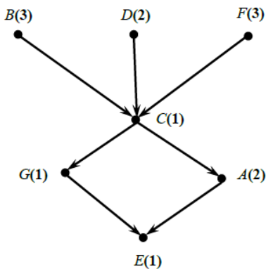

### Решение

Если прерывания заданий запрещены, то кратчайшим является следующее расписание длительности 9:

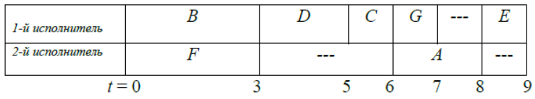

---

Если разрешить прерывания заданий и заменить задания A.B.D.F последовательностями единичных заданий, то получим новый граф, в котором все задания имеют длительность 1:

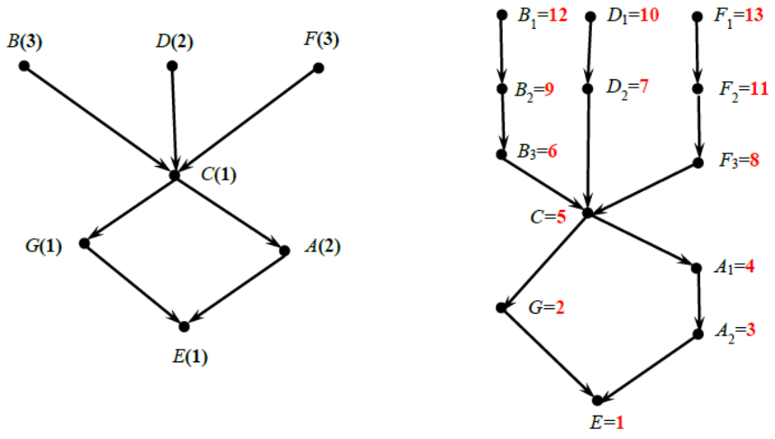

К этому графу уже можно будет применить «лексикографическую стратегию». На рисунке указаны приоритеты заданий. В соответствии с ними получаем более короткое расписание с прерываниями длительности 8:

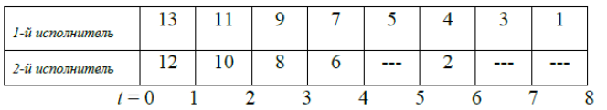

Сокращение длительности расписания на 1 произошло за счёт прерывания выполнения заданий В, D и F. В некоторых случаях можно добиться и более существенного сокращения длительности расписания, если заменить «длинные» задания на цепочки последовательных заданий с «дробной» длительностью - 1/2, 1/3 и т.п.
