# 🎯 Пятая модельная задача

Пятая модельная задача имеет следующую формулировку:
1. ⚙️ Количество заданий произвольно;
2. ⚙️ Каждое задание имеет свою длительность;
3. ⚙️ Задания независимы (т.е. их можно выполнять одновременно);
4. ⚙️ Разрешены прерывания при выполнении заданий;
5. 👩‍🔧 Количество работников произвольно (но не больше числа заданий);
6. 👩‍🔧 Работники универсальны (т.е. каждый может выполнять любое задание);
7. 👩‍🔧 **У каждого работника своя производительность**;
8. 📅 Требуется построить расписание выполнения всех заданий в кратчайшие сроки.

**Пояснения к постановке задачи**: работники могут отличаться производительностью. Это означает, что одно и то же задание может выполняться быстрее или медленнее в зависимости от работника, которому оно было назначено. А поскольку в данной задаче разрешены прерывания, то нам разрешено менять исполнителей одного итого же задания. Например, начать выполнять задание может исполнитель с низкой производительностью, а завершить - исполнитель с более высокой производительностью, или наоборот. Оказывается, за счёт правильного выбора моментов прерываний и правильного подбора исполнителей можно существенно сократить общее время выполнения всех заданий. Для нас важно, что правильное решение можно найти с помощью эффективного (т.е. быстрого и точного) алгоритма.

---

Чтобы лучше понять постановку задачи и эффективный алгоритм для её решения будем далее использовать следующую интерпретацию заданий и исполнителей. Пусть имеется несколько ёмкостей (цистерны) с жидкостью. Все ёмкости имеют одинаковый объём, но количество жидкости в них может отличаться. И пусть имеется несколько насосов для выкачивания жидкости из этих ёмкостей. Насосы могут иметь разную производительность (мощность). Более мощные насосы откачивают жидкость быстрее, менее мощные - медленнее. Наша цель - откачать всю жидкость из всех ёмкостей с помощью имеющихся насосов как можно быстрее. Можно сколько угодно раз менять насосы, откачивающие жидкость из любой ёмкости, но **нельзя откачивать жидкость из одной ёмкости сразу двумя насосами**! Как мы должны действовать?

## 📝 Пример 1
Пусть у нас имеется всего три ёмкости и два насоса. Во всех ёмкостях первоначально находится по 8 литров жидкости. Первый насос откачивает жидкость со скоростью 1 литр в минуту, а второй - 3 литра в минуту. Как организовать работу насосов, чтобы они откачали всю жидкость за минимальное время?

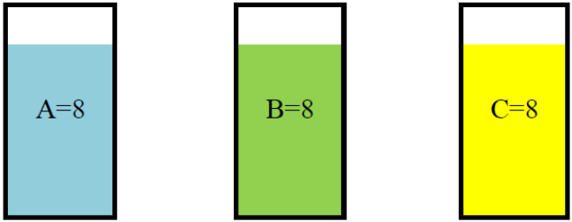

### Решение

Сначала вычислим искомое минимальное время, за которое можно откачать всю жидкость, а затем выясним, как правильно организовать работу насосов.
Минимальное время вычисляется по формуле:

$$
t_{min}=\frac{8+8+8}{1+3} = \text{ 6 минут}
$$

Искомое оптимальное расписание изображено на диаграмме Ганта:

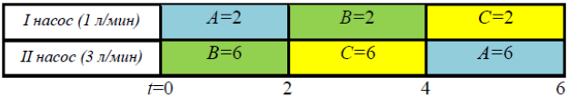

Очевидно, что это расписание является кратчайшим, т.к. в нём оба насоса заканчивают работу одновременно и ни один из них ни разу не простаивал. При этом все задания прерывались и выполнялись до прерываний по 2 минуты ($\frac{\text{6 минут}}{\text{3 задания}}$).

---

### Выводы
Обобщим пример 1 и сделаем выводы, которые из него следуют: если имеется $k$ насосов и $n$ ёмкостей с одинаковым объёмом жидкости в начальный момент ($k \leq n$) то:
1) минимальное время выполнения всех заданий вычисляется по формуле

$$
t_{min}=\frac{n \cdot V_1}{p_1 + p_2 + ... + p_k}
$$

  где:
  - $V_1$ - начальный объём жидкости в каждой из ёмкостей, 
  - $p_1 + p_2 + ... + p_k$ - мощности насосов;

2) в оптимальном расписании у каждого исполнителя временной интервал $[0, t_{min}]$ разбит на $n$ равных частей, причём каждое задание выполняется каждым исполнителем только на одной из этих частей.

Рассмотрим более сложный пример, когда первоначальный объём жидкости в разных ёмкостях отличается.

## 📝 Пример 2

Пусть у нас имеется две ёмкости и два насоса. В первой ёмкости находится 6 литров жидкости, а во второй - 9 литров. Первый насос откачивает жидкость со скоростью 1 литр в минуту, а второй - 2 литра в минуту. Какое расписание работы насосов будет оптимальным в этом случае?

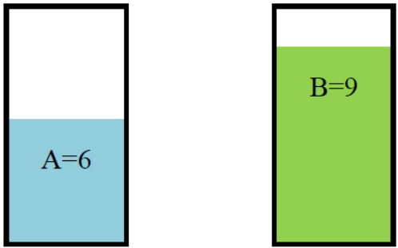

### Решение

Искомое минимальное время, за которое можно откачать всю жидкость, вычисляется по формуле:

$$
t_{min}=\frac{6+9}{1+2} = \text{ 5 минут}
$$

Очевидно, в этом примере также придётся прерывать задания. Эффективный алгоритм для решения этой задачи рекомендует поступить следующим образом: более мощный насос поместить в ту ёмкость, где больше жидкости, а менее мощный - туда, где жидкости меньше. Нужно включить оба насоса одновременно и ждать, пока уровни жидкости в обеих ёмкостях сравняются. Момент, когда уровни жидкости в ёмкостях А и В сравняются, можно найти из уравнения:

$$
9 - 2t = 6 - t
$$

Решая это уравнения, получаем $t = 3$. Таким образом, через 3 минуты после начала работы насосов уровни жидкостей в обеих ёмкостях сравняются, причём в них будет по 3 литра жидкости:

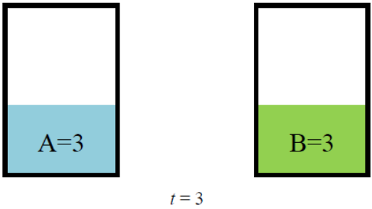

---

Как поступить далее, мы уже знаем из примера 1. А именно, согласно расчётам у нас осталось 2 минуты на то, чтобы закончить работу. Делим эти две оставшиеся минуты на два равных временных интервала $[3;4]$ и $[4;5]$ и, согласно примеру 1, на 4-й минуте меняем насосы местами. Таким образом, мы получаем оптимальное расписание, указанное на диаграмме Ганта:

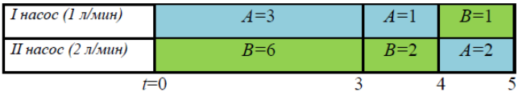

---

### Выводы из примера 2

Если имеется 2 насоса мощности $p_1$ и $p_2$ и 2 ёмкости с разным объёмом жидкости $V_1$, и $V_2$ в начальный момент, причём $р_1 < p_2$, a $V_1 < V_2$, то:
1) минимальное время выполнения обоих заданий вычисляется по формуле

$$
t_{min}=\frac{V_1 + V_2}{p_1 + p_2}
$$

2) в оптимальном расписании сначала более мощный насос следует поместить в ёмкость с большим объёмом жидкости, а менее мощный насос - в ёмкость с меньшим объёмом жидкости, а затем, как только уровни жидкости в обеих ёмкостях сравняются, следует действовать как в примере 1.

Рассмотрим ещё один пример, после которого уже можно будет окончательно сформулировать все правила, применяемые в эффективном алгоритме построения оптимального расписания для данной модельной задачи.

## 📝 Пример 3

Пусть имеется три ёмкости с первоначальным объёмом жидкости 13, 7, 4 литра и два насоса мощности 2 и 1 литр в минуту. Требуется построить оптимальное расписание работы насосов, обеспечивающее выполнение всех заданий по откачиванию жидкости в кратчайшие сроки.

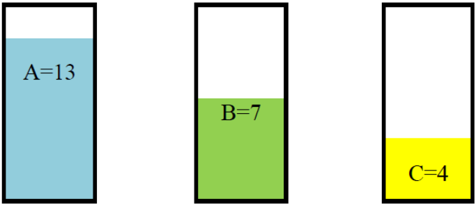

### Решение

Искомое минимальное время, за которое можно откачать жидкость из всех ёмкостей, вычисляется по формуле:

$$
t_{min}=\frac{13+7+4}{2+1} = \text{ 8 минут}
$$

Согласно примеру 2, поместим насос мощности 2 л/мин в ёмкость А, а насос мощности 1 л/мин в ёмкость В. Оба насоса начинают работать одновременно. Будем следить за тем, как падают уровни жидкости в этих ёмкостях. Очевидно, что в ёмкости А уровень жидкости падает быстрее, чем в ёмкости В, а в ёмкости С уровень жидкости не меняется. Согласно примеру 2, надо вычислить первый из моментов времени, когда в каких-либо ёмкостях уровни жидкости сравняются.

Есть три возможности:
1. Сравняются уровни жидкости в ёмкостях А и В. Чтобы узнать, когда это произойдёт, решим уравнение

$$
13 - 2t = 7 - t.
$$

Его решение $t = 6$, т.е. через 6 минут после старта.

2. Сравняются уровни жидкости в ёмкостях А н С. Чтобы узнать, когда это произойдёт, решим уравнение

$$
13 - 2t = 4.
$$

Его решение $t = 4,5$, т.е. через 4 мин 30 сек после старта.

3. Сравняются уровни жидкости в ёмкостях В и С. Чтобы узнать, когда это произойдёт, решим уравнение

$$
7 - t = 4.
$$

Его решение $t = 3$, т.е. через 3 минуты после старта.

**Вывод**: раньше всего (а именно, через 3 минуты после старта) наступает следующее событие - уровни жидкости в ёмкостях В и С сравняются и в них будет по 4 литра, а в ёмкости А объём жидкости будет равен 13 - 2 • 3 = 7л.

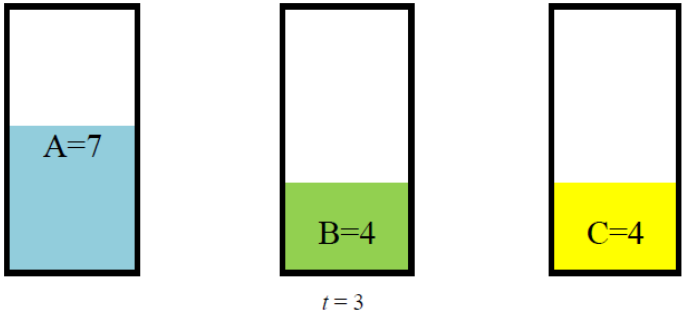

Мы уже можем нарисовать начальный фрагмент диаграммы Ганта:

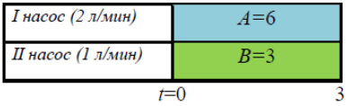

Упростим задачу так, чтобы мы могли снова применить идею из примера 2. Будем считать, что у нас не две ёмкости В и С по 4 литра в каждой, с которыми работает насос мощности 1 л/мин, а одна ёмкость с 4 литрами жидкости внутри и в ней работает насос мощности 0,5 л/мин. По затратам времени - это эквивалентные задачи: «откачать жидкость из двух ёмкостей по 4 литра в каждой с помощью насоса мощности 1 л/мин» и «откачать 4 литра жидкости из одной ёмкости с помощью насоса мощности 0,5 л/мин». Обе они требуют 8 минут. Но вторая задача для нас проще, т.к. место 3 ёмкостей А, В и С нам придётся иметь дело с двумя А и В, но при этом надо помнить, что второй насос теперь работает в 2 раза медленнее, т.е. его мощность упала до 0,5 л/мин.

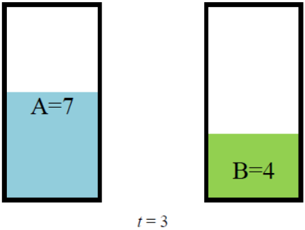

Согласно примеру 2, мы помещаем насос мощности 2 в ёмкость А, а насос мощности 0,5 в ёмкость В, и это продолжается, пока уровни жидкостей в этих ёмкостях не сравняются. Когда это произойдёт, мы узнаем, решив уравнение

$$
7 - 2t = 4 - 0,5t.
$$

Его решение $t = 2$, т.е. через $3 + 2 = 5$ минут после старта. При этом в ёмкостях А, В и С будет по 3 литра жидкости.

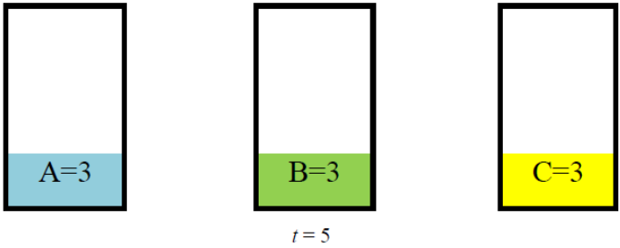

Мы можем дорисовать следующий фрагмент диаграммы Ганта на временном интервале $[3;5]$. Этот интервал разбит на 2 равные части $[3:4]$ и $[4;5]$ согласно примеру 1.

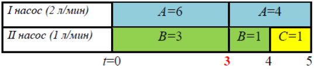

Таким образом, через 5 минут после старта мы имеем три ёмкости, в каждой из которых находится по 3 литра жидкости, и у нас есть два насоса мощности 2 и 1. Согласно примеру 1, оставшееся время вычисляется по формуле:

$$
t=\frac{3+3+3}{2+1} = \text{ 3 минуты}
$$

а оптимальное завершение работ выглядит следующим образом:

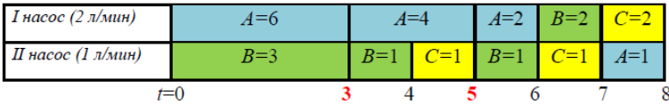

Задача решена. Мы построили оптимальное расписание длительности 8 минут. Его оптимальность подтверждается тем, что оба насоса одновременно начали работу и одновременно её завершили, и при этом они ни разу не простаивали, т.е. полученное расписание является максимально «плотным».

---

На основании рассмотренных примеров можно сформулировать алгоритм построения оптимального расписания. Пусть имеется $n$ заданий (ёмкостей) длительности $V_1, V_2, …, V_n$, (их можно интерпретировать как объёмы жидкости). Для удобства будем считать, что $V_1 \geq V_2 \geq V_3 \geq  …  \geq  V_n$. И пусть имеется $k$ работников с производительностью $p_1, p_2, …, p_k$ (их можно интерпретировать как мощности насосов). Для удобства будем считать, что $p_1 \geq p_2 \geq p_3 \geq … \geq p_k$. Число работников всегда меньше либо равно числу заданий, т.е. $k \leq n$.

## Алгоритм решения задачи
Далее для формулировки алгоритма будем под приоритетом задания в каждый конкретный момент понимать длительность оставшейся части задания (т.е. объём оставшейся жидкости в данной ёмкости). В начальный момент времени приоритет задания равен первоначальному объёму жидкости в ёмкости. С течением времени приоритеты будут снижаться (подобно уровням оставшейся жидкости в ёмкостях). Главная идея алгоритма состоит в том, чтобы поддерживать вполне разумное правило: задание с более высоким приоритетом должно выполняться исполнителем с более высокой производительностью. Для этого нужно в некоторые моменты времени пересматривать текущее распределение заданий между исполнителями.

1. Выберем задания с самым высоким приоритетом. Пусть их количество оказалось равным $m$. Возможны два случая:
    - $m > k$. Тогда делим всех работников поровну между этими $m$ заданиями (как в примере 1).
    - $m < k$. Тогда к выбранным $m$ заданиям будем добавлять задания с более низким приоритетом, пока суммарное количество выбранных заданий не станет больше или равно $k$. Делим всех $k$ работников поровну между всеми выбранными заданиями (как в примере 1).
2. Выполнение выбранных на первом шаге заданий продолжается до тех пор, пока не наступит хотя бы одно из двух событий:
    - какое-либо из заданий будет завершено и, следовательно, освободится исполнитель; в этот момент нужно перераспределить ещё не завершённые задания между работниками (согласно принципу, сформулированному на шаге 1);
    - сравняются приоритеты у двух заданий, которые до этого момента имели разные приоритеты (как в примерах 2 и 3). Это означает, что задание с более высоким приоритетом, которое выполнялось работником с более высокой производительностью, теперь стало иметь настолько низкий приоритет, что оно теперь должно «делиться» своим работником с другими заданиями, имеющими такой же низкий приоритет. В этот момент нужно перераспределить задания между работниками (согласно принципу, сформулированному на шаге 1).

## 📝 Пример 4

Требуется построить оптимальное расписание с прерываниями для системы из 4 заданий длительности 41, 25, 13, 11 и 3 исполнителей с производительностью 6, 2, 1.

### Решение

Начальную ситуацию можно интерпретировать следующим образом:

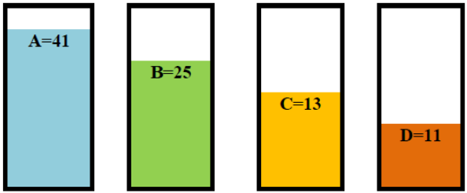

Согласно алгоритму, исполнителей назначаем самым длительным заданиям, причём, чем выше производительность исполнителя, тем более длительное задание мы ему отдаём. В данном примере первому исполнителю отдаём задание А, второму - задание В, третьему - задание С.

---

После начала работ будем следить за тем, как падают уровни жидкости ёмкостях и «ловить» момент, когда в каких-либо ёмкостях уровни сравняются. Может произойти одно из следующих событий:
1) $A = В$, т.е. $41 - 6t = 25 - 2t$, Это произойдёт при $t = 4$;
2) $В = С$, т.е. $25 - 2t = 13 - t$. Это произойдёт при $t = 12$;
3) $C = D$, т.е. $13 - t = 11$. Это произойдёт при = $t = 2$.

Вывод: быстрее всего сравняются уровни в ёмкостях С и D, и это произойдёт через 2 (часа) после начала работ. В этот момент ситуация будет следующая

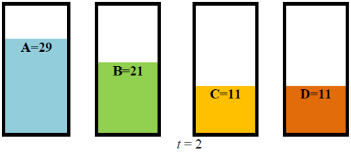

Начальный фрагмент диаграммы Ганта будет выглядеть следующим образом:

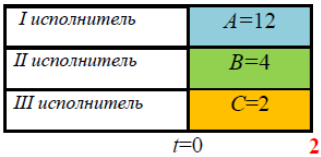

Согласно алгоритму, в момент времени $t = 2$ нужно перераспределить исполнителей, а именно: третьему исполнителю назначить сразу два задания - С и D. Аналогичная ситуация у нас возникла в примере 3 в момент времени $t = 3$. В этот момент мы назначили второму исполнителю сразу 2 задания - В и С.

По аналогии с примером 3 будем считать, что у нас вместо двух заданий С и D длительности 11 имеется только задание С длительности 11, но его выполняет исполнитель с производительностью 0,5. Снова будем следить за падением уровней жидкости в ёмкостях А.В,С и ждать момент, когда сравняются уровни в каких-либо ёмкостях (А,В,С). 

Возможны следующие события:
1) $A = В$, т.е. $29 - 6t = 21 - 2t$. Это произойдёт при $t = 2$;
2) $В = С$, т.е. $21 - 2t = 11 - 0,5t$. Это произойдёт при $t = 6\frac{2}{3}$;

Вывод: быстрее всего сравняются уровни в ёмкостях А и В, и это произойдёт через $2 + 2 = 4$ (часа) после начала работ. В этот момент ситуация будет следующая:

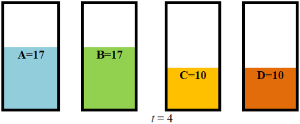

Начальный фрагмент диаграммы Ганта будет выглядеть следующим образом:

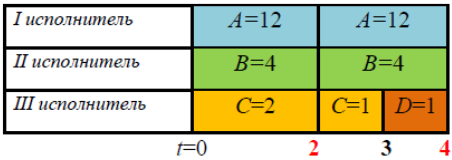

Согласно алгоритму, в момент времени $t = 4$ нужно перераспределить исполнителей, а именно: первому и второму исполнителям назначить два задания - А и В, поделив поровну время работы этих исполнителей над заданиями А и В. При этом мы будем считать, что вместо двух заданий А и В длительности 17 и двух исполнителей с производительностью 6 и 2 у нас есть одно задание А и исполнитель с производительностью $(6 + 2) / 2 = 4$.

Будем дальше следить за падением уровней жидкости в ёмкостях А и С. Вычислим момент, когда в них сравняются уровни. Это можно сделать, решив уравнение $17 - 4t = 10 - 0,5t$. Это произойдёт при $t = 2$.

Вывод: Во всех 4 ёмкостях уровни сравняются через $2 + 2 + 2 = 6$ (часов) после начала работ. В этот момент ситуация будет следующая:

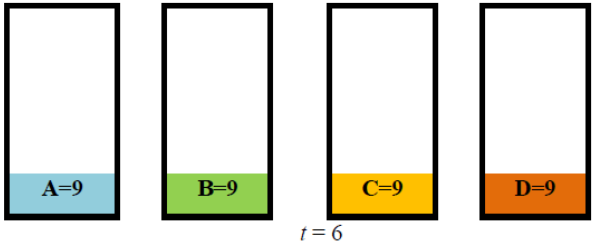

Диаграмма Ганта к этому моменту будет выглядеть следующим образом:

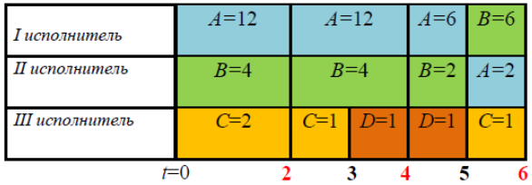

Согласно алгоритму, начиная с момента $t = 6$ все исполнители будут выполнять все задания поочерёдно, деля поровну время между всеми заданиями. Это будет продолжаться в течение 4 часов, поскольку $t = 4$ является решением уравнения $9 - 9/4t = 0$. 

В диаграмме Ганта это будет выглядеть следующим образом:

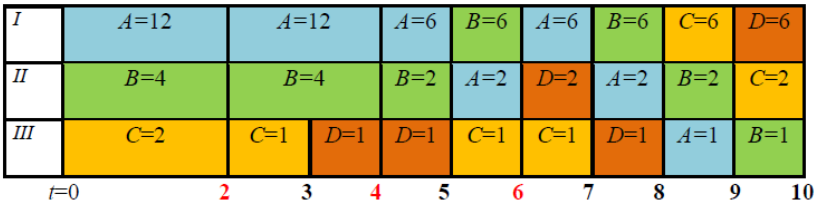

Таким образом мы получили длительность оптимального расписания 10 (часов).
