# 🎯 Аномалии многопроцессорных расписаний

В теории расписаний существует немало «аномальных» примеров, когда интуитивно ожидаемый результат сильно отличается от реального. Рассмотрим два таких примера.

## 📝 Пример 1

Пусть имеется набор из 9 заданий, граф зависимостей между которыми выглядит следующим образом:

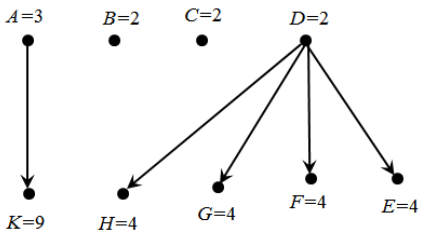

Задания имеют длительности, указанные на рисунке, а также приоритеты, которые указаны в таблице:

| Задание      |  A  |  B  |  C  |  D  |  E  |  F  |  G  |  H  |  K  |
|:-------------|:---:|:---:|:---:|:---:|:---:|:---:|:---:|:---:|:---:|
| Приоритет    |  9  |  8  |  7  |  6  |  5  |  4  |  3  |  2  |  1  |
| Длительность |  3  |  2  |  2  |  2  |  4  |  4  |  4  |  4  |  9  |

Требуется сравнить расписание минимальной длительности без прерываний для трёх и для четырёх идентичных исполнителей. Заметим, что такая постановка задачи не подходит ни под одну из модельных задач, которые мы рассматривали в рамках теории расписаний.

Интуитивно кажется очевидным, что увеличение количества исполнителей с 3 до 4 должно привести к сокращению сроков выполнения заданий. Однако, происходит совершенно противоположное тому, что мы ожидаем.

Ниже приведены диаграммы Ганта кратчайшего расписания для трёх исполнителей:

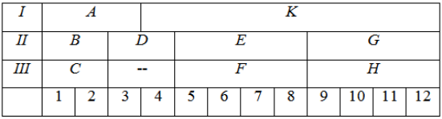

Для четырёх исполнителей:

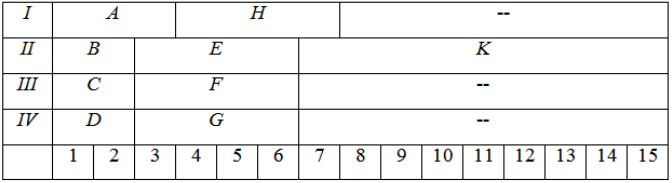

Как видим, четыре исполнителя, действуя самым оптимальным образом, будут работать дольше, чем трое, которые также действуют оптимально. Заметим, что «аномалия» здесь возникла из-за жёсткого соблюдения приоритетов заданий.

## 📝 Пример 2

Пусть имеется набор из 9 заданий с тем же графом зависимостей между заданиями, что и в примере 1, но длины всех заданий сделаем короче на 1 (час).

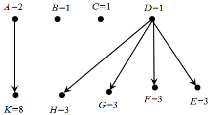

Составим кратчайшее расписание для трёх исполнителей. Естественно ожидать, что оно будет короче, чем в примере 1 для трёх исполнителей. Однако, это не так. Кратчайшее расписание стало на 1 (час) длиннее! Ниже приведена диаграмма Ганта оптимального расписания:

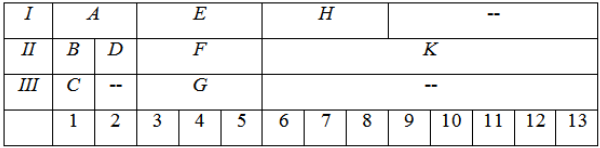

# 🎯 Теория графов: основные понятия и алгоритмы

Графы являются одной из важнейших областей дискретной математики. Граф — это абстрактное понятие, посредством которого можно описывать разнообразные реальные явления: организацию транспортных систем, человеческих взаимоотношений, передачи данных и многие другие. Возможность формального моделирования такого множества разных реальных структур позволяет программисту решать широкий круг прикладных задач.

## 📌 Что такое граф?

Граф G = (V, E) состоит из набора вершин V и набора рёбер E, соединяющих пары вершин. С помощью графов можно представить практически любые взаимоотношения. Например, посредством графов можно создать модель сети дорог, представляя населенные пункты вершинами, а дороги между ними — соединяющими соответствующие вершины рёбрами. На предыдущих занятиях с помощью графов мы моделировали отношения предшествования задач для построения расписаний.

Представление задачи в виде графа является ключевым подходом к решению многих алгоритмических задач. Теория графов предоставляет язык для описания свойств взаимоотношений, и просто поразительно, как часто запутанные прикладные задачи поддаются простому описанию и решению посредством применения свойств классических графов.

Разработка по-настоящему оригинальных алгоритмов для графов является очень трудной задачей. Ключевым аспектом эффективного использования алгоритмов на графах является правильное моделирование задачи, чтобы можно было воспользоваться уже существующими алгоритмами. В этой лекции мы рассмотрим основные понятия теории графов, способы их представления в памяти компьютера и классические алгоритмы, которые составляют основу для решения практических задач.

## 📌 Типы графов

На выбор конкретного типа структуры данных для представления графов и алгоритмов для работы с ними оказывают влияние несколько фундаментальных свойств графов. Поэтому первым шагом в решении любой задачи на графах будет определение подходящего типа графа.
1. Неориентированные/ориентированные. Граф G (V, E) является неориентированным, если из $(x, y) \in E$ следует, что $(y, x)$ также является членом $E$. В противном случае говорят, что граф ориентированный. Дорожные сети между городами обычно неориентированные, т, к, по любой обычной дороге можно двигаться в обоих направлениях, А вот дорожные сети внутри городов почти всегда ориентированы, т, к, и большинстве городов найдется, по крайней мере, несколько улиц с односторонним движением.
2. Взвешенные/невзвешенные. Каждому ребру (или вершине) взвешенного графа  присваивается числовое значение, или вес. Например, в зависимости от контекста, весом ребер графа дорожной сети может быть их протяженность, максимальная скорость движения, пропускная способность и пр. Вершины и ребра невзвешенных графов не различаются по весу.
3. Простые/сложные. Наличие ребер некоторых типов затрудняют работу с графами. Петлей называется ребро $(x, x)$, т. е. ребро, имеющее только одну вершину. Кратными называются ребра, соединяющие одну и ту же пару вершин $(x, y)$. Наличие в графе обеих этих структур требует особого внимания при реализации алгоритма работы с графом, поэтому графы, которые не содержат их, называются простыми.
4. Разреженные/плотные. Граф является разреженным, когда в действительности ребра определены только для малой части возможных пар вершин. Граф, у которого ребра определены для большей части возможных пар вершин, называется плотным. Не существует четкой границы между разреженными и плотными графами; но, как правило, у плотных графов отношение количества ребер к количеству вершин обычно описывается квадратичной функцией, а у разреженных - линейной.
5. Циклические/ациклические. Ациклический граф не содержит циклов. Деревья являются связными ациклическими неориентированными графами. Деревья представляют собой самые простые графы, рекурсивные по своей природе, т. к., разорвав любое ребро, мы получим два меньших дерева. Для обозначения ориентированных ациклических графов часто используется аббревиатура DAG (directed acyclic graph). Графы DAG часто возникают в задачах теории расписаний, где ориентированное ребро $(x, y)$ обозначает, что задание $x$ должно выполниться раньше, чем задание $y$.

## 📌 Основные понятия теории графов
### Степень вершины
Степенью вершины называется количество рёбер, инцидентных данной вершине.
- В неориентированном графе степень вершины — просто количество соединённых с ней рёбер.
- В ориентированном графе различают:
    * Полустепень исхода — количество выходящих дуг;
    * Полустепень захода — количество входящих дуг.

📝 Пример: В графе социальных связей степень вершины показывает количество друзей у человека.

### Пути и циклы
Путём называется последовательность вершин, где каждая следующая вершина соединена ребром с предыдущей.
- Простой путь — путь, в котором все вершины различны.
- Циклом называется путь, у которого начальная и конечная вершины совпадают.
- Простой цикл — цикл, в котором все вершины, кроме начальной и конечной, различны.

### Связность
Граф называется связным, если между любыми двумя вершинами существует путь.
- Компонента связности — максимальный связный подграф.
- В ориентированных графах различают:
    * Сильную связность — когда в ориентированном графе из любой вершины можно добраться до любой другой, следуя направлению рёбер.
    * Слабую связность — когда граф становится связным при игнорировании направлений рёбер.

### Деревья и лес
- Дерево — связный ациклический неориентированный граф.
- Лес — граф, компоненты связности которого являются деревьями.
- Корневое дерево — дерево с выделенной вершиной (корнем).

Свойства деревьев:
- Между любыми двумя вершинами существует ровно один простой путь.
- Количество рёбер на 1 меньше количества вершин: $|E| = |V| - 1$.
- Добавление любого нового ребра создаёт ровно один цикл.

### Остовное дерево
Остовным деревом связного графа называется любой его связный ациклический подграф, содержащий все вершины исходного графа.
- Минимальное остовное дерево — остовное дерево с минимальным суммарным весом рёбер (для взвешенных графов).
- Каждый связный граф имеет хотя бы одно остовное дерево.

### Двудольные графы

Граф называется двудольным, если множество его вершин можно разбить на два непересекающихся подмножества так, что все рёбра соединяют вершины из разных подмножеств.

📝 Пример: Задача о назначениях. Одна группа вершин — исполнители, другая — задачи. Ребро соединяет исполнителя и задачу, если исполнитель может выполнить эту задачу

### Эйлеров и гамильтонов графы
Эйлеров цикл — цикл, проходящий через каждое ребро графа ровно один раз.

Гамильтонов цикл — цикл, проходящий через каждую вершину графа ровно один раз.

Теорема Эйлера: Связный неориентированный граф содержит эйлеров цикл тогда и только тогда, когда степени всех его вершин чётны.

---

## 📌 Структуры данных для графов
Выбор правильной структуры данных для графа может иметь огромное влияние на производительность алгоритма. Двумя основными структурами данных для графов являются матрицы смежности и списки смежности.

### Матрица смежности
Граф G можно представить с помощью матрицы $M$ размером $n × n$, где элемент $M_{ij} = 1$, если $(i,j)$ является ребром графа G, и 0 в противном случае. Таким образом мы можем дать быстрый ответ на вопрос "Содержит ли граф G ребро (i, j)?", а также быстро отобразить вставки и удаления ребер. Но такая матрица может потребовать большой объем памяти для графов с большим количеством вершин и относительно небольшим количеством ребер.

Для взвешенных графов элемент матрицы $M_{ij} = 2$, указывает на вес ребра $(i,j)$.

Граф $M$:

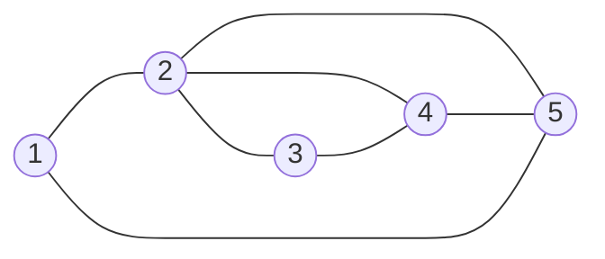

Матрица смежности графа $M$:

|     |**1**|**2**|**3**|**4**|**5**|
|:---:|:---:|:---:|:---:|:---:|:---:|
|**1**|  0  |  1  |  0  |  0  |  1  |
|**2**|  1  |  0  |  1  |  1  |  1  |
|**3**|  0  |  1  |  0  |  1  |  0  |
|**4**|  0  |  1  |  1  |  0  |  1  |
|**5**|  1  |  1  |  0  |  1  |  0  |
 

Преимущества:
- Быстрая проверка наличия ребра: $O(1)$.
- Простота реализации.
- Эффективна для плотных графов.

Недостатки:
- Занимает много памяти: $O(|V|^2)$.
- Неэффективна для разреженных графов.
- Медленный перебор всех соседей вершины.

### Списки смежности
Более эффективным способом представления разреженных графов является использование связных списков для хранения соседствующих вершин. Для каждой вершины хранится список смежных с ней вершин (для взвешенных графов — с указанием весов).


Граф $M$:


Списки смежности графа $M$:

|     | Смежные вершины |
|:---:|:------------|
|**1:**|  2, 5       |
|**2:**|  1, 3, 4, 5 |
|**3:**|  2, 4       |
|**4:**|  2, 3, 5    |
|**5:**|  2, 4, 1    |
 
Преимущества:
- Экономное использование памяти: $O(|V| + |E|)$.
- Быстрый перебор всех соседей вершины.
- Эффективна для разреженных графов.

Недостатки:
- Медленная проверка наличия конкретного ребра: $O(deg(v))$.
- Более сложная реализация.

### Сравнение матриц и списков смежности

| Задача                                    | Оптимальный вариант |
|:------------------------------------------|:-------------------:|
| Проверка на вхождение ребра (х, у) в граф | Матрица смежности   |
| Определение степени вершины               | Списки смежности    |
| Объем памяти для небольших графов         | Списки смежности    |
| Объем памяти для больших графов           | Матрица смежности   |
| Вставка или удаление ребра                | Матрица смежности   |
| Обход графа                               | Списки смежности    |

## 📌 Обход графа

Фундаментальной задачей на графах, является систематизированное посещение каждой вершины и каждого ребра графа. Все основные служебные операции по работе с графами (такие как распечатка, копирование графов или преобразования графа из одного представления в другое) являются приложениями обхода графа.

Ключевая идея обхода графа - пометить каждую вершину при первом ее посещении и помнить о том, что не было исследовано полностью. Каждая вершина будет находиться в одном из следующих трех состояний:
- неоткрытая (undiscovered) - первоначальное, нетронутое состояние вершины;
- открытая (discovered) - вершина обнаружена, но мы еще не проверили все инцидентные ей ребра;
- обработанная (processed) - все инцидентные данной вершине ребра были посещены.

Очевидно, что вершину нельзя обработать до того, как она открыта, поэтому в процессе обхода графа состояние каждой вершины начинается с неоткрытого, переходит в открытое и заканчивается обработанным.

Нам также нужно иметь структуру, содержащую все открытые, но еще не обработанные вершины. Первоначально открытой считается только одна вершина - начало обхода графа. Для полного исследования вершины $v$ нужно изучить каждое исходящее из нее ребро. Если какие-либо ребра идут к неоткрытой вершине $x$, то эта вершина помечается как открытая и добавляется в список для дальнейшей обработки. Ребра, идущие к обработанным вершинам, игнорируются, т.к. их дальнейшее исследование не сообщит нам ничего нового о графе. Также можно игнорировать любое ребро, идущее открытой, но не обработанной вершине, т. к. эта вершина уже внесена в список вершин, подлежащих обработке.

Каждое неориентированное ребро рассматривается дважды, по одному разу при исследовании каждой из его вершин. Ориентированные ребра рассматриваются только один раз, при исследовании его источника. В конечном счете, все ребра и вершины в связном графе должны быть посещены. Почему? Допустим, что имеется непосещенная вершина $u$, чья соседняя вершина $v$ была посещена. Эта соседняя вершина будет со временем исследована, после чего мы непременно посетим вершину $u$. Таким образом, мы в конечном счете найдем все, что можно найти.


### Обход в ширину
Обход в ширину (BFS - Breadth-First Search). При обходе в ширину граф исследуется "слоями" — сначала все вершины на расстоянии 1 от начальной, затем на расстоянии 2, и так далее, для хранения вершин, подлежащих обработке используется очередь (FIFO). Помещая вершины в очередь типа FIFO, мы исследуем самые старые неисследованные вершины первыми. Таким образом, наше исследование медленно распространяется вширь, начиная от стартовой вершины. В этом суть обхода в ширину.

Алгоритм:

```
    Поместить стартовую вершину в очередь и пометить как открытую

    Пока очередь не пуста:

        Извлечь вершину из начала очереди

        Обработать вершину

        Для каждого соседа этой вершины:

            Если сосед не открыт, пометить как открытый и добавить в конец очереди

    Пометить вершину как обработанную
```

Свойства:
- Находит кратчайшие пути в невзвешенных графах.
- Обходит вершины в порядке возрастания расстояния от стартовой.
- Использует память $O(|V|)$ для хранения очереди.
- Временная сложность: $O(|V| + |E|)$.

Применение:
- Поиск кратчайшего пути в невзвешенном графе.
- Поиск компонент связности.
- Проверка двудольности графа.
- Волновой алгоритм в лабиринтах

Граф:

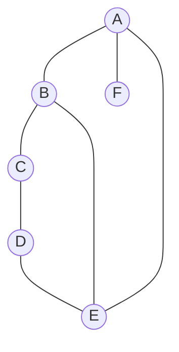

Дерево обхода в ширину:

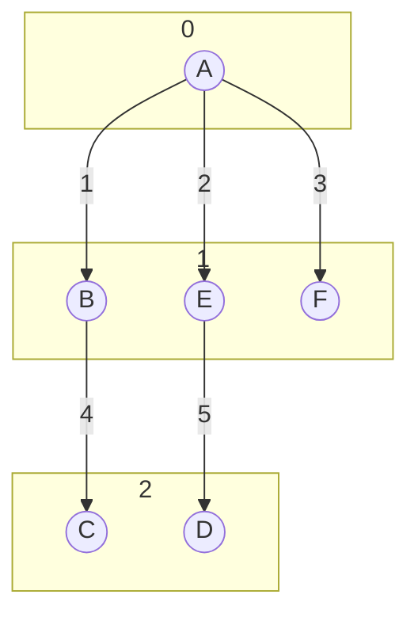

### Обход в глубину

Обход в глубину (DFS - Depth-First Search). Алгоритм использует стек (LIFO) — явно или через рекурсию. Помещая вершины в стек с порядком извлечения LIFO, мы исследуем их, отклоняясь от пути для посещения очередного соседа, если таковой имеется, и возвращаясь назад, только если оказываемся в окружении ранее открытых вершин. Таким образом, мы в своем исследовании быстро удаляемся от стартовой вершины, и в этом заключается суть обхода в глубину.

Алгоритм:

```
    Создать пустой стек и поместить в него стартовую вершину

    Пометить стартовую вершину как открытую

    Пока стек не пуст:

        Извлечь вершину с вершины стека

        Если вершина еще не обработана:

            Пометить вершину как обработанную

            Для каждого соседа данной вершины:

                Если сосед не открыт, пометить как открытый и поместить в стек
```

Свойства:
- Может быть реализован рекурсивно или итеративно со стеком.
- Естественным образом обнаруживает структуру графа.
- Использует память $O(|V|)$ для стека вызовов или явного стека.
- Временная сложность: $O(|V| + |E|)$

Классификация рёбер:
- Древесные рёбра — ведут к неоткрытым вершинам (формируют DFS-дерево)
- Обратные рёбра — ведут к предкам в DFS-дереве (обнаруживают циклы)
- Прямые рёбра — ведут к потомкам в DFS-дереве
- Перекрёстные рёбра — ведут к вершинам, не являющимся предками или потомками

Применение:
- Топологическая сортировка ориентированных ациклических графов (DAG).
- Поиск компонент сильной связности.
- Обнаружение циклов в графе.
- Поиск мостов и точек сочленения.

Граф:


Дерево обхода в глубину:

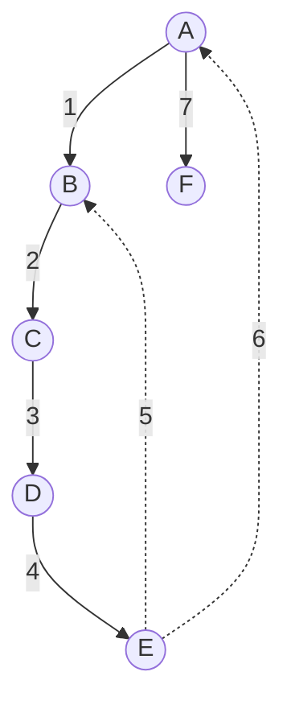

## 📌 Поиск кратчайшего пути в графе

Важной прикладной задачей, достаточно подробно изученной в рамках теории графов, является задача о минимальном пути. Она возникает, например, когда в сети дорог, соединяющих несколько населённых пунктов, требуется найти такой путь из пункта А в пункт В (проходящий, возможно, через другие населённые пункты), чтобы суммарная длина дорог, составляющих этот путь, была минимальной. Иногда требуется, чтобы такой путь обеспечивал минимальные затраты на перевозку груза или минимальное время доставки груза. Всё это разные варианты задачи о минимальном пути.

### Алгоритм Дейкстры
Алгоритм Дейкстры является предпочтительным методом поиска кратчайших путей в графах со взвешенными ребрами и/или вершинами. Алгоритм находит кратчайший путь от заданной начальной вершины $s$ ко всем другим вершинам графа, включая требуемую конечную вершину $t$
.
Допустим, что кратчайший путь от вершины $s$ к вершине $t$ графа $G$ проходит через определенную промежуточную вершину $х$. Очевидно, что этот путь должен содержать кратчайший путь от вершины $s$ к вершине $х$, в качестве префикса, ибо в противном случае можно было бы сократить путь $s-t$, используя более короткий префиксный путь $s-x$. Таким образом, прежде чем найти кратчайший путь от начальной вершины $s$ к конечной вершине $t$, нам нужно найти кратчайший путь от начальной вершины $s$ к промежуточной вершине $х$.

Алгоритм Дейкстры работает поэтапно, находя на каждом этапе кратчайший путь от вершины $s$ к некой новой вершине. Подход аналогичен динамическому программированию. Кратчайший путь от вершины $s$ к самой себе является тривиальным, при условии отсутствия ребер с отрицательным весом, поэтому $dist(s, s) = 0$. Если $(s, y)$ является самым легким ребром, входящим в вершину $s$, то это означает, что $dist(s, y) = w(s, y)$. Определив кратчайший путь к вершине $х$, мы проверяем все исходящие из нее ребра, чтобы узнать, не существует ли лучшего пути из начальной вершины $s$ к какой-либо неизвестной вершине через вершину $х$.

Алгоритм Дейкстры нельзя применять, когда некоторые ребра имеют отрицательный вес. В некоторых практических задачах такое вполне возможно. Например, вес ребра может означать величину получаемой прибыли или выплачиваемого штрафа. Здесь естественно считать, что прибыль выражается положительным числом, а штраф - отрицательным.

### Алгоритм Флойда

В отличие от алгоритма Дейкстры, алгоритм Флойда находит кратчайшие пути сразу для всех пар вершин и может работать с ребрами отрицательного веса (при отсутствии цикла отрицательной стоимости).

Допустим, что нам нужно найти "центральную" вершину графа, т. е. вершину с кратчайшими путями ко всем остальным вершинам. Практическим примером такой задачи может быть выбор места для открытия офиса. Или, допустим, вам нужно узнать диаметр графа, т. е. максимальное кратчайшее расстояние между всеми парами вершин. Практическим примером данной задачи может быть определение максимального временного интервала для доставки письма или сетевого пакета. В этих случаях нужно искать кратчайшие пути между всеми парами вершин графа и можно использовать алгоритм Флойда.

Подробно алгоритм Флойда обсуждался на лекции 3.

### Алгоритм Беллмана-Форда

Алгоритм Беллмана-Форда решает задачу поиска кратчайших путей из одной вершины в графах с произвольными весами рёбер, включая отрицательные (в отличие от алгоритма Дейкстры).

Основная идея алгоритма основана на принципе релаксации рёбер. Если кратчайший путь от начальной вершины $s$ до некоторой вершины $v$ проходит через вершину $u$, то расстояние до $v$ можно улучшить, рассмотрев путь $s → u → v$. Алгоритм выполняет $|V| - 1$ итерацию, на каждой из которых релаксируются все рёбра графа. Такого количества итераций достаточно, поскольку любой простой путь в графе может содержать не более $|V| - 1$ ребро.

Важным преимуществом алгоритма Беллмана-Форда является его способность обнаруживать циклы отрицательного веса. После $|V| - 1$ итерации выполняется дополнительная проверка: если удаётся улучшить расстояние до какой-либо вершины, это свидетельствует о наличии в графе цикла отрицательного веса, достижимого из начальной вершины. В таких случаях задача поиска кратчайшего пути теряет смысл, так как можно бесконечно уменьшать длину пути, обходя отрицательный цикл.

## 📌 Построение минимального остовного дерева

Задача построения минимального остовного дерева (Minimum Spanning Tree, MST) является одной из фундаментальных задач теории графов с многочисленными практическими приложениями. Остовное дерево связного графа — это подграф, содержащий все вершины исходного графа и являющийся деревом, то есть связным ациклическим графом.

Когда граф является взвешенным, возникает естественная задача найти остовное дерево с минимальным суммарным весом его рёбер. Такая задача возникает в самых разных областях:
- Проектирование коммуникационных сетей — соединение компьютеров или населённых пунктов с минимальной общей длиной кабеля.
- Транспортное планирование — соединение городов дорогами с минимальными затратами на строительство.
- Кластеризация данных — группировка объектов с минимальной общей стоимостью соединений.

Интересно, что для любой связной взвешенной неориентированной компоненты графа существует единственное минимальное остовное дерево, если все веса рёбер различны. Если же веса могут совпадать, минимальных остовных деревьев может быть несколько.

Рассмотрим три классических алгоритма решения этой задачи, каждый из которых основан на своей стратегии, но все они приводят к оптимальному результату.

### Алгоритм Крускала

Алгоритм Крускала - классический жадный алгоритм для построения минимального остовного дерева, который работает путём последовательного добавления рёбер в порядке возрастания их весов, обеспечивая при этом отсутствие циклов. Алгоритм реализует жадный подход - локально оптимальный выбор на каждом шаге приводит к глобально оптимальному решению.

Алгоритм начинает с пустого множества рёбер и на каждом шаге добавляет самое лёгкое из оставшихся рёбер, которое не образует цикла с уже выбранными рёбрами. Этот процесс продолжается до тех пор, пока не будет выбрано $|V| - 1$ ребро.

Алгоритм:

```
    Сортировка рёбер: Все рёбра графа сортируются по возрастанию веса

    Инициализация: Создаётся пустое множество для рёбер остова

    Построение остова: Для каждого ребра в отсортированном порядке:

        Если добавление ребра не создаёт цикла, оно добавляется в остов

        Процесс прекращается, когда выбрано |V| - 1 ребро
```

Для эффективной проверки образования циклов используется структура данных Система непересекающихся множеств (DSU):
- Каждая вершина изначально находится в своём собственном множестве.
- При добавлении ребра $(u, v)$ проверяется, принадлежат ли $u$ и $v$ одному множеству.
- Если нет — ребро добавляется, а множества объединяются.

#### 📝 Пример

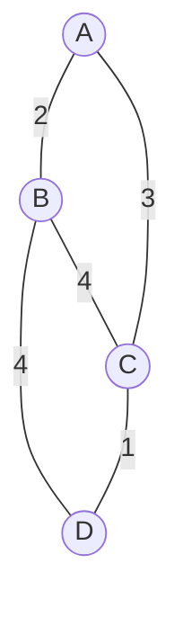
Отсортированные рёбра: 
1. (C-D:1),
2. (A-B:2), 
3. (A-C:3), 
4. (B-D:4)

Шаг 1: Добавляем C-D (вес 1)

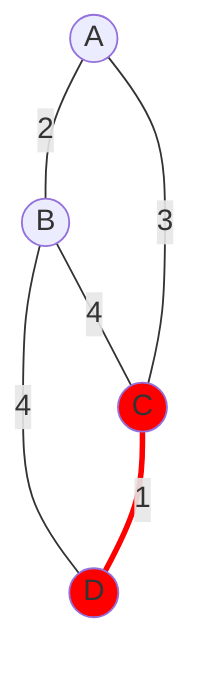

Шаг 2: Добавляем A-B (вес 2) 

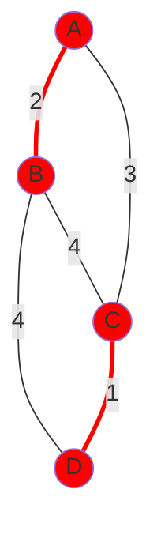

Шаг 3: Добавляем A-C (вес 3) - не создаёт цикла

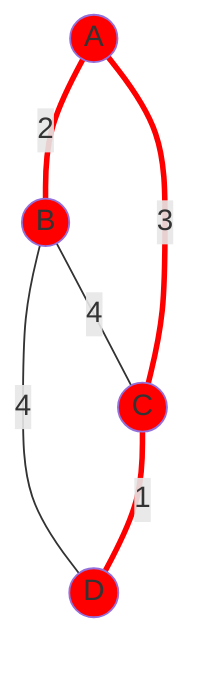

Алгоритм завершился: Построенное дерево содержит 3 ребра для 4 вершин. Полученное минимальное остовное дерево имеет общий вес: 2 + 3 + 1 = 6.


### Алгоритм Прима

Алгоритм Прима - еще один жадный алгоритм построения минимального остовного дерева. Строящееся дерево "растёт" от начальной вершины, в него последовательно добавляются самые лёгкие рёбра, соединяющие уже построенную часть дерева с остальными вершинами графа.

Алгоритм начинает с произвольной вершины и на каждом шаге добавляет ребро минимального веса, которое соединяет текущее дерево с вершиной, ещё не включённой в дерево. Таким образом, дерево "растёт" от начальной вершины, пока не покроет все.

Алгоритм:

```
    Инициализация: Выбираем произвольную стартовую вершину

    Инициализация приоритетной очереди: Все рёбра из стартовой вершины добавляются в очередь с приоритетом по весу

    Построение остова: Пока очередь не пуста и дерево не содержит все вершины:

        Извлекаем ребро с минимальным весом

        Если вершина на другом конце ребра ещё не в дереве:

            Добавляем ребро в остов

            Добавляем все рёбра из новой вершины в очередь
```

#### 📝 Пример


Стартовая вершина: A

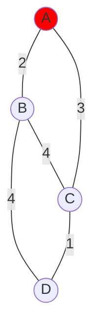

Шаг 1: Добавляем A-B (вес 2)

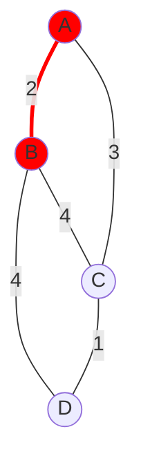

Шаг 2: Добавляем A-C (вес 3) 

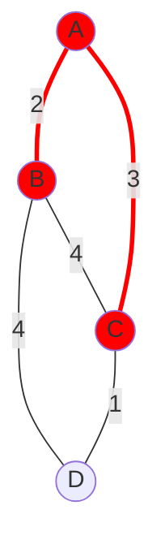

Шаг 3: Добавляем C-D (вес 1)


Алгоритм завершился: Построенное дерево содержит 3 ребра для 4 вершин. Полученное минимальное остовное дерево имеет общий вес: 2 + 3 + 1 = 6.

### Алгоритм Борувки

Алгоритм Борувки - один из старейших алгоритмов построения минимального остовного дерева, отличающийся эффективностью для распределённых вычислений.

Алгоритм работает в несколько фаз, на каждой из которых каждая компонента связности (поддерево) независимо находит своё минимальное инцидентное ребро, ведущее к другой компоненте, и все такие рёбра добавляются одновременно.

Алгоритм:

```
    Инициализация: Каждая вершина образует свою собственную компоненту

    Повторять до тех пор, пока не останется одна компонента:

        Для каждой компоненты найти ребро минимального веса, соединяющее её с другой компонентой

        Добавить все найденные рёбра в остов

        Объединить компоненты, соединённые добавленными рёбрами

    Завершение: Когда осталась одна компонента — получено минимальное остовное дерево
```

Алгоритм Борувки особенно ценен в современных распределённых системах, где возможность параллельной обработки компонент позволяет эффективно работать с очень большими графами, распределёнными между вычислительными узлами.

#### 📝 Пример


Каждая вершина образует свою собственную компоненту

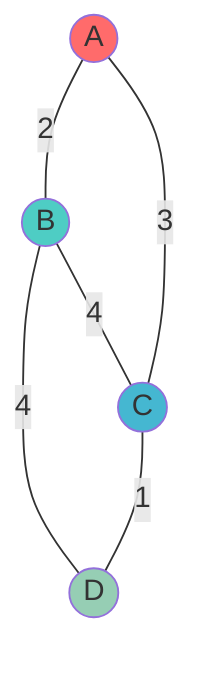

Фаза 1:
- Компонента A: min ребро A-B (2),
- Компонента B: min ребро A-B (2),
- Компонента C: min ребро C-D (1),
- Компонента D: min ребро C-D (1).

Добавляем рёбра: A-B, C-D, получаем новые компоненты: {A,B}, {C,D}.

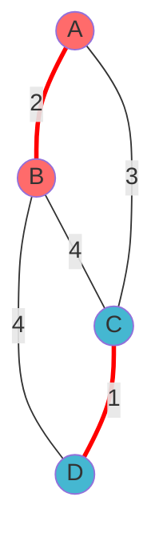

Фаза 2:
- Компонента {A,B}: min ребро A-C (3),
- Компонента {C,D}: min ребро A-C (3).

Добавляем ребро: A-C и объединяем все вершины в одну компоненту: {A,B,C,D}.


Алгоритм завершился: Построенное дерево содержит 3 ребра для 4 вершин. Полученное минимальное остовное дерево имеет общий вес: 2 + 3 + 1 = 6.
