# 🎯 Эвристические алгоритмы для задачи упаковки в контейнеры

Большинство задач комбинаторной оптимизации, возникающих на практике, являются вычислительно сложными задачами, требующими для своего решения значительных временных затрат, особенно при больших значениях входных параметров. Тем не менее, исследования показывают, что некоторые из этих сложных задач оказываются более сложными, чем остальные. Например, задача об упаковке в контейнеры считается более сложной, чем евклидова задача коммивояжёра. Это выражается в следующем факте: для задачи коммивояжёра известны «псевдополиномиальные» алгоритмы, решающие эту задачу с регулируемой погрешностью $\varepsilon$ и имеющие полиномиальную сложность, где показатель степени полинома неограниченно растёт при $\varepsilon \to 0$. А для задачи об упаковке в контейнеры ни одного такого алгоритма до сих пор не известно. Все используемые на практике быстрые алгоритмы решают эту задачу с погрешностью, которая не поддаётся регулированию.

Для особо сложных задач, подобных задаче об упаковке в контейнеры, часто применяют эвристические алгоритмы (или эвристики). Нестрого говоря, это алгоритмы, которые, как правило, основаны на каких-либо правдоподобных (но не доказанных строго логически) рассуждениях. К классу эвристических алгоритмов часто относят «жадные» алгоритмы. Обычно эти алгоритмы находят решения быстро, но с некоторой погрешностью, и это подтверждается многочисленными примерами их работы на конкретных наборах входных данных. Однако, одновременно ограничить сверху погрешность алгоритма какой-либо константой, а функцию его сложности — каким-либо полиномом, не удаётся. Для повышения точности эвристического алгоритма приходится увеличивать время его работы. И хотя теоретически можно достичь любой нужной нам точности, практически сделать это невозможно.

Рассмотрим постановку задачи об упаковке в контейнеры. Пусть у нас имеется $n$ предметов, веса которых равны $x_1, x_2, x_3, \dots, x_n$. Считается, что $0 < x_i \leq 1$ при всех $i = 1,2,3, \dots, n$. Нужно выяснить, какое минимальное количество одинаковых контейнеров потребуется, чтобы поместить в них все $n$ предметов, если вместимость каждого контейнера равна 1. Очевидно, что эта задача является задачей комбинаторной оптимизации, поскольку её можно решить перебором всех возможных вариантов распределения исходных предметов по $k$ контейнерам, где $k$ пробегает все значения от 1 до $n$. Нетрудно проверить, что такой переборный алгоритм имеет сложность, не превосходящую

$$
1 + 2^n + 3^n + \dots + n^n \leq n^{n+1}.
$$

Для решения задачи об упаковке в контейнеры рассмотрим три различных эвристики.

## 1. «Пожарный алгоритм». 

Идея этой эвристики состоит в следующем: перебираем предметы в порядке возрастания их номеров $i = 1,2,3,\dots,n$. Очередной предмет $x_i$ пытаемся положить в текущий контейнер. Если он туда не помещается, кладём его в новый (ещё пустой) контейнер, который теперь становится текущим. Поскольку количество просмотренных контейнеров для каждого предмета не превосходит 2, описанный алгоритм имеет линейную сложность.

### 📝 Пример 1
Применим «пожарный алгоритм» для следующего набора предметов:

| Номер предмета | 1 | 2 | 3 | 4 | 5 | 6 | 7 | 8 | 9 |
| :--- | :---: | :---: | :---: | :---: | :---: | :---: | :---: | :---: | :---: |
| Вес предмета | $2/5$ | $1/2$ | $3/7$ | $1/4$ | $1/3$ | $2/7$ | $1/5$ | $1/3$ | $1/7$ |

### Решение
Заметим, что суммарный вес всех предметов составляет $2\frac{367}{420}$. Следовательно, для упаковки предметов потребуется не менее трёх контейнеров.

Пронумеруем шаги «пожарного алгоритма»:

1) предмет $x_1$ кладём в 1-й контейнер (оставшаяся вместимость 1-го контейнера составляет $3/5$);

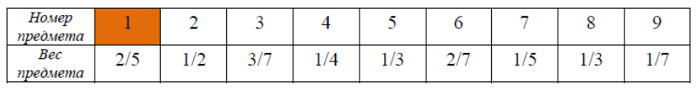

2) предмет $x_2$ кладём в 1-й контейнер (оставшаяся вместимость 1-го контейнера составляет $1/10$);

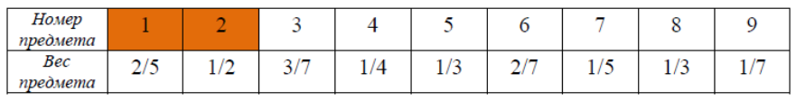

3) предмет $x_3$ не помещается в 1-й контейнер, кладём его во 2-й контейнер (оставшаяся вместимость 2-го контейнера составляет $4/7$);

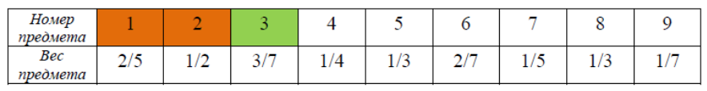

4) предмет $x_4$ кладём во 2-й контейнер (оставшаяся вместимость 2-го контейнера составляет $9/28$);

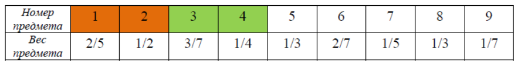

5) предмет $x_5$ не помещается во 2-й контейнер, кладём его в 3-й контейнер (оставшаяся вместимость 3-го контейнера составляет $2/3$);

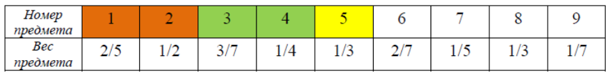

6) предмет $x_6$ кладём в 3-й контейнер (оставшаяся вместимость 3-го контейнера составляет $8/21$);

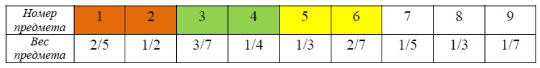

7) предмет $x_7$ кладём в 3-й контейнер (оставшаяся вместимость 3-го контейнера составляет $19/105$);

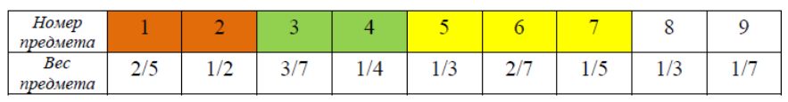

8) предмет $x_8$ не помещается в 3-й контейнер, кладём его в 4-й контейнер (оставшаяся вместимость 4-го контейнера составляет $2/3$);

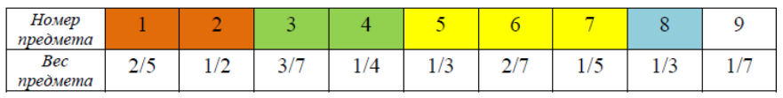

9) предмет $x_9$ кладём в 4-й контейнер (оставшаяся вместимость 4-го контейнера составляет $11/21$).

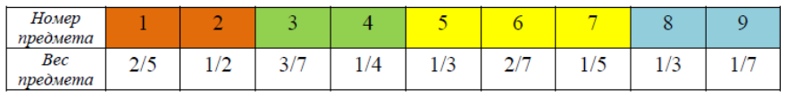

Таким образом, ответ «пожарного алгоритма» составляет 4 контейнера, что превышает правильный ответ на 1. Это означает, что погрешность алгоритма в данном случае составила

$$
\varepsilon = \frac{4-3}{3} \cdot 100\% \approx 33\%,
$$

это меньше, чем его максимальная погрешность, которая, как известно, в худшем случае может достигать 100%.

## 2. Алгоритм «упаковки при переездах»

Идея этой эвристики состоит в следующем: перебираем предметы в порядке возрастания их номеров $i = 1,2,3, \dots, n$. Очередной предмет $x_i$ пытаемся положить в первый подходящий контейнер, просматривая контейнеры в порядке возрастания их номеров $1,2,3, \dots$ Поскольку количество просмотренных контейнеров для каждого предмета не превосходит $n$, сложность указанного алгоритма не превосходит $n^2$.

### 📝 Пример 2

Применим алгоритм «упаковки при переездах» к набору предметов из примера 1:

| Номер предмета | 1 | 2 | 3 | 4 | 5 | 6 | 7 | 8 | 9 |
| :--- | :---: | :---: | :---: | :---: | :---: | :---: | :---: | :---: | :---: |
| Вес предмета | $2/5$ | $1/2$ | $3/7$ | $1/4$ | $1/3$ | $2/7$ | $1/5$ | $1/3$ | $1/7$ |

### Решение
Пронумеруем шаги алгоритма:

1) предмет $x_1$ кладём в 1-й контейнер (оставшаяся вместимость 1-го контейнера составляет $3/5$);

2) предмет $x_2$ кладём в 1-й контейнер (оставшаяся вместимость 1-го контейнера составляет $1/10$);

3) предмет $x_3$ не помещается в 1-й контейнер, кладём его во 2-й контейнер (оставшаяся вместимость 2-го контейнера составляет $4/7$);

4) предмет $x_4$ не помещается в 1-й контейнер, кладём его во 2-й контейнер (оставшаяся вместимость 2-го контейнера составляет $9/28$);

5) предмет $x_5$ не помещается ни в 1-й, ни во 2-й контейнер, кладём его в 3-й контейнер (оставшаяся вместимость 3-го контейнера составляет $2/3$);

6) предмет $x_6$ не помещается в 1-й контейнер, кладём его во 2-й контейнер (оставшаяся вместимость 2-го контейнера составляет $1/28$);

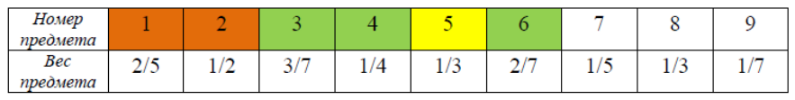

7) предмет $x_7$ не помещается ни в 1-й, ни во 2-й контейнер, кладём его в 3-й контейнер (оставшаяся вместимость 3-го контейнера составляет $7/15$);

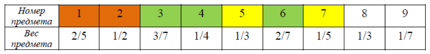

8) предмет $x_8$ не помещается ни в 1-й, ни во 2-й контейнер, кладём его в 3-й контейнер (оставшаяся вместимость 3-го контейнера составляет $2/15$);

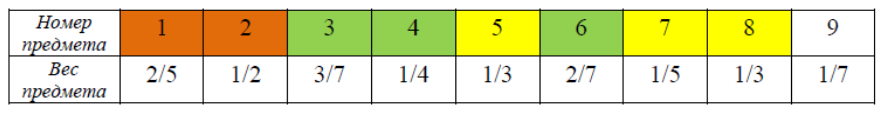

9) предмет $x_9$ не помещается ни в 1-й, ни во 2-й, ни в 3-й контейнер, кладём его в 4-й контейнер (оставшаяся вместимость 4-го контейнера составляет $6/7$).

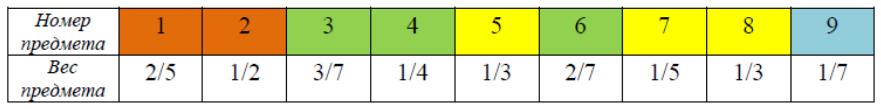

Таким образом, ответ алгоритма «упаковки при переездах» составляет 4 контейнера. Его погрешность в данном примере составила примерно 33%, однако, в худшем случае этот алгоритм может завышать требуемое количество контейнеров почти на 70%. Известно, что для числа контейнеров $K_{\text{пер}}$, определяемого данным алгоритмом, выполняется неравенство

$$
K_{\text{пер}} \leq \left\lceil \frac{17}{10} \cdot K_{\text{опт}} \right\rceil + 1,
$$

где $K_{\text{опт}}$ — искомое оптимальное число контейнеров.

## 3. Алгоритм «упаковки при переездах с сортировкой»

Идея этой эвристики состоит в том, что исходные предметы сначала упорядочивают по убыванию их весов, а затем к полученной последовательности предметов применяют те же правила распределения предметов по контейнерам, что и в алгоритме «упаковки при переездах». Сложность этой эвристики также составляет $O(n^2)$, однако по сравнению со второй эвристикой для числа контейнеров $K_{\text{подх}}$, определяемого данным алгоритмом, выполняется неравенство

$$
K_{\text{подх}} \leq \left\lceil \frac{11}{9} \cdot K_{\text{опт}} \right\rceil + 1,
$$

где $K_{\text{опт}}$ — искомое оптимальное число контейнеров.

### 📝 Пример 3

Применим алгоритм «упаковки при переездах с сортировкой» к набору предметов из примера 1, предварительно **упорядочив предметы по убыванию их весов**:

| Номер предмета | 1 | 2 | 3 | 4 | 5 | 6 | 7 | 8 | 9 |
| :--- | :---: | :---: | :---: | :---: | :---: | :---: | :---: | :---: | :---: |
| Вес предмета | $1/2$ | $3/7$ | $2/5$ | $1/3$ | $1/3$ | $2/7$ | $1/4$ | $1/5$ | $1/7$ |

### Решение

Пронумеруем шаги алгоритма:

1) предмет $x_1$ кладём в 1-й контейнер (оставшаяся вместимость 1-го контейнера составляет $1/2$);

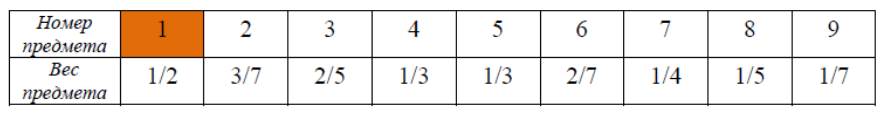

2) предмет $x_2$ кладём в 1-й контейнер (оставшаяся вместимость 1-го контейнера составляет $1/14$);

3) предмет $x_3$ не помещается в 1-й контейнер, кладём его во 2-й контейнер (оставшаяся вместимость 2-го контейнера составляет $3/5$);

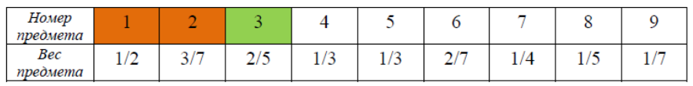

4) предмет $x_4$ не помещается в 1-й контейнер, кладём его во 2-й контейнер (оставшаяся вместимость 2-го контейнера составляет $4/15$);

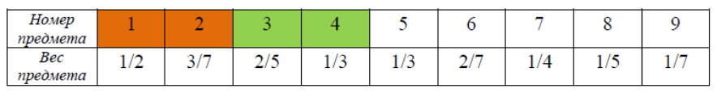

5) предмет $x_5$ не помещается ни в 1-й, ни во 2-й контейнер, кладём его в 3-й контейнер (оставшаяся вместимость 3-го контейнера составляет $2/3$);

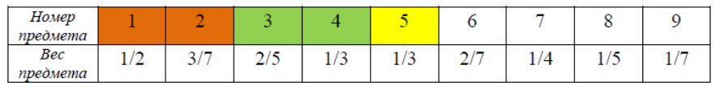

6) предмет $x_6$ не помещается ни в 1-й, ни во 2-й контейнер, кладём его в 3-й контейнер (оставшаяся вместимость 3-го контейнера составляет $8/21$);

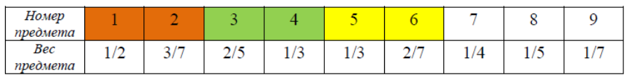

7) предмет $x_7$ не помещается в 1-й, кладём его во 2-й контейнер (оставшаяся вместимость 2-го контейнера составляет $1/60$);

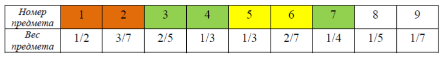

8) предмет $x_8$ не помещается ни в 1-й, ни во 2-й контейнер, кладём его в 3-й контейнер (оставшаяся вместимость 3-го контейнера составляет $19/105$);

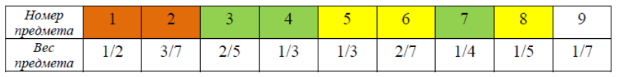

9) предмет $x_9$ не помещается ни в 1-й, ни во 2-й, кладём его в 3-й контейнер (оставшаяся вместимость 3-го контейнера составляет $4/105$).

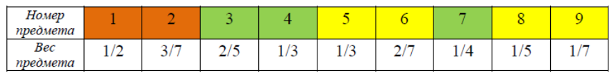

Как видим, эвристика упаковки при переездах с сортировкой позволила получить правильный ответ — 3 контейнера.
